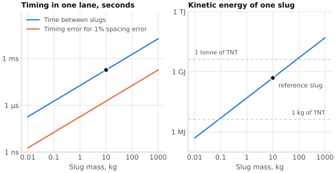

# Slug discreteness screen {#sec-app-slug-discreteness}

The fixed-flux treatment is useful, but the slugs themselves cannot stay abstract. In the 500 km, 10 km/s, 300-lane, 10 kN/m reference case, each lane carries about $5.4\times10^{4}$ kg/s of mass flux. The table below shows what that means for several representative slug masses.

| Slug mass | Slugs per second per lane | Spacing at 10 km/s | Time headway | Kinetic energy per slug |
| ---: | ---: | ---: | ---: | ---: |
| $0.1~\mathrm{kg}$ | $\sim 5.4\times10^{5}~\mathrm{s}^{-1}$ | $\sim 1.8~\mathrm{cm}$ | $\sim 1.8~\mu\mathrm{s}$ | $\sim 5~\mathrm{MJ}$ |
| $1~\mathrm{kg}$ | $\sim 5.4\times10^{4}~\mathrm{s}^{-1}$ | $\sim 18~\mathrm{cm}$ | $\sim 18~\mu\mathrm{s}$ | $\sim 50~\mathrm{MJ}$ |
| $10~\mathrm{kg}$ | $\sim 5.4\times10^{3}~\mathrm{s}^{-1}$ | $\sim 1.8~\mathrm{m}$ | $\sim 0.18~\mathrm{ms}$ | $\sim 500~\mathrm{MJ}$ |
| $100~\mathrm{kg}$ | $\sim 5.4\times10^{2}~\mathrm{s}^{-1}$ | $\sim 18~\mathrm{m}$ | $\sim 1.8~\mathrm{ms}$ | $\sim 5~\mathrm{GJ}$ |

This is a genuine design fork, and @fig-slug-mass-trade shows both sides of it.

{#fig-slug-mass-trade}

- Small slugs reduce individual projectile energy, but demand extreme event rate, timing accuracy, sensing bandwidth, and electromagnetic switching frequency.
- Large slugs relax rate and timing, but make each slug an individually catastrophic object.

For the rest of the screening discussion, it is useful to keep one bookkeeping row in mind. A 10 kg slug is not claimed to be optimal, but it is a workable reference because it implies about $5.4\times10^{3}$ slugs per second per lane, about 1.8 m spacing, about 0.18 ms headway, and about 500 MJ per slug. That is already severe while remaining easier to visualize than the lighter-slug rows.

The no-fill/no-drain argument in @sec-fill-drain-required-steady remains kinematically sound for steady speed fields, but it only works if headway compression and expansion stay inside collision margins. If a controller is allowed only 10% headway error, then the 1 kg row above implies a timing tolerance of only a few microseconds, while the 0.1 kg row pushes into the sub-microsecond regime. That does not kill the concept by itself, but it means slug discreteness has to become a first-class design variable rather than a hidden detail.

The 10 kg bookkeeping row also gives a simple cancellation-budget screen:

| Quantity for the 10 kg row | Approximate value |
| --- | ---: |
| Slug rate per lane | $\approx 5.4\times10^{3}~\mathrm{s}^{-1}$ |
| Headway | $\approx 0.185~\mathrm{ms}$ |
| Timing error for 1% headway error | $\approx 1.8~\mu\mathrm{s}$ |
| Timing error for 0.1% headway error | $\approx 0.18~\mu\mathrm{s}$ |
| Averaging time needed for one-slug count error to fall below 0.1% | $\approx 0.19~\mathrm{s}$ |

That last line is especially sobering. If balance is judged purely by counts, a one-slug mismatch does not average below 0.1% until the window is of order 0.2 s. But the lane and shell dynamics of concern are much faster than that. So precise four-lane balance is not just a matter of good average throughput accounting. It requires real-time synchronization, phase control, and fast local state estimation.

## Discreteness and the shape control {#sec-discreteness-shape}

The shape control of @sec-collective-stability treats each stream as a continuous flow. The local particle simulation of @sec-look-ahead was rerun with the slugs spaced more and more widely, to see where that stops being true. The test is the decay rate of a wave under the mirror law.

| Wavelength | Slugs 20 m apart | 31 m | 50 m | 83 m | 125 m |
| --------------- | ---------: | ---------: | ---------: | ---------: | ---------: |
| 417 m | 1.00 | 0.97 | 0.34 | 0.24 | 0.22 |
| 1.25 km | 0.97 | 0.93 | 0.45 | 0.18 | 0.24 |
| 2.5 km | 1.00 | 1.00 | 1.05 | 0.51 | 0.35 |
| 5 km | 1.00 | 1.00 | 1.00 | 1.04 | 1.15 |

: Decay rate of a wave under the mirror law in the local particle simulation, as a fraction of its value with the slugs 10 m apart. {#tbl-discreteness}

Up to 20 m the spacing makes no difference worth the name. Beyond that the damping goes, first for the shortest waves: at 50 m for waves of 400 m to 1.25 km, and at 83 m for 2.5 km. The reference spacing is 1.8 m. Slugs of 100 kg, 18 m apart, would be at the edge of the safe range, and slugs of a tonne would be outside it. Which of the control's lengths sets the limit has not been isolated. The tube's bending length, 120 m, is of that order.

Discreteness also raises a stability question that this paper does not answer. A train of separate slugs loads its guide periodically, at the passing frequency and its multiples: 5.4 kHz for the 10 kg row. Separate masses moving along a beam can destabilize it where a continuous flow of the same mean density would not, as a train of masses [@nelson1971dynamic] and even as a single one [@metrikine1997instability]. That is a question about the guide's own structure at the slug-passing frequency, thousands of times a second. The models of this paper have nothing at that scale, and the test above, which concerns waves hundreds of metres long, does not settle it.
