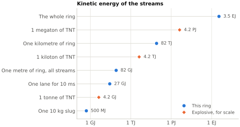

# Fault-domain and degraded-mode screen {#sec-app-fault-domains}

At the 500 km reference point, the moving stream stores about 82 GJ/m. That makes allowable fault energy the key quantity for architecture. If one chooses an allowable released energy $E_\mathrm{allow}$, the corresponding maximum isolated domain length is roughly

$$
L_\mathrm{iso} \approx \frac{E_\mathrm{allow}}{82~\mathrm{GJ/m}}.
$$ {#eq-isolation-length}

The result is brutal:

| Allowable released energy | Maximum isolation length | Stream transit time across that length at 10 km/s |
| ---: | ---: | ---: |
| 1 GJ | about 1.2 cm | about $1.2~\mu\mathrm{s}$ |
| 10 GJ | about 12 cm | about $12~\mu\mathrm{s}$ |
| 100 GJ | about 1.2 m | about 0.12 ms |
| 1 TJ | about 12 m | about 1.2 ms |
| 10 TJ | about 120 m | about 12 ms |
| 82 TJ | about 1 km | about 0.10 s |

@fig-fault-ladder sets the energies involved on one scale. The streams of the whole ring hold 3.5 EJ, the yield of about 840 megatons of TNT.

{#fig-fault-ladder}

So if tolerable fault release is only gigajoule-scale, the implied isolation lengths are absurdly short. Even if one accepts terajoule-scale domains, the required gates, dump paths, catchers, and bypass logic still have to operate on millisecond-to-tens-of-milliseconds timescales.

This is also where four-lane degraded mode becomes inseparable from containment. A lane dropout is not just a control nuisance. It is a fault-domain event that may force local cell isolation, rapid unloading of neighboring cells, and transfer of support demand to a wider region. The safe machine is therefore not merely a balanced nominal lattice. It is a balanced lattice plus an explicit fault-response architecture.

A simple worked screen shows how quickly the numbers become uncomfortable. In the 10 kg bookkeeping row, one lane carries about $5.4\times10^{3}$ slugs/s, so a 10 ms loss-of-guidance event sweeps about 54 slugs into the faulted region. That packet contains roughly 540 kg of moving mass and about 27 GJ of kinetic energy. If one simply loses one lane of a balanced cell for those same 10 ms without immediately unloading its mirrored partners, the missing ring-direction momentum-flux channel implies an uncompensated impulse of about $5.4\times10^{6}$ N s.

That is not yet a complete fault simulation, but it is enough to show the architecture's character. Even sub-second degraded events are already too energetic to be treated as routine control glitches. They are containment-and-reconfiguration events.
