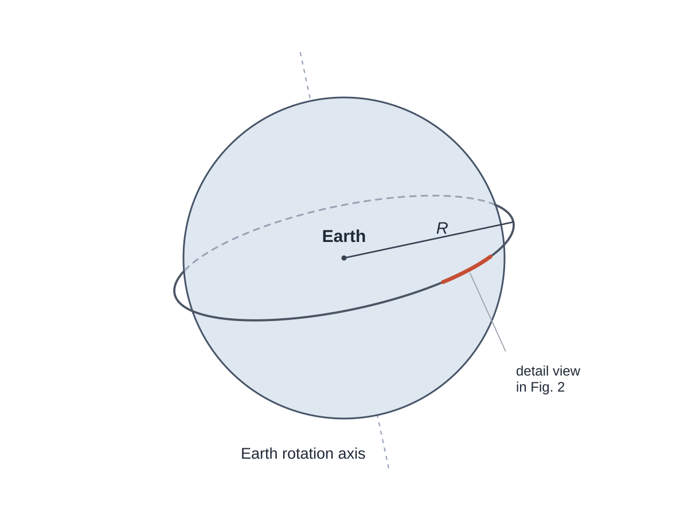
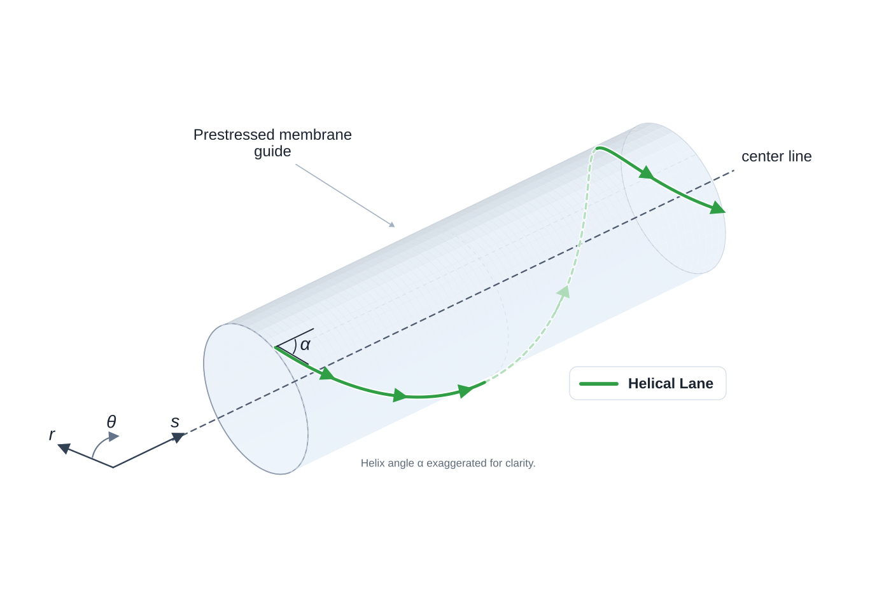

# Introduction {#sec-introduction}

The usual picture of an orbital ring [@birch1982orbital] is seductively simple: put a very fast moving mass around Earth, let curvature redirect momentum, and use the resulting reaction force to support a ring. But that picture leaves out two problems that are not secondary.

First, a fast moving mass stream does not provide passive self-centering by momentum redirection alone. If its path develops a curvature perturbation, the stream pushes further into that curvature. A simple straight lane or monolithic rotor therefore does not merely need support force. It needs a surrounding architecture that can resist and control a fundamentally anti-restoring tendency.

Second, even if one has enough moving momentum to loft a ring, that does not by itself provide a good mechanism for local structural stiffness or macro-scale alignment actuation. A ring around Earth has to survive construction tolerances, tether loads, payload impulses, gravity-gradient effects, and long-wavelength wobble. A concept that only says "there is a rotor going around the planet" has not yet explained how the machine is to be actuated, much less closed in feedback. An ideal system would be one where the same system that provides momentum for lift can be used for active control. 

This paper proposes a specific answer to both problems, in three parts.

1. **Helical slug streams at small $\alpha$ in a prestressed membrane guide shell.** The lanes are wrapped helically around a large tensile membrane tube. Their curvature creates outward pressure that inflates and prestresses the torus, turning moving momentum into a steady prestress channel and reaction substrate for an independently stabilized guide structure.
2. **A four-lane balanced cell for actuation along the ring.** The same helical geometry allows balanced groups of lanes whose momentum components cancel in steady operation but can be modulated through fixed spatial speed gradients to produce distributed tug fields: forces along the ring that add between counter-propagating lanes.
3. **Steering for shape.** The anti-restoring tendency is not fought with tug fields. It is removed by commanding each stream toward the mirror image of the structure's shape, so that the streams push every bump back instead of further out. The tug fields keep the jobs that lie along the ring, and gain two: keeping the whole ring centered on the planet, and meeting changes of load at the longest wavelengths, where steering has no room to work.

The claim envelope should be stated early. This paper does not claim closure of the full orbital-ring system. It claims that shallow helical momentum streams plus four-lane balanced cells define a plausible internal prestress and actuation primitive, and that the shape of a ring built from them can be held: every shape mode but one decays in linear models and in particle simulations of the ring, and the exception, uniform breathing, is stable if the slugs coast. That is closed-loop stability of a model, not of a machine. The models assume the ring's shape is measured and the guide force is commanded, and they leave out the tube's cross-section. Sensing, guide technology, thermal rejection, fault isolation, startup, deployment, and passive-mass closure remain explicit closure requirements.

The main fatal risks are also worth naming early: a shape instability that the steering law cannot hold in a real machine, unacceptable guide loss, impossible thermal rejection, unmanageable fault-domain energy, and a passive-mass closure loop that fails to converge.

To ground ourselves in the geometry of the problem, @fig-global-geometry gives the global geometry of the orbital ring concept and the local section chosen for closer inspection. 

{#fig-global-geometry}

The highlighted section of the orbital ring is displayed below in @fig-local-helical-lane and shows the corresponding local guide-shell geometry and a representative helical lane used throughout the paper.

{#fig-local-helical-lane}

## Paper structure {#sec-paper-structure}

The argument proceeds in eight steps. First, momentum redirection is established as the basic force mechanism. Second, the paper asks what one lane demands from its magnetic guide. Third, it shows why a straight high-speed lane does not self-center under perturbation. Fourth, it restates the force balance of the whole ring in terms of an effective tension, which says what holds the ring up, what a force along the ring does to it, and how fast its shape runs away if nothing intervenes. Fifth, it introduces the helical toroidal guide architecture as a way to turn the dominant steady curvature load into useful local prestress while making the remaining stability problem explicit. Sixth, it develops the four-lane balanced cell. Seventh, it derives distributed tug fields and works out what they can and cannot do to the ring. Eighth, it asks how the ring's shape can be held, finds that steering the streams does it where making them follow cannot, and tests the result in simulation. With that vocabulary in place it sets the paper against earlier work (@sec-prior-work). Only then does it turn to the harder practicality screens: macro lift throughput, fault-domain architecture, and closure.

## Coordinate convention {#sec-coordinate-convention}

To avoid ambiguity, the paper uses three local coordinates:

$$
s = \text{distance along the ring centerline around Earth}
$$

$$
\theta = \text{azimuth around the torus cross-section}
$$

$$
r = \text{local radial direction normal to the torus cross-section}
$$

In the local tube approximation, what other orbital-ring discussions often call "axial" means the $s$ direction, not the global Earth rotation axis. The helical lanes wind in $\theta$ while moving mainly along $s$.

## Reference bookkeeping case {#sec-reference-bookkeeping-case}

To keep later screens anchored, the paper uses one primary bookkeeping case unless otherwise stated.

| Quantity | Baseline value | Role in the paper |
| --- | --- | --- |
| Altitude | 500 km | Primary reference case |
| Ring-tangential speed $u$ | 10 km/s | Macro-lift and actuation screens |
| Torus radius $a$ | 50 m | Helix-curvature and shell screens |
| Net inward non-stream load $w_p$ | 10 kN/m | Notional support burden |
| Lane count | about 300 | Discrete-lane and balanced-cell screens |
| Prestress ratio $\Gamma$ | 10 baseline, 30 to 100 sensitivity | Lower-bound shell-prestress screen |

This is a bookkeeping case, not an optimized design. The 500 km altitude is only a convenient reference point (indeed, a better altitude might be considerably lower, perhaps even below 100 km to avoid orbital debris), and none of the other ring parameters in this test case are claimed to be optimal. The case is used to keep the paper's numbers internally consistent while making clear which burdens grow when the passive mass or prestress target rises.

Throughout the paper, $w_p$ should be read as the **net inward non-stream load per metre**. It includes whatever passive structural burden, tether load, payload load, drag-like disturbance, or other non-stream loading the moving stream must support. For the guide shell's own mass, that bookkeeping can include gravity minus the guide's small centrifugal relief from Earth co-rotation. At 500 km altitude that relief is small, but defining $w_p$ this way keeps the lift comparison unambiguous.

Because the local numbers are easy to underestimate, the corresponding whole-ring inventory is worth stating early:

| Reference-case inventory item | Approximate value |
| --- | ---: |
| Ring radius at 500 km altitude | about 6,871 km |
| Circumference | about 43,000 km |
| Passive mass for $w_p=10~\mathrm{kN/m}$ | about $5\times10^{10}$ kg |
| Moving-stream mass for $\lambda_\mathrm{stream}\approx 1600~\mathrm{kg/m}$ | about $6.9\times10^{10}$ kg |
| Total moving kinetic energy | about $3.5\times10^{18}$ J |
| Total slug count for 10 kg slugs | about $6.9\times10^{9}$ |

That table does not refute the architecture, but it does place the reference case firmly in the megastructure regime. Even the paper's nominally light reference point already involves tens of billions of kilograms of passive and moving inventory.
