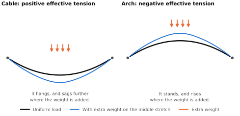
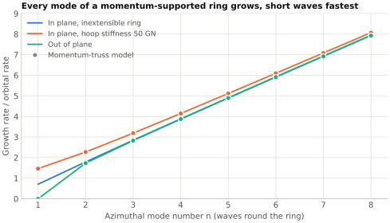

# Effective tension: the ring as an arch of momentum {#sec-effective-tension}

@sec-no-self-centering looked at one straight lane. This chapter puts the same physics in the form a structural engineer would use for the whole ring. That form answers three questions the rest of the paper depends on: what holds the ring up, what a force applied along the ring does to it, and how fast its shape runs away if nothing intervenes.

## The stress resultant of a stream {#sec-stress-resultant}

Cut the ring at one station and ask what crosses the cut.

The passive structure contributes its axial tension $N$.

Each lane contributes a flux of momentum. Slugs of line density $\lambda_j$ moving at $\pm u_j$ carry momentum $\pm\lambda_j u_j$ per unit length, and that momentum crosses the cut at $\pm u_j$. The flux is the product, $\lambda_j u_j^2 = \dot m_j u_j$, and it has the same sign for both travel directions. Momentum flux is even in velocity. Summed over all lanes,

$$
\Pi = \sum_j \dot m_j u_j .
$$ {#eq-momentum-flux}

By the momentum theorem, a flux of momentum through a cut loads whatever lies beyond the cut exactly as a compressive force of the same size would. So for the purpose of force balance the streams are a member in compression $\Pi$, and the ring as a whole carries the stress resultant

$$
T_\mathrm{eff} = N - \Pi ,
$$ {#eq-effective-tension}

counted positive in tension. This paper calls $T_\mathrm{eff}$ the effective tension, the name given in the mechanics of marine risers to the same kind of combination, of wall tension with the pressure of the contents [@sparks1984influence]. It is the ring-scale version of the dynamic-tension scale $T_\mathrm{eq}$ of @eq-dynamic-tension, with the sign and the structure's own tension included.

Because the lanes are balanced, the streams' momentum density sums to zero even though their momentum flux does not. A balanced set of streams therefore adds two things to the structure and nothing else: its mass $\lambda$, which rides with the structure in any sideways motion, and a compressive stress resultant $\Pi$. There is no net convective term.

For an element of ring with unit tangent $\hat t$, curvature $\kappa$, and load $q$ per unit length, force balance is

$$
\frac{d}{ds}\left(T_\mathrm{eff}\,\hat t\right) + q = 0 ,
$$ {#eq-ring-equilibrium}

which splits into a tangential and a normal part,

$$
\frac{dT_\mathrm{eff}}{ds} + q_t = 0, \qquad T_\mathrm{eff}\,\kappa + q_n = 0 ,
$$ {#eq-ring-equilibrium-parts}

with $q_n$ measured toward the center of curvature. These are the equations of a cable. Everything that follows comes from the sign of $T_\mathrm{eff}$.

For a uniform ring of radius $R$ the load is the weight of structure and streams together, $q_n = (m + \lambda) g_h$ with $m = w_p/g_h$ the passive mass per unit length, and $\kappa = 1/R$. The normal balance gives

$$
T_\mathrm{eff} = -(m + \lambda)\,g_h R .
$$ {#eq-ring-effective-tension}

With no tension in the structure, $\Pi = \lambda u^2 = (m+\lambda) g_h R$, which rearranges to $\lambda\left(u^2/R - g_h\right) = w_p$. That is the lift balance of @eq-lift-lane, summed over lanes.

A cable has $T_\mathrm{eff} > 0$ and hangs. A ring that supports itself has $T_\mathrm{eff} < 0$ and stands. It is an arch, and its compression member is made of momentum. In the reference case $\Pi$ is about 164 GN.

The same combined quantity appears wherever moving mass runs along a flexible path. A pipe conveying fluid at speed $U$ behaves as if its tension were reduced by $MU^2$ [@housner1952bending; @paidoussis2014fluid], and a moving belt or band-saw blade as if reduced by $\rho v^2$ [@wickert1990classical]. What is particular to an active-support structure is that the reduction is not a correction. It is larger than the tension, on purpose, because the difference is the lift. Birch's result that a tube carrying opposed streams is neutral in bending is the case between the two, $T_\mathrm{eff} = 0$ (@sec-prior-rings).

## Effective tension is the same all round a free ring {#sec-teff-uniform}

Suppose nothing pushes on the ring along its length. Then $q_t = 0$ and the tangential balance says $T_\mathrm{eff}$ is constant round the ring.

This constrains what any internal actuator can do. A tug field (@sec-tug-fields) changes the streams' momentum flux by some $\Delta\Pi(s)$ and puts the force $-d\Pi/ds$ on the structure. The structure can only react that force as a change in its own tension, so

$$
N(s) - \Pi(s) = \text{constant} .
$$ {#eq-tug-reaction}

Between a ramp where the streams speed up and the next ramp where they slow down, the two tugs pull the structure apart with exactly the force by which the faster streams push outward harder. The normal balance does not notice. A stationary speed field cannot move curvature lift from one part of the ring to another.

What a speed field does move is weight, in two ways. At fixed mass flux the line density is $\lambda = \dot m/u$, so slugs bunch where they are slow. A fractional speed change $\delta u/u$ changes the local stream weight by

$$
\delta w = -\lambda g_h \frac{\delta u}{u} .
$$ {#eq-weight-shift}

The structure's weight moves as well. Where the streams are slower the structure's tension is lower, by @eq-tug-reaction, so the structure is less stretched there and there is more of it per metre of ring. With an axial stiffness $EA$ its weight changes by $-m g_h\,\delta N/EA$, and $\delta N = \Pi\,\delta u/u$. The two add:

$$
\delta w = -\chi\,\lambda g_h \frac{\delta u}{u}, \qquad \chi = 1 + \frac{m u^2}{EA} .
$$ {#eq-weight-shift-total}

For a structure too stiff to stretch, $\chi = 1$ and only the streams' weight moves. The reference structure has $EA = 50$ GN, the stiffness of the 0.16 m² of carbon composite that @sec-tug-hoop sizes it with. Then $\chi = 3.4$, and the structure's weight moves more than the streams' does.

@fig-speed-ripple shows these statements on a numerical model of the whole ring (@sec-momentum-truss). A stationary speed ripple of one part in ten thousand, eight waves round the ring, changes the momentum flux by 16 MN peak. The tension in the structure follows it to within 3%, so the effective tension stays flat to that accuracy. The ring's shape changes by about 20 m. With the stream weight held uniform it still changes by 14 m, which is the structure's share, and with a structure too stiff to stretch as well it does not change at all.

{#fig-speed-ripple}

For a ripple $u = u_0\left(1 + \epsilon\cos n\vartheta\right)$ with $n$ waves round the ring, $\vartheta$ being the angle round the planet, on a ring whose hoop is stiff, the first-order response is a radial displacement and a tension ripple of amplitudes

$$
W = -\frac{\lambda}{m+\lambda}\,\frac{R}{n^2}\,\epsilon , \qquad
N_1 = \left(\Pi - \frac{\lambda g_h R}{n^2}\right)\epsilon .
$$ {#eq-speed-ripple}

On a ring that stretches, $W$ is larger by the factor $\chi$, a little less at the longest wavelengths, where the hoop's own give lowers the tension ripple.

Two things in @eq-speed-ripple matter later. The tension ripple is essentially the whole of $\epsilon\Pi$, so the structure has to be sized to carry whatever speed modulation is commanded: one part in a thousand is 164 MN. And $W$ is negative. Where the ring has been made lighter it moves inward, not outward. That is the next consequence.

## The shape is a funicular, and it responds backward {#sec-funicular}

For a load disturbance $\delta q$ of wavelength short compared with $R$, the normal balance for the sideways displacement $y$ is $T_\mathrm{eff}\,y'' + \delta q = 0$. For a sinusoid of wavenumber $k$,

$$
y = \frac{\delta q}{T_\mathrm{eff}\,k^2} = -\frac{\delta q}{\Pi k^2} \qquad (N = 0) .
$$ {#eq-funicular}

A cable moves the way it is pushed. This ring moves the other way. Extra weight on one stretch makes that stretch rise, because the thrust line of an arch has to curve more sharply under a heavier load [@heyman1995stone]. The same expression holds for the whole ring with $k = n/R$ for $n$ waves round the circumference, to within about 10% at the longest wavelengths. @fig-cable-arch shows the two cases side by side.

{#fig-cable-arch}

The size of the response is modest. A load mismatch of 1% of the supported weight, 100 N/m, displaces the reference ring by about 0.15 m at a wavelength of 100 km, 15 m at 1000 km, and 7 km for two waves round the ring. The ring does not need large forces to hold a nearly circular shape. Static authority is not the difficulty.

The difficulty is that this equilibrium is the top of a hill.

## Every shape mode grows {#sec-shape-modes-grow}

The heading needs three qualifications, which this section supplies: waves shorter than about 120 m are held by the tube's bending stiffness, a tilt of the whole ring is neutral, and uniform breathing is a stable oscillation if the slugs coast. Every other shape mode grows.

Add inertia to the normal balance. The streams' mass rides with the structure, so the mass per unit length is $m + \lambda$, and for wavelengths short compared with $R$

$$
(m+\lambda)\,\ddot y = -T_\mathrm{eff}\,k^2\,y = +\Pi k^2 y .
$$

Every wavelength grows exponentially, at the rate

$$
\sigma = k\sqrt{\frac{\Pi}{m+\lambda}} = k u\sqrt{\frac{\lambda}{m+\lambda}} .
$$ {#eq-local-growth}

This is @eq-anti-restoring with the structure's inertia included. In the reference case the square root is 0.76.

On the scale of the whole ring three more things enter: the ring's curvature, the fall-off of gravity with height, and what the slugs do along the track.

The last is a choice. Suppose first that the stators hold every slug at a fixed speed and that the hoop does not stretch. In a central field with orbital rate $\Omega = \sqrt{g_h/R}$, mode $n$ then grows at

$$
\sigma_n^2 = \Omega^2\,\frac{n^4}{n^2+1} \quad\text{(in the ring's plane)}, \qquad
\sigma_n^2 = \Omega^2\left(n^2 - 1\right) \quad\text{(out of plane)} .
$$ {#eq-ring-growth}

The in-plane $n=1$ mode is the ring drifting off center as a whole. Its rate, $\Omega/\sqrt 2$, is that of the classical instability of a solid ring round a planet [@maxwell1859stability]. The out-of-plane $n=1$ mode is a tilt of the whole ring, which is just a different orbital plane, and it is neutral. For large $n$ both expressions tend to $\sigma = n\Omega$, which is @eq-local-growth again.

Now suppose the slugs coast, pushed sideways by the guide and not at all along the track. Then they behave like anything else in orbit. A stretch of stream that is carried outward slows down, and the slugs bunch there. Out of the ring's plane nothing changes. In the plane every mode grows a little more slowly: for large $n$ the rate tends to $\sigma_n^2 = \Omega^2\left(n^2 - 1.2\right)$, against $\Omega^2\left(n^2 - 1\right)$ with speed held.

One mode changes completely. It is $n = 0$, the ring growing or shrinking uniformly. With the streams held at speed, their outward push falls off as $1/r$ while the weight it carries falls off as $1/r^2$, so the ring runs away outward or inward unless the hoop holds it. A coasting stream conserves angular momentum instead. It slows as the ring grows, its push falls off as $1/r^3$, and the mode becomes a stable oscillation, as it is for any orbit.

This paper takes coasting as the baseline. In steady state the stators then have nothing to do along the track except make up losses.

| Disturbance | Growth rate | Time to grow by a factor $e$ |
| --- | ---: | ---: |
| 1 km wavelength | 48 s⁻¹ | 21 ms |
| 10 km wavelength | 4.8 s⁻¹ | 0.2 s |
| 100 km wavelength | 0.48 s⁻¹ | 2 s |
| 1000 km wavelength | 0.048 s⁻¹ | 21 s |
| Three waves round the ring, in plane | 0.0033 s⁻¹ | 5 min |
| Two waves round the ring, in plane | 0.0022 s⁻¹ | 8 min |
| Whole ring off center | 0.0010 s⁻¹ | 17 min |
| Uniform growth or shrinkage | none | oscillates, period 83 min |

The first four rows are @eq-local-growth. It holds down to a wavelength of a few hundred metres. Below about 120 m the bending stiffness of a tube this size outweighs the streams' push, and waves that short do not grow. The last four rows are for coasting slugs and a structure with hoop stiffness $EA = 50$ GN. Hoop stiffness matters for the lowest modes. The measure of it is $EA/(m g_h R)$, which sets the hoop's stiffness against the structure's weight per unit length times the ring's radius, and at 50 GN that is only 0.73. Such a ring is soft in the hoop direction. If the hoop could not stretch at all, the off-center mode would take 26 minutes to grow by a factor $e$, not 17.

These choices matter for the first few modes and for nothing else. In units of the orbital rate, the growth rates are:

| Case | $n = 1$ | $n = 2$ | $n = 3$ | $n = 4$ |
| --- | ---: | ---: | ---: | ---: |
| Slugs coast, hoop stiffness 50 GN | 0.90 | 1.94 | 2.96 | 3.97 |
| Slugs coast, stiff hoop | 0.57 | 1.72 | 2.81 | 3.85 |
| Speed held, stiff hoop | 0.71 | 1.79 | 2.85 | 3.88 |
| Out of plane | 0 | 1.73 | 2.83 | 3.87 |

@fig-ring-modes shows the baseline case and the out-of-plane modes against mode number.

{#fig-ring-modes}

Three remarks put these numbers in their place.

First, they are slow at the scale of the ring and fast at the scale of a lane, and it is one mechanism at both scales. Nothing separates a "local stability problem" from a "global" one except the wavelength.

Second, the helical prestress of @sec-helical-shell does not enter. Prestress acts round the tube. These modes bend the tube's axis.

Third, every rate here assumes that the streams follow the structure's shape exactly. That is what a stiff guide does, and it is a design choice, not a law. @sec-collective-stability makes a different choice.

## The numerical models {#sec-momentum-truss}

Three models stand behind the whole-ring results. Each was built separately and each checks the others.

The first, in `analysis/truss.py`, is a pin-jointed frame in which every member has an elastic tension and, in addition, carries a balanced pair of streams with a prescribed momentum flux and line density. By the momentum theorem the streams load the joints exactly as a compression $\Pi$ along the member would, so each member's stress resultant is $N - \Pi$ and the stream mass is lumped with the joints. The model finds static equilibria by Newton iteration, whether or not they are stable, and the growth rates of small motions about them. Because it prescribes the streams' speed, it describes streams whose speed is held.

The second, in `analysis/ring_modes.py`, gives each stream its own radial position, speed and spacing, so that slugs can coast, trade speed for height, and bunch. It is linear and treats one mode at a time.

The third, in `analysis/ring_particles.py`, is a simulation of the whole ring: a ring of masses and hoop springs for the structure, several hundred point masses in each direction for the streams, all in the planet's inverse-square field, with the guide pushing each slug at right angles to the structure. The slugs and the structure move under the full equations of motion. Only the guide's geometry is taken to first order in the structure's displacement, so the simulation is a test of the other models for small motions, not a study of large ones. Because short waves grow fastest, it keeps only the long ones; short waves have a simulation of their own in @sec-look-ahead.

| Check | Reference | Model |
| ---------------------------------------- | ----------------------------: | --------------------------------: |
| Regular polygon is in equilibrium | residual 0 | truss: $2\times10^{-12}$ of the weight |
| In-plane growth, speed held, stiff hoop: $\sigma_n^2/\Omega^2$ for $n = 1, 2, 3$ | @eq-ring-growth: 0.500, 3.200, 8.100 | truss: 0.500, 3.201, 8.100; linear: 0.500, 3.201, 8.101 |
| In-plane growth, coasting, stiff hoop: $\sigma_n^2/\Omega^2$ | cubic: 0.3305, 2.973, 7.869 | linear: 0.3305, 2.973, 7.869 |
| In-plane growth, coasting, $EA = 50$ GN: $\sigma_n/\Omega$ | linear: 0.9016, 1.9406, 2.9589 | particles: 0.9017, 1.9397, 2.9576 |
| Out-of-plane growth: $\sigma_n^2/\Omega^2$ | @eq-ring-growth: 0, 3, 8 | truss: 0.000, 2.999, 7.996 |
| Speed ripple, $n = 8$, $\epsilon = 10^{-4}$, stiff hoop: radial amplitude | @eq-speed-ripple: −6.23 m | truss: −6.24 m |
| Same ripple, stiff hoop: tension ripple over flux ripple | @eq-speed-ripple: 0.991 | truss: 0.991 |
| Same ripple, stiff hoop, stream weight held uniform: radial amplitude | 0 | truss: −0.01 m |
| Same ripple, $EA = 50$ GN: radial amplitude | $\chi$ times @eq-speed-ripple: −21.0 m | truss: −20.5 m |
| Same ripple, $EA = 50$ GN, stream weight held uniform | $(\chi - 1)/\chi$ of the truss value: −14.4 m | truss: −14.4 m |

The cubic in the third row is the dispersion relation of the linear model for a stiff hoop, worked out by hand; it is written out in `analysis/ring_modes.py`. The tests in `tests/test_ring.py` and `tests/test_ring_modes.py` repeat these comparisons on every change to the repository.
