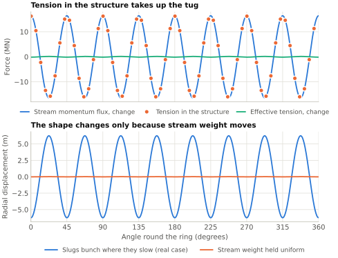

# Effective tension: the ring as an arch of momentum {#sec-effective-tension}

@sec-no-self-centering looked at one straight lane. This chapter puts the same physics in the form a structural engineer would use for the whole ring. That form answers three questions the rest of the paper depends on: what holds the ring up, what a force applied along the ring does to it, and how fast its shape runs away if nothing intervenes.

## The stress resultant of a stream {#sec-stress-resultant}

Cut the ring at one station and ask what crosses the cut.

The passive structure contributes its axial tension $N$.

Each lane contributes a flux of momentum. Slugs of line density $\lambda_j$ moving at $\pm u_j$ carry momentum $\pm\lambda_j u_j$ per unit length, and that momentum crosses the cut at $\pm u_j$. The flux is the product, $\lambda_j u_j^2 = \dot m_j u_j$, and it has the same sign for both travel directions. Momentum flux is even in velocity. Summed over all lanes,

$$
\Pi = \sum_j \dot m_j u_j .
$$ {#eq-momentum-flux}

By the momentum theorem, a flux of momentum through a cut loads whatever lies beyond the cut exactly as a compressive force of the same size would. So for the purpose of force balance the streams are a member in compression $\Pi$, and the ring as a whole carries the stress resultant

$$
T_\mathrm{eff} = N - \Pi ,
$$ {#eq-effective-tension}

counted positive in tension. This paper calls $T_\mathrm{eff}$ the effective tension. It is the ring-scale version of the dynamic-tension scale $T_\mathrm{eq}$ of @eq-dynamic-tension, with the sign and the structure's own tension included.

Because the lanes are balanced, the streams' momentum density sums to zero even though their momentum flux does not. A balanced set of streams therefore adds two things to the structure and nothing else: its mass $\lambda$, which rides with the structure in any sideways motion, and a compressive stress resultant $\Pi$. There is no net convective term.

For an element of ring with unit tangent $\hat t$, curvature $\kappa$, and load $q$ per unit length, force balance is

$$
\frac{d}{ds}\left(T_\mathrm{eff}\,\hat t\right) + q = 0 ,
$$ {#eq-ring-equilibrium}

which splits into a tangential and a normal part,

$$
\frac{dT_\mathrm{eff}}{ds} + q_t = 0, \qquad T_\mathrm{eff}\,\kappa + q_n = 0 ,
$$ {#eq-ring-equilibrium-parts}

with $q_n$ measured toward the centre of curvature. These are the equations of a cable. Everything that follows comes from the sign of $T_\mathrm{eff}$.

For a uniform ring of radius $R$ the load is the weight of structure and streams together, $q_n = (m + \lambda) g_h$ with $m = w_p/g_h$ the passive mass per unit length, and $\kappa = 1/R$. The normal balance gives

$$
T_\mathrm{eff} = -(m + \lambda)\,g_h R .
$$ {#eq-ring-effective-tension}

With no tension in the structure, $\Pi = \lambda u^2 = (m+\lambda) g_h R$, which rearranges to $\lambda\left(u^2/R - g_h\right) = w_p$. That is the lift balance of @eq-lift-lane, summed over lanes.

A cable has $T_\mathrm{eff} > 0$ and hangs. A ring that supports itself has $T_\mathrm{eff} < 0$ and stands. It is an arch, and its compression member is made of momentum. In the reference case $\Pi$ is about 164 GN.

The same combined quantity appears wherever moving mass runs along a flexible path. A pipe conveying fluid at speed $U$ behaves as if its tension were reduced by $MU^2$, and a moving belt or band-saw blade as if reduced by $\rho v^2$. What is particular to an active-support structure is that the reduction is not a correction. It is larger than the tension, on purpose, because the difference is the lift.

## Effective tension is the same all round a free ring {#sec-teff-uniform}

Suppose nothing pushes on the ring along its length. Then $q_t = 0$ and the tangential balance says $T_\mathrm{eff}$ is constant round the ring.

This constrains what any internal actuator can do. A tug field (@sec-tug-fields) changes the streams' momentum flux by some $\Delta\Pi(s)$ and puts the force $-d\Pi/ds$ on the structure. The structure can only react that force as a change in its own tension, so

$$
N(s) - \Pi(s) = \text{constant} .
$$ {#eq-tug-reaction}

Between a ramp where the streams speed up and the next ramp where they slow down, the two tugs pull the structure apart with exactly the force by which the faster streams push outward harder. The normal balance does not notice. A stationary speed field cannot move curvature lift from one part of the ring to another.

What a speed field does move is weight. At fixed mass flux the line density is $\lambda = \dot m/u$, so slugs bunch where they are slow. A fractional speed change $\delta u/u$ changes the local stream weight by

$$
\delta w = -\lambda g_h \frac{\delta u}{u} .
$$ {#eq-weight-shift}

@fig-speed-ripple shows both statements on a numerical model of the whole ring (@sec-momentum-truss). A stationary speed ripple of one part in ten thousand, eight waves round the ring, changes the momentum flux by 16 MN peak. The tension in the structure follows it to within one per cent, and the effective tension stays flat. The ring's shape changes by about 6 m, and that change disappears entirely when the calculation is repeated with the stream weight held uniform.

{#fig-speed-ripple}

For a ripple $u = u_0\left(1 + \epsilon\cos n\vartheta\right)$ with $n$ waves round the ring, $\vartheta$ being the angle round the planet, on a ring whose hoop is stiff, the first-order response is a radial displacement and a tension ripple of amplitudes

$$
W = -\frac{\lambda}{m+\lambda}\,\frac{R}{n^2}\,\epsilon , \qquad
N_1 = \left(\Pi - \frac{\lambda g_h R}{n^2}\right)\epsilon .
$$ {#eq-speed-ripple}

Two things in @eq-speed-ripple matter later. The tension ripple is essentially the whole of $\epsilon\Pi$, so the structure has to be sized to carry whatever speed modulation is commanded: one part in a thousand is 164 MN. And $W$ is negative. Where the ring has been made lighter it moves inward, not outward. That is the next consequence.

## The shape is a funicular, and it responds backwards {#sec-funicular}

For a load disturbance $q'$ of wavelength short compared with $R$, the normal balance for the sideways displacement $y$ is $T_\mathrm{eff}\,y'' + q' = 0$. For a sinusoid of wavenumber $k$,

$$
y = \frac{q'}{T_\mathrm{eff}\,k^2} = -\frac{q'}{\Pi k^2} \qquad (N = 0) .
$$ {#eq-funicular}

A cable moves the way it is pushed. This ring moves the other way. Extra weight on one stretch makes that stretch rise, because the thrust line of an arch has to curve more sharply under a heavier load. The same expression holds for the whole ring with $k = n/R$ for $n$ waves round the circumference.

The size of the response is modest. A load mismatch of one per cent of the supported weight, 100 N/m, displaces the reference ring by about 0.15 m at a wavelength of 100 km, 15 m at 1000 km, and 7 km for two waves round the ring. The ring does not need large forces to hold a nearly circular shape. Static authority is not the difficulty.

The difficulty is that this equilibrium is the top of a hill.

## Every shape mode grows {#sec-shape-modes-grow}

Add inertia to the normal balance. The streams' mass rides with the structure, so the mass per unit length is $m + \lambda$, and for wavelengths short compared with $R$

$$
(m+\lambda)\,\ddot y = -T_\mathrm{eff}\,k^2\,y = +\Pi k^2 y .
$$

Every wavelength grows exponentially, at the rate

$$
\sigma = k\sqrt{\frac{\Pi}{m+\lambda}} = k u\sqrt{\frac{\lambda}{m+\lambda}} .
$$ {#eq-local-growth}

This is @eq-anti-restoring with the structure's inertia included. In the reference case the square root is 0.76.

On the scale of the whole ring, curvature and the fall-off of gravity with height both enter. For a ring whose hoop does not stretch, in a central field with orbital rate $\Omega = \sqrt{g_h/R}$, mode $n$ grows at

$$
\sigma_n^2 = \Omega^2\,\frac{n^4}{n^2+1} \quad\text{(in the ring's plane)}, \qquad
\sigma_n^2 = \Omega^2\left(n^2 - 1\right) \quad\text{(out of plane)} .
$$ {#eq-ring-growth}

The in-plane $n=1$ mode is the ring drifting off centre as a whole. Its rate, $\Omega/\sqrt 2$, is the classical result for a solid ring round a planet. The out-of-plane $n=1$ mode is a tilt of the whole ring, which is just a different orbital plane, and it is neutral. For large $n$ both expressions tend to $\sigma = n\Omega$, which is @eq-local-growth again.

| Disturbance | Growth rate | Time to grow by a factor $e$ |
| --- | ---: | ---: |
| 100 m wavelength | 480 s⁻¹ | 2 ms |
| 10 km wavelength | 4.8 s⁻¹ | 0.2 s |
| 100 km wavelength | 0.48 s⁻¹ | 2 s |
| 1000 km wavelength | 0.048 s⁻¹ | 21 s |
| Two waves round the ring, in plane | 0.0020 s⁻¹ | 8 min |
| Whole ring off centre | 0.00078 s⁻¹ | 21 min |

These rates assume a hoop that does not stretch. The ring's hoop stiffness is better compared with gravity than with its own weight: the measure is $EA/\left((m+\lambda)R^2\Omega^2\right)$, and for a structure with $EA = 50$ GN it is only 0.31. Such a ring is soft in the hoop direction, and its lowest modes grow faster. The off-centre mode then takes 10 minutes to grow by a factor $e$, not 21. @fig-ring-modes shows the low modes for both cases.

{#fig-ring-modes}

Three remarks put these numbers in their place.

First, they are slow at the scale of the ring and fast at the scale of a lane, and it is one mechanism at both scales. Nothing separates a "local stability problem" from a "global" one except the wavelength.

Second, the helical prestress of @sec-helical-shell does not enter. Prestress acts round the tube. These modes bend the tube's axis.

Third, every rate here assumes that the streams follow the structure's shape exactly. That is what a stiff guide does, and it is a design choice, not a law.

## The numerical model {#sec-momentum-truss}

The whole-ring results above were checked on a model built for the purpose, in `analysis/truss.py`. It is a pin-jointed frame in which every member has an elastic tension and, in addition, carries a balanced pair of streams with a prescribed momentum flux and line density. By the momentum theorem the streams load the joints exactly as a compression $\Pi$ along the member would, so each member's stress resultant is $N - \Pi$ and the stream mass is lumped with the joints. The model finds static equilibria by Newton iteration, whether or not they are stable, and the growth rates of small motions about them.

| Check | Closed form | Model |
| --- | ---: | ---: |
| Regular polygon is in equilibrium | residual 0 | $2\times10^{-12}$ of the weight |
| In-plane growth, $n = 1, 2, 3$, stiff hoop: $\sigma_n^2/\Omega^2$ | 0.500, 3.200, 8.100 | 0.500, 3.201, 8.101 |
| In-plane growth, $n = 1, 2, 3$, $EA = 50$ GN | 2.147, 5.164, 10.170 | 2.147, 5.164, 10.169 |
| Out-of-plane growth, $n = 1, 2, 3$ | 0, 3, 8 | 0.000, 2.999, 7.996 |
| Speed ripple, $n = 8$, $\epsilon = 10^{-4}$: radial amplitude | −6.23 m | −6.24 m |
| Same ripple: tension ripple over flux ripple | 0.991 | 0.991 |
| Same ripple, stream weight held uniform: radial amplitude | 0 | −0.01 m |

The tests in `tests/test_ring.py` repeat these comparisons on every change to the repository.
