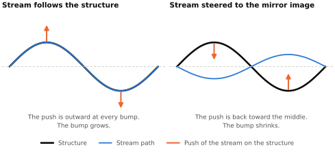
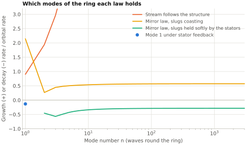
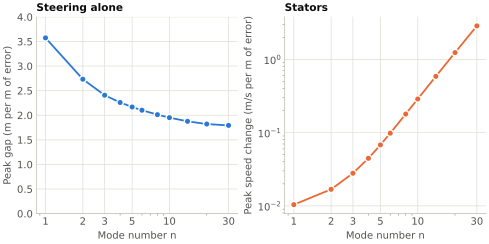
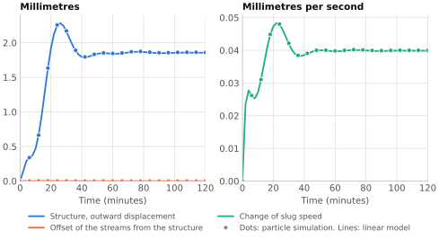

# Holding the shape: steering the streams {#sec-collective-stability}

@sec-effective-tension showed that every shape mode of the ring grows if the streams follow the structure. @sec-tug-fields showed that tug fields are the wrong tool for stopping it. This chapter asks what the right tool is.

The answer is to stop making the streams follow the structure. If each stream is steered toward the mirror image of the structure's shape, the push of the streams on the structure changes sign, and the ring becomes a string in tension instead of an arch in compression. The rest of the chapter works out what that takes: how the motion is damped, how much room the guide needs, what happens under steady load, and what changes on the scale of the whole ring, where the stators turn out to be needed after all, and what it takes to carry loads that change, where for the longest modes the streams go back to following and the stators hold the shape.

## Stream and structure as two things {#sec-two-body-model}

So far the stream has been treated as part of the structure. To ask what a guide should do, the two have to be separated.

Take a straight run of ring, short compared with $R$, and one sideways direction. The structure has displacement $y(s,t)$ and mass $m$ per unit length. There are two streams, one for each direction of travel, each standing for all the lanes that run that way. Stream $j$ has its own centerline $\eta_j(s,t)$. A slug is a free body apart from the force the guide puts on it, so with $f_j$ the guide force per unit length on stream $j$,

$$
\lambda_j D_j^2 \eta_j = f_j , \qquad D_j = \frac{\partial}{\partial t} \pm u\,\frac{\partial}{\partial s} ,
$$ {#eq-stream-motion}

where $D_j$ follows the slugs, and the structure feels the reaction,

$$
m\,\ddot y = -\sum_j f_j .
$$ {#eq-structure-motion}

The guide is whatever sets $f_j$. Everything in this chapter is a choice of that rule.

One property of a balanced pair of streams is used throughout. If both are given the same path $\eta$, the sum of their accelerations is $\lambda\left(\ddot\eta + u^2\eta''\right)$. The cross terms $\pm 2u\,\dot\eta'$ cancel, exactly as momentum density canceled in @sec-stress-resultant.

## A guide that follows cannot hold the shape {#sec-following-fails}

A stiff guide holds each stream on the structure, $\eta_j = y$. Adding the two equations gives $(m+\lambda)\ddot y = -\Pi y''$, which is @eq-local-growth: every wavelength grows at $0.76\,k u$.

A softer guide does not help in the way one might hope. Suppose the guide is a lightly damped spring between stream and structure, stiff enough that a slug displaced in it would oscillate at 10 Hz. A slug travels 1 km in one such oscillation. Waves much shorter than that go by too fast for the stream to respond, so the stream flies straight, the structure feels only a spring to a straight line, and those waves are stable. Waves longer than about 400 m are not. The stream follows them, and their growth rate climbs back to that of the stiff guide. A softer spring moves the boundary to longer waves and leaves everything beyond it unstable. More damping makes matters worse: with a damping ratio of a half or more the guide drags the stream along with the structure at every wavelength, and every wavelength grows.

The top panel of @fig-guide-laws shows the stiff guide and the lightly damped spring. Whatever its stiffness, a guide that pulls the stream toward the structure makes the long waves grow.

{#fig-guide-laws}

## The mirror law {#sec-mirror-law}

A stream pushes on the outside of its own bends. If its bends are the structure's bends, it pushes every bump of the structure further out. That is all the instability is.

So give the stream different bends. Command each stream to fly the mirror image of the structure's shape, scaled by a gain $c_m$:

$$
\eta^* = -c_m\,y .
$$ {#eq-mirror-command}

Where the structure bulges one way, the stream now curves the other way and pushes the bulge back (@fig-mirror-sketch).

{#fig-mirror-sketch}

If the guide holds the streams on that path, @eq-stream-motion and @eq-structure-motion give

$$
\left(m - c_m\lambda\right)\ddot y = c_m\,\Pi\,y'' .
$$ {#eq-mirror-string}

This is the equation of a string in tension. The tension is $c_m\Pi$ and is made of the same momentum flux that made the arch, with its sign reversed. The mass is $m - c_m\lambda$, because the stream's reaction now adds inertia with the opposite sign, and that sets a limit: $c_m$ must be less than $m/\lambda$, which is 0.72 in the reference case. With $c_m = 0.5$ the tension is 82 GN, the effective mass is 370 kg/m, and waves travel along the structure at 15 km/s.

The guide that does this has to be a force actuator. Its rule is

$$
f_j = \lambda_j D_j^2 \eta^* - K\left(\eta_j - \eta^*\right) - C\,D_j\left(\eta_j - \eta^*\right) :
$$ {#eq-guide-law}

the force that makes the stream fly the commanded path, plus a spring and a damper that bring it back if it strays. The first term matters. Without it the correction always lags, the lag feeds the motion, and the guide would have to be faster than every wave it steers. With it, a guide with a modest hold on its path is enough. A passive guide, whose force is set by its gap, is the spring guide of @sec-following-fails and cannot be used this way. The mirror law needs a guide whose force is commanded.

## Damping by looking ahead {#sec-look-ahead}

@eq-mirror-string has no damping, and any delay in the loop turns that into slow growth. The cure is to steer each stream toward the mirror image of the shape it is about to meet, a distance $d_a$ ahead of it in its own direction of travel. The launch loop uses the stream's known speed in the same way, passing measurements downstream to meet the piece of ribbon they describe [@lofstrom1985launch]. For a wave of wavenumber $k$ the structure then obeys

$$
\left(m - c_m\lambda\cos k d_a\right)\ddot y + 2 c_m\lambda\,u k \sin(k d_a)\,\dot y + c_m\Pi k^2\cos(k d_a)\,y = 0 .
$$ {#eq-mirror-damped}

The middle term is damping, and its sign is the sign of $d_a$. Looking ahead damps the wave. A control delay does the opposite. To outrun a delay $\tau$ the look-ahead has to exceed

$$
d_a > u\tau\,\frac{m}{2\left(m - c_m\lambda\right)} ,
$$ {#eq-look-ahead-floor}

which is 3.6 m for $c_m = 0.5$ and a loop with a bandwidth of 1 kHz. The energy of the wave leaves through the steering actuators, which do work whenever they change the gap under load.

The reference design looks ahead by a fixed phase of the wave, $k d_a = 0.3$ rad, about a twentieth of a wavelength, and never by less than 20 m. The damping ratio of the structure's wave is then

$$
\zeta = \sin(k d_a)\sqrt{\frac{c_m\lambda}{\left(m - c_m\lambda\cos k d_a\right)\cos k d_a}} = 0.43
$$ {#eq-mirror-damping-ratio}

at every wavelength beyond a kilometre or so, where neither the 20 m floor nor the structure's own stiffness matters.

Short waves are left alone. Below a cut-off wavelength of 300 m the commanded path ignores the structure's shape, so the streams fly a smooth path through its small wrinkles. Those are held by the structure's own bending stiffness, which outweighs the push of streams that follow it below about 120 m and has nothing to outweigh once they stop following. A little structural damping is needed there. With a loss factor of 0.1% the reference design is stable at every wavelength from 3 m to 10,000 km (lower panel of @fig-guide-laws). With none, a few narrow bands between 3 and 24 m grow at up to 0.005 per second.

The same model was run as a particle simulation: 5 km of structure as 250 masses, a thousand slugs as separate particles, each steered by @eq-guide-law with a commanded path that passes through a filter standing for sensing and actuation delay. @fig-local-runs shows one wave under a spring guide and under the mirror law. The spring guide's growth matches the predicted rate to a part in a thousand, and the mirror law's decay to 6%.

{#fig-local-runs}

## What the law asks for {#sec-mirror-limits}

**Room in the guide.** Under the mirror law the stream sits away from the structure by about $(1 + c_m)$ times the structure's displacement. A load $q$ per unit length at wavenumber $k$ displaces the string by $q/(c_m\Pi k^2)$, so if the guide allows an offset of at most $\delta_\mathrm{max}$, the largest load it can hold is

$$
q_\mathrm{max} = \frac{c_m}{1 + c_m}\,\Pi k^2\,\delta_\mathrm{max} .
$$ {#eq-stroke-capacity}

With 20 mm of room that is 430 N/m at a wavelength of 10 km, which is 4% of the supported weight. It is 4.3 N/m at 100 km and 0.043 N/m at 1000 km. Look-ahead takes a few percent off these figures. The capacity falls as the square of the wavelength. The particle simulation confirms @eq-stroke-capacity and shows what lies beyond it: once the offset saturates the stream is following the structure again, and the wave runs away.

**A measurement of shape.** The command is built from the structure's displacement from where it should be, over wavelengths from 300 m to the size of the ring. Gap sensors cannot supply that. It needs an alignment reference, optical or inertial, that this paper does not design.

**A force actuator.** The guide force has to be commanded, as above, and the path command must not lag by more than @eq-look-ahead-floor allows.

## Steady loads and the set point {#sec-set-point}

@eq-stroke-capacity looks fatal for long waves. A steady load mismatch of 1% of the supported weight would use up 20 mm of room at any wavelength beyond 20 km.

But a steady load does not have to be held with an offset. @sec-funicular found the position where the streams carry a load with no offset at all: the funicular position, in which the structure has moved backward by $q/(\Pi k^2)$. It is an unstable equilibrium, and the mirror law is exactly what is needed to hold the ring at one.

To make it go there, add a set point $z$ to the commanded path, $\eta^* = z - c_m y$, and let the set point drift in the direction of the offset it sees:

$$
\dot z = \epsilon_z\,k u\left(\bar\eta - y\right) ,
$$ {#eq-set-point}

where $\bar\eta$ is the mean of the two streams' positions. The feedback is positive, which looks wrong and is right. The idea is that of zero-power magnetic levitation, in which the suspension is let drift to the position where its permanent magnets carry the load and its coils carry none [@morishita1988zero].

That centers the streams on average. Look-ahead still commands the two streams to opposite sides of the structure, by 15% of its displacement each, and at long wavelengths that alone would fill the guide. A second set point $z_d$, added to one stream's path and subtracted from the other's, removes it. It is driven the ordinary way round, against the difference it sees:

$$
\dot z_d = -\epsilon_z\,k u\,\frac{\eta_+ - \eta_-}{2} .
$$ {#eq-set-point-difference}

With $\epsilon_z = 0.03$ both set points settle within about a minute at a wavelength of 100 km, the design stays stable at every wavelength, and under a steady load every stream ends in the middle of its guide. Only waves longer than 1 km are given set points. The rate has a margin of about two before the lowest ring modes go unstable.

The response to a sudden load has a characteristic shape (@fig-sudden-load). The structure first gives way in the direction of the push, as a string would. Then, as the set points adapt, it comes back through where it started and settles on the far side, at the funicular position, with the streams back in the middle of the guide.

{#fig-sudden-load}

So room in the guide is spent only on changes faster than the set points can follow. A steady load costs shape and no room: 0.15 m at 100 km for a 1% mismatch, 15 m at 1000 km. Where that much shape error is unwelcome, which means at the longest wavelengths, the load should be canceled at its source by the weight trim of @sec-tug-weight.

## The whole ring {#sec-ring-control}

The local model leaves out the ring's curvature, the change of gravity with height, and the steady lift force. On the whole ring the lift force matters in a new way. A guide pushes at right angles to itself, not to the slug's path. When the mirror law tilts the path of the stream against the structure, the lift force acquires a component along the slugs' motion, speeds them up and slows them down, and they bunch.

The linear model of @sec-momentum-truss, extended with the guide and stator laws of this chapter, gives the following.

**Bunching has to be damped by the stators.** With coasting slugs and no look-ahead, the mirror law leaves the short modes neutral only while the structure's wave is slower than the stream, which requires

$$
c_m < \frac{m}{2\lambda} = 0.36 .
$$ {#eq-bunching-limit}

Above that the slugs surf the wave and bunch at a rate of order $\Omega$, at every wavelength. With look-ahead there is slow bunching at any gain. The cure is for the stators, which are linear synchronous motors [@gieras2011linear], to hold each slug softly to its place in their traveling wave, pulling its speed and position back at rates of $\Omega$ and $\Omega^2$. Softly, and only the pattern: a stiff hold on the mean speed would bring back the breathing instability of @sec-shape-modes-grow.

With that soft hold in place the upper limit on the gain is $m/\lambda$ again. There is also a lower one, set by the lowest modes, where gravity and curvature work against the mirror law's stiffness: two waves round the ring are held only for $c_m$ above 0.36, three waves for $c_m$ above 0.16. At $c_m = 0.5$ every in-plane mode from $n = 2$ upward decays (@fig-ring-control). The slowest motions, which decay at 0.3 to 0.6 $\Omega$, are those of slug spacing. From $n = 4$ up the structure's own wave keeps the damping ratio of @eq-mirror-damping-ratio.

{#fig-ring-control}

**The breathing mode is left alone.** Mirroring $n = 0$ would make it run away. Left to coast it is the stable oscillation of @sec-shape-modes-grow, undamped by anything in this model.

**The mirror law cannot hold the ring on center.** Shifting the stream's whole path sideways changes no curvature. With coasting slugs the steady force that steering can exert at $n = 1$ is exactly zero, and no value of $c_m$, with or without the stators' soft hold, makes the mode decay. What can hold it is weight. If the slugs run slower on the side of the ring that has drifted away from the planet, they bunch there, that side grows heavier, and gravity pulls the ring back. Steering can reach that lever indirectly, because a stream moved outward slows down, and an optimal steering law, a linear-quadratic regulator [@anderson1990optimal], does stabilize the mode. But it needs 3.6 m of offset for every metre the ring is off center. The stators reach the lever directly, with a speed ripple that has one wave round the ring.

The streams take 72 minutes to go round, which is the time scale of the instability itself, so a simple proportional law on the stators is not enough. A state-feedback law on the stators' force, designed for this one mode, makes the offset decay with a time constant of about two hours. It asks for a speed change of 10 mm/s per metre of offset. A ring 100 m off center needs 1 m/s, one part in ten thousand of the stream speed.

**Each actuator has its range.** @fig-actuator-travel asks the same question of both: starting one metre along the growing mode, how far must the actuator move to bring the ring back? For steering alone, under an optimal law that counts a metre of offset and a metre of shape error equally, the answer is between 1.8 and 3.6 m of offset per metre of error for every mode up to $n = 30$. With 20 mm of room, steering recovers errors of a centimetre or less. For the stators the answer is a speed change that rises steeply with mode number, as $n^2$ beyond $n = 10$: 10 mm/s per metre at $n = 1$, 0.29 m/s at $n = 10$, 2.9 m/s at $n = 30$. With 1 m/s of authority the stators recover about 100 m at $n = 1$ and 0.35 m at $n = 30$, and they do no better than steering only beyond about $n = 170$, a wavelength of 250 km.

{#fig-actuator-travel}

So the stators are the long-wave actuator and steering the short-wave one, with a wide overlap. The difference is in what they cost. Steering does no work to first order. Stators handle power in proportion to the load they shift, at the rate of @eq-weight-trim-cost.

**At the scale of the ring the guide has almost no room for loads.** @eq-stroke-capacity falls as the square of the wavelength, and the ring is long. In @fig-sudden-load a sudden load of 0.1 mN/m with three waves round the ring, a hundred-millionth of the supported weight, takes 17 mm of offset before the set points catch up. A point load of $F$ puts $F/\pi R$ into every mode, so without set points the two-wave part of a point load of 500 N would fill a 20 mm guide. Steering can keep the long modes stable. It cannot carry changes of load in them. Those have to arrive slowly enough for the set points to follow, or be met by the stators, which have the authority: a speed change of one part in ten thousand moves 4.7 N/m of weight. @sec-changing-loads gives the long modes to the stators for that reason.

Out of the ring's plane none of the complications arise. Nothing along the track is involved, and the mirror law with look-ahead damps every out-of-plane mode from the tilt of the whole ring upward.

Steady loads behave on the ring as they do locally, with larger numbers. Without set points, a steady load of 1 N/m with two waves round the ring would displace the structure by 560 m and ask for 830 m of offset. With them, the ring settles 66 m backward with no offset. The Moon's tide is a load of this shape, about 2.5 mN/m. Seen from a ring that turns with the Earth it comes round every 12.4 hours, too fast for the set points to follow, and left to them it would ask for more than half a metre of offset. It has to be met by the stators, with a speed ripple of a millimetre or two a second that turns with the Moon. The stators of @sec-changing-loads do that without being told the tide is coming.

## The whole ring in simulation {#sec-ring-simulation}

The complete controller was run on the particle simulation of @sec-momentum-truss: a structure of 120 masses and hoop springs, 1,200 slugs, inverse-square gravity, the guide pushing at right angles to the structure, @eq-guide-law steering modes 2 and up toward the mirror image with look-ahead, the stators' soft hold on the slugs, and the stator feedback on mode 1. The guide in the simulation is deliberately slow. It holds its commanded path with a bandwidth of 0.5 rad/s, and the command lags by about a second, so that the simulation can take long time steps. The first term of @eq-guide-law is what makes so slow a guide enough for the modes these runs keep.

@fig-ring-recovery starts the ring with its first three shape modes displaced by 10, 5 and 3 mm. With a guide that follows, the fastest of them reaches hundreds of metres within the hour. Under the controller they die away, the offset of the streams from the structure never exceeds 12 mm, and no slug's speed changes by more than 0.1 mm/s. The simulation follows the linear model's prediction to within 1% of the largest amplitude.

{#fig-ring-recovery}

A second run displaced every mode from 1 to 30 at once, at random, by 1 to 2 mm each, on a finer mesh of 960 masses and 19,200 slugs. Within the hour the shape error fell from 2.9 mm to 0.12 mm, the largest offset was 9 mm, and every one of the thirty modes followed its linear prediction to within 3.5%. @fig-sudden-load is the same simulation under a suddenly applied load, with the set points adapting. It matches the linear prediction to within 2%.

Three limits of these runs should be plain. The simulation moves the slugs and the structure under the full equations of motion, but it works out the guide's geometry to first order in the structure's displacement, so it tests the linear models for small motions and says nothing about large ones. It keeps only the ring's longest modes, down to a wavelength of 1,400 km in the second run. And the local simulation of @sec-look-ahead covers wavelengths of a few kilometres. Between the two the evidence is the linear models, which agree with each other where they overlap.

## Loads that change {#sec-changing-loads}

A ring that is to be used has to carry loads that come and go: vehicles, payloads on tethers, the tide. Steering alone does this badly, and @eq-stroke-capacity says why. To push back against a load the mirror law has to offset the streams from the structure, and at long wavelengths a small load needs a large offset. A point load is the hard case. It puts the same load, $F/\pi R$, into every mode of the ring, down to the longest.

Loads in this section are given in tonnes, meaning 9.8 kN each. At the ring's height a tonne of mass weighs 14% less than that.

With steering holding every mode from $n = 2$ upward, as in the runs above, a point load of 56 kg put on suddenly fills 20 mm of guide. The set points do not rescue it. They adapt at a rate tied to the wavelength (@eq-set-point), and for the longest waves that means hours.

**The stators can hold the long modes instead.** The feedback that keeps the ring on center works for any long mode. Let the streams follow the structure in that mode, so that there is no offset to run out of, and hold the shape with the stators. Designed mode by mode in the way it was for $n = 1$, this feedback makes every mode from 2 to 170 decay within half an hour: in 29 minutes for two waves round the ring and in about 15 for the rest.

Under a load the streams stay centered, and the stators answer by changing the slugs' speed near the load. Where the slugs are slowed the ring is heavier, by the streams' bunching and by the structure's (@eq-weight-shift-total), and that extra weight is what balances an outward load. The feedback designed here lets the structure settle a little way out in the direction of the load. There the arch pushes it further, so the stators end up holding it with more weight than the load alone would need.

@fig-stator-held-load shows the particle simulation with the stators holding modes 1 to 3, under the load of @fig-sudden-load. Where steering needed 17 mm of offset, the offset now stays under 3 micrometres. The structure moves 1.9 mm and the slugs' speed changes by 0.04 mm/s. The simulation follows the linear model to within 0.5% of the largest amplitude.

{#fig-stator-held-load}

**What the ring can then carry.** The table gives the largest point load for three divisions of the work, from the linear model. The first is the arrangement of @sec-ring-simulation.

| The stators hold | Put on suddenly | Moving at 10 m/s | At 100 m/s | At 1 km/s | Stators' limit | Power per tonne |
| ------------------------------ | ---------: | ---------: | ---------: | ---------: | ---------: | ---------: |
| the off-center mode only | 56 kg | 8.2 t | 0.8 t | 76 kg | — | — |
| the 30 longest modes | 1.6 t | 157 t | 15 t | 1.8 t | 110 t | 0.7 GW |
| the 170 longest modes | 9.0 t | 876 t | 85 t | 10 t | 16 t | 5 GW |

: The largest point load that keeps every stream within 20 mm of the structure, put on suddenly and moving along the ring at three speeds; the largest that the stators answer with no more than 1 m/s of speed change; and the power that a load which stays keeps passing between the counter-moving lanes, in each direction of travel. {#tbl-load-capacity}

The offset that remains comes from the modes left to steering, and the longest of those are the weakest. Giving more modes to the stators raises the load the guide can take in proportion. It lowers the load the stators can answer, because they then gather the balancing weight into a shorter stretch of ring, 250 km for 170 modes, and that takes a larger change of speed. The two limits pull in opposite directions (@fig-load-capacity).

{#fig-load-capacity}

Below a few hundred metres a second the guide's limit is inversely proportional to the load's speed, because the set points of the steered modes follow a slow load. Their rate is 3% of the stream's transit rate, so a load that moves at more than about 3% of the stream speed outruns them. With 170 modes the limit levels off at 8 tonnes for a load moving at 2 or 3 km/s.

**The power.** A stream that is slowed and then let go again gives up power on the way in and takes it back on the way out. Slowing one direction's streams by $\delta u$ takes $\tfrac12\Pi\,\delta u$ out of them, 82 MW for every millimetre a second, and at each end of the slow stretch the counter-moving lanes pass that much between them. Holding a tonne with 170 modes changes the speed by 61 mm/s and keeps 5 GW moving in each direction of travel for as long as the load stays. This is the cost that @sec-tug-power-cost put on weight trim, and it is why the stators should hold no more modes than the loads require, and should not go on holding a load that has come to stay.

**The tide** is the same problem in a single mode. The Moon pulls on structure and slugs alike, outward and along the ring in turn, with an acceleration of 0.9 µm/s². Left to steering it asks for 0.6 m of offset. With the stators holding that mode the offset is nothing, the ring's shape moves by 0.06 m, and the speed ripple is 1.3 mm/s.

**Margins.** The stator feedback was checked against errors in the model it was designed on. Every mode from 2 to 170 stays stable with the hoop stiffness anywhere from half to three times its value, the supported load 20% off, the stream speed 30 m/s off, and the gain halved or doubled. Two things have less margin. If the streams move 2% further than the structure where they should move exactly with it, the highest modes go unstable, and at 10% every mode above 53 does. And the path command has to keep up: with a bandwidth of 1 Hz the modes from 155 up are lost. The first thirty modes tolerate all of these. The motion that decays most slowly within each mode is a wave in the slugs' spacing, with a damping ratio of 2% at mode 30 and 0.4% at mode 170.

**Limits.** In round numbers, a ring with 20 mm of guide room and 1 m/s of stator authority carries a point load of about eight tonnes without preparation, put on suddenly or moving at any speed up to 3 km/s. Several things qualify that.

- The eight tonnes come from the linear model. The simulation has run one stator-held mode, under a load nearly forty times smaller than eight tonnes would put into it.
- Heavier loads are not excluded, but they need more room in the guide, or preparation: a slow approach, or weight placed by the stators before the load arrives. That preparation has not been designed.
- A load that stays should be handed over to the ring's shape, as the set points do for the steered modes, so that the stators stop spending power on it. That is not designed either.
- The stators' feedback for each mode uses the full state of that mode: the shape of the structure and the position, speed and spacing of the slugs, all the way round the ring. And the split between the modes that follow and the modes that are steered has to be clean, because a stream that half-follows is in neither regime.
- The uniform part of a point load sets the ring breathing: its radius grows by 50 mm for each tonne and swings by as much again, with a period of 83 minutes, and nothing in this model damps that swing. Loads that come and go will keep kicking it.
- The speed changes put the structure's tension up and down by $\Pi\,\delta u/u$, 1 MN for each tonne held with 170 modes. A structure with no tension to spare would go slack.
- Weight acts in the plane of the ring. Against a sideways load at long wavelength the stators have nothing to shift, and steering, with the small capacity of the table's first row, is all there is.
- How much the stators can shift depends on the structure's stiffness through $\chi$. A stiffer hoop leaves them less.

## The control hierarchy {#sec-control-hierarchy}

Put together, the ring is held by a handful of mechanisms, each with its own range.

| Range | What would go wrong | What holds it | How fast |
| -------------------- | ---------------------------- | ---------------------------------------- | ------------------ |
| Wavelengths under 300 m | Nothing, once the streams stop following wrinkles this short | Bending stiffness and structural damping. The streams fly a smooth path. | the structure's own |
| 300 m to 250 km, or to half the ring if loads never change | Every shape mode grows | Steering: the mirror law with look-ahead | damping ratio 0.43 |
| The same, for steady loads | The guide runs out of room | The set points move the ring to the funicular position | a minute at 100 km, hours at ring scale |
| Above 250 km, when loads change | Every shape mode grows, and steering has no room for loads | Stators hold the shape by shifting weight, and the streams follow (@sec-changing-loads) | 15 to 29 minutes |
| Slug spacing, all wavelengths | Bunching | Stators hold each slug softly in the traveling wave | decays in 30 to 50 minutes |
| Ring off center ($n = 1$) | Grows in 12 to 17 minutes | Stators: a speed ripple that shifts weight | hours |
| Uniform breathing ($n = 0$) | Nothing, if the slugs coast | Orbital mechanics | period 83 minutes |
| Loads along the ring | Tension round the structure | Tug fields (@sec-tug-purpose) | as commanded |

@fig-control-bands lays the same mechanisms out by wavelength.

{#fig-control-bands}

Two things stand out. Where steering holds the shape, stability comes from sideways forces on the streams, and costs room in the guide, not power. And the tug primitive of @sec-tug-fields has more to do than carry loads along the ring. It keeps the ring centered on the planet, and it meets changes of load at long wavelengths, where the guide has no room. There it costs power, and the designer chooses how many modes to give it by what the loads require.

## What has and has not been shown {#sec-control-status}

Shown, in linear models and in particle simulations that agree with them for small motions:

- A guide that makes the streams follow the structure cannot by itself hold the ring's shape at any stiffness.
- Under the mirror law with look-ahead, a soft stator hold on slug spacing, and stator feedback on the off-center mode, every shape mode of the reference ring decays, in and out of plane, except uniform breathing, which is stable and undamped. Three models cover the range between them: the local model from 3 m to ring scale, with a real guide and control delay but no bunching; the ring model for mode numbers up to 30,000, with bunching and a real guide; and the ring simulation for the thirty longest modes.
- Steady loads can be carried with every stream in the middle of its guide.
- In the linear model, with the stators holding the 170 longest modes while the streams follow the structure in them, every mode still decays, and a point load of 9 tonnes put on suddenly, or of 8 tonnes moving at up to 3 km/s, stays within 20 mm of guide room. Only one stator-held mode under a small load has been run in the particle simulation.
- For errors of millimetres, the stream offsets needed are millimetres and the speed changes a fraction of a millimetre per second.

Not shown:

- **Sensing.** The law assumes the ring's shape is known against an absolute reference at every wavelength from 300 m up. How well it must be known, and how, is open.
- **The guide as a force actuator.** A real magnetic guide has its own stiffness, positive or negative, that the control has to cancel. The models command force directly.
- **Disturbances and heavy loads.** The room in the guide has been set against point loads, not against the loads a real ring would see. Loads beyond about eight tonnes need preparation that is not designed here, loads that stay need handing over to the ring's shape, and sideways loads at long wavelength have only steering to meet them (@sec-changing-loads).
- **The tube.** These models have two streams and one sideways direction at a time. The real ring has 300 lanes wound helically round a tube 100 m across, so the two sideways directions are coupled along every lane, and the tube has cross-section modes of its own (@sec-app-tube-section). Below a few hundred metres a tube that wide does not bend like the slender beam assumed here.
- **A ring that turns with the Earth.** The models hold the structure still. Turning with the Earth makes the two directions of travel unequal by 5% in speed and adds Coriolis terms.
- **Large motions and saturation.** The simulations confirm the linear models for small motions and show that the law fails abruptly when the guide runs out of room. What a recovery from that looks like has not been studied.
- **The middle wavelengths in simulation.** From tens of kilometres to a thousand the evidence is linear.
- **Faults.** Nothing here says what happens when a sector loses steering or a lane loses its stream.
