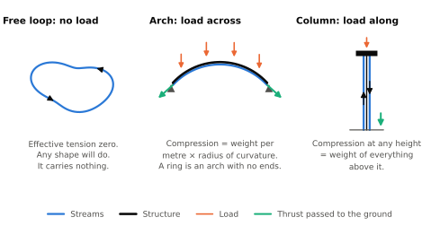

# Beyond the orbital ring {#sec-generalization}

Nothing in the force balance of @eq-ring-equilibrium is particular to a ring. It holds for any slender structure that carries balanced streams. This chapter applies it to the other members of the family, restates the local results of the earlier chapters in a form that does not mention the ring, and then looks at rings on other worlds and at an arch small enough for a table.

## Three ways to load a stream {#sec-three-loads}

@fig-stream-family shows the three cases that cover the family.

{#fig-stream-family}

**No load: the free loop.** With no load, the normal part of @eq-ring-equilibrium-parts reads $T_\mathrm{eff}\,\kappa = 0$. Wherever the loop curves, $T_\mathrm{eff} = 0$: the tension in the structure, or in the chain if the stream is a chain, equals the momentum flux, whatever the shape. Such a loop has no preferred shape and keeps the one it is given. This is the fast chain of Aitken's experiments [@aitken1878account], and Birch's neutral tube (@sec-prior-rings). It carries nothing. The string-shooter toy looks like an exception, a free loop that holds itself up, and is not one. Its lift comes from the drag of the air [@taberlet2019propelled; @daerr2019charmed].

**Load across the stream: the arch.** A stream that curves at radius $R_c$ under a load $w$ per unit length across it has

$$
T_\mathrm{eff} = -\,w R_c .
$$ {#eq-arch-thrust}

For weight, $w = (m+\lambda)g$. A ring is an arch with no ends and $R_c = R$, and @eq-arch-thrust is then @eq-ring-effective-tension. An arch with ends has to pass a thrust $|T_\mathrm{eff}|$ into the ground at each of them, as any arch does at its abutments. Where the streams are turned back at the ends, as in the launch loop [@lofstrom1985launch], that thrust is the load on the turning magnets. At a given radius of curvature it does not depend on the span. A short piece of ring needs the same abutments as a long one.

For an arch that is not a circle about the planet's center, such as the space cable [@knapman2009stability], gravity is not everywhere square to the path. @eq-arch-thrust then holds at the crown, and the tangential part of @eq-ring-equilibrium-parts gives the change of $T_\mathrm{eff}$ down each side.

**Load along the stream: the column.** For a vertical pair of streams turned round under a station, the idea behind the space fountain [see @hyde1988earthbreak], there is no curvature and the tangential equation does all the work. With $z$ measured upward, $dT_\mathrm{eff}/dz = (m+\lambda)g$, so

$$
T_\mathrm{eff}(z) = -\left(\text{weight of everything above } z\right) .
$$ {#eq-column}

If the slugs coast, each stream carries its own weight by slowing as it climbs, so that its momentum flux falls by its weight per metre, and the tower's structure hangs from the station. The net compression at any height, the streams' momentum flux less the tower's tension, is the weight above, as in any column.

## What carries over {#sec-general-results}

The local results of @sec-effective-tension and @sec-collective-stability used nothing but the force balance of a short run of structure. They hold for every member of the family, and for an arch they take a simple form.

**A threshold speed.** A stream curving at radius $R_c$ under gravity carries more than its own weight only if

$$
u > u_c = \sqrt{g R_c} .
$$ {#eq-threshold-speed}

For a ring, $u_c$ is the orbital speed. For a tighter arch it is lower. Write $\nu = u/u_c$ for the speed ratio. In the reference case $\nu = 1.31$.

**Stream mass.** With no tension in the structure, each kilogram of structure and load needs $\lambda/m = 1/(\nu^2 - 1)$ kilograms of stream. Tension in the structure has to be carried too, and raises that.

**Stored energy.** The kinetic energy of the streams per metre is

$$
E' = \tfrac12 \lambda u^2 = \tfrac12\, m\, g R_c\, \frac{\nu^2}{\nu^2 - 1} \;\ge\; \tfrac12\, m\, g R_c .
$$ {#eq-energy-floor}

The floor is reached by very fast, very thin streams. It is set by the gravity well and the radius of the arch, and no choice of engineering lowers it, short of a structure that carries part of the compression itself. For the reference ring it is 34 GJ/m, and the reference case stores 2.4 times that.

**The shape instability.** If the streams follow the structure, a shape error of wavenumber $k$ grows at $\sigma = k\sqrt{|T_\mathrm{eff}|/(m+\lambda)}$. For an arch in equilibrium this is

$$
\sigma = k\sqrt{g R_c} = k\,u_c .
$$ {#eq-general-growth}

For balanced streams the rate depends on nothing else: not on the speed of the streams, not on how much they carry, and not on how the compression is shared between momentum and structure. @eq-local-growth is the same statement, since the reference ring's orbital speed is 0.76 of its stream speed. Two things lower it. A structure that turns with its planet has a little centrifugal relief of its own, worth 0.2% for the Earth ring. And a single stream, with no partner to cancel its convective term, grows more slowly or not at all (@sec-tabletop).

For a column the same expression gives $\sigma = k\sqrt{g\,h}$, where $h$ is the height of uniform column that would weigh what the column above actually weighs. A column of momentum is a hanging chain turned upside down. Waves on a hanging chain travel at the square root of $g$ times the length of chain below. Errors in the column grow at $k$ times the square root of $g$ times the length of column above.

**Steering.** The mirror law of @sec-mirror-law needs the structure to outweigh the part of the stream it commands, $c_m < m/\lambda$. For an arch,

$$
c_m < \nu^2 - 1
$$ {#eq-general-gain-limit}

when the structure carries no tension. A slow, heavy stream cannot be steered hard. The gain of 0.5 used in this paper needs $\nu > 1.22$. Under the mirror law the structure is a string of tension $c_m\Pi$ whatever its geometry, and @eq-stroke-capacity for the load a given guide room can carry holds as it stands.

@fig-speed-ratio shows what the choice of speed ratio costs and allows.

{#fig-speed-ratio}

**What does not carry over.** The whole-ring results of @sec-ring-control do not. The off-center mode and the breathing mode are properties of a closed ring in orbit. Bunching happens on any run of guide, at a rate of the order of $\Omega$, but the slugs of an arch with ends are through it too soon for that to matter: an arch 2,000 km long is crossed at 14 km/s in a sixth of $1/\Omega$. An arch and a column also have ends, where the streams are turned and can be re-timed, and where the structure is held. Their whole-structure modes have not been worked out here.

## Two worked cases {#sec-general-examples}

**An arch at the launch loop's speed and height.** Lofstrom's loop runs its ribbon at 14 km/s along a track 80 km up [@lofstrom1985launch]. For any arch that follows the planet's curvature at that height, the threshold speed is 7.9 km/s, so $\nu = 1.78$. The ribbon can carry 2.2 times its own mass per metre in stationary track and load. Its stored energy is 1.5 times the floor. The steering gain limit is 2.2, far from binding. And a shape error 100 km long would grow e-fold in 2.0 s if the ribbon simply followed the track. The reference ring's figure is 2.1 s, nearly the same, because @eq-general-growth does not depend on the speed of the stream. These are consequences of this chapter's formulas for his speed and height. They are not figures from his paper.

**A column.** Take a station of 100 tonnes on a tower 100 km tall with 10 kg/m of structure, and slugs that arrive at the top at 1 km/s. These are illustrative numbers, chosen for round figures. The slugs leave the ground at 1.7 km/s. Each stream carries 5.4 tonnes per second. The compression at the base is 18.6 MN, which is the weight of station, tower and the 800 tonnes of slugs in flight. Those slugs hold 0.75 TJ. Near the base a kink 10 km long grows e-fold in 1.5 s if the streams follow the tower. Higher up, where there is less above to carry, it grows more slowly.

## Rings on other worlds {#sec-other-worlds}

The same ring can be put round a smaller world. The table compares the reference case with rings round Mars and the Moon that have the same speed ratio, the same passive mass per metre, the same tube and the same number of lanes. The altitudes are choices made here: 200 km for Mars, above most of its atmosphere, and 20 km for the Moon, which has no atmosphere and no debris to clear, only mountains.

| | Earth, 500 km | Mars, 200 km | Moon, 20 km |
| ------------------------------------------------------ | ---------------: | ---------------: | ---------------: |
| Orbital speed | 7.6 km/s | 3.5 km/s | 1.7 km/s |
| Stream speed | 10.0 km/s | 4.5 km/s | 2.2 km/s |
| Circumference | 43,200 km | 22,600 km | 11,000 km |
| Momentum flux $\Pi$ | 164 GN | 34 GN | 7.9 GN |
| Stored energy per metre | 82 GJ | 17 GJ | 3.9 GJ |
| Stored energy, whole ring | 3,500 PJ | 380 PJ | 43 PJ |
| Energy of a 10 kg slug | 500 MJ | 103 MJ | 24 MJ |
| Guide load per lane from the helix | 2.1 kN/m | 0.82 kN/m | 0.39 kN/m |
| Control delay budget at 100 m (@eq-delay-budget) | 0.83 ms | 1.8 ms | 3.8 ms |
| Uncontrolled growth time, 100 km wave | 2.1 s | 4.6 s | 9.5 s |
| Uncontrolled growth time, two waves round the ring | 7.7 min | 9.6 min | 10.1 min |
| Uncontrolled growth time, ring off center | 17 min | 26 min | 29 min |
| Orbital period | 95 min | 109 min | 110 min |

: The reference ring and its equivalents round Mars and the Moon. {#tbl-worlds}

Two things stand out. Everything local scales with the orbital speed, and on the Moon that makes the machine 4.6 times slower and 21 times less energetic per metre. A lunar ring stores an eightieth of the energy of the reference ring. A fault that would release 82 GJ from a metre of the Earth ring releases 3.9 GJ there, and the fastest control loops have 4.6 times as long to act.

The whole-ring motions do not get slower in the same way. Their rates are multiples of the orbital rate, and the period of a low orbit depends only on the mean density of the body, and on that only as its square root. The three periods lie within a fifth of one another. The whole-ring growth times in the table are for the same 50 GN of hoop stiffness in each case, which is stiffer in proportion on a smaller world and accounts for part of the difference. A lunar ring's long shape modes grow in ten minutes where the Earth ring's take eight, and it drifts off center in 29 minutes against 17.

A lunar ring is therefore the kinder first case in most respects, and it eases the whole-ring control problem only a little. One thing has not been computed here. The Moon's gravity is lumpy, and 20 km above the surface that is a steady load which varies along the ring by a larger fraction than anything the Earth ring sees.

## An arch for a table {#sec-tabletop}

A chain that runs along itself takes the same shapes as a chain at rest, with its tension raised by $\lambda u^2$. One of those shapes is an arch, the hanging chain turned over, which at rest would have to be in compression. A chain running fast enough can stand in it. The compression to be made up is greatest at the feet, where it is the weight per metre times the crown's radius of curvature plus the rise, so the bare chain stands if

$$
u^2 > g\left(R_c + h\right)
$$ {#eq-chain-arch}

for a rise $h$. For a crown radius of 1 m and a rise of 0.3 m that is 3.6 m/s, within reach of a chain driven between two wheels.

At 5 m/s such a chain, of 0.1 kg/m, could carry a light guide of up to 0.096 kg/m riding on it before its tension at the feet fell to zero. That would be an arch of momentum on a table: a stationary structure held up by a stream. With a guide of 0.08 kg/m locked to the chain, a kink 1 m long would grow e-fold in about 110 ms, slow enough to film. The rate is below @eq-general-growth because one stream keeps the convective term that two streams cancel, $\sigma = k\sqrt{gR_c - (\lambda u/(m+\lambda))^2}$, and for a guide lighter than 0.06 kg/m that term holds the arch neutral.

This is a suggestion for an experiment, not a result. It has not been built. The string shooter is a warning for anyone who tries: the drag of the air on the chain would have to be shown small, by a heavy chain or by running at reduced pressure, before any lift was credited to momentum.
