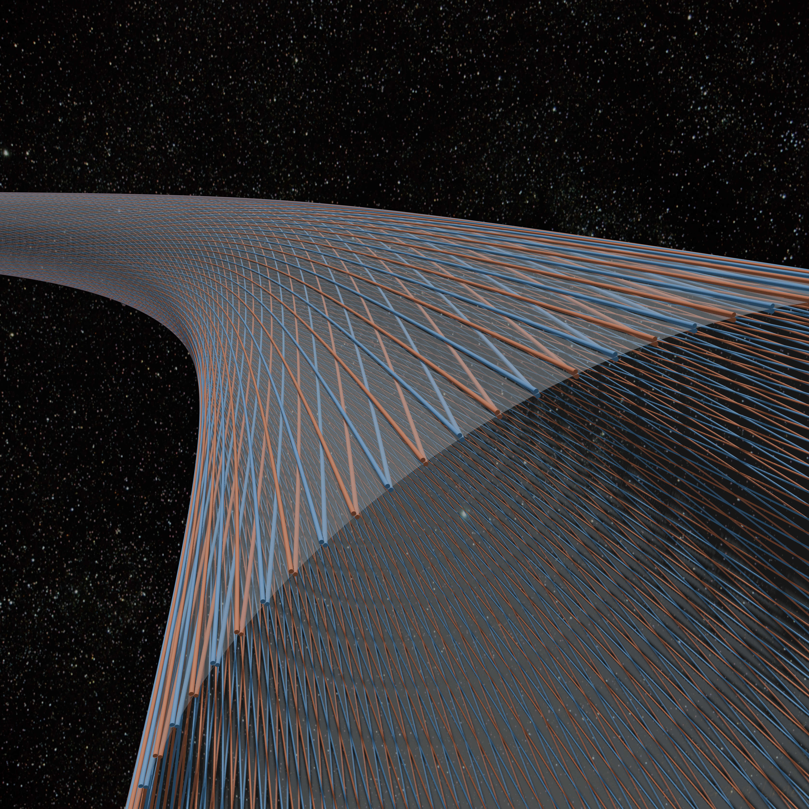
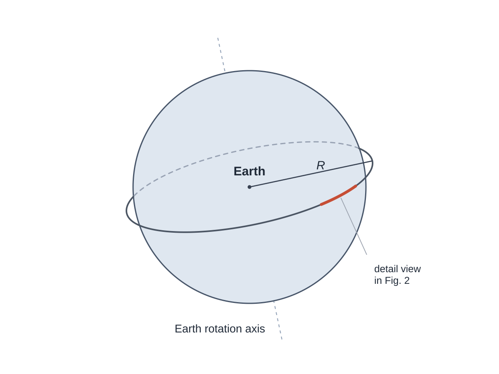
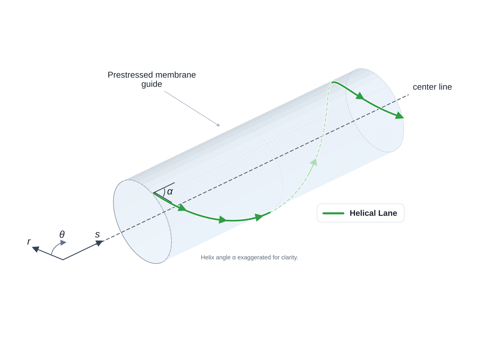
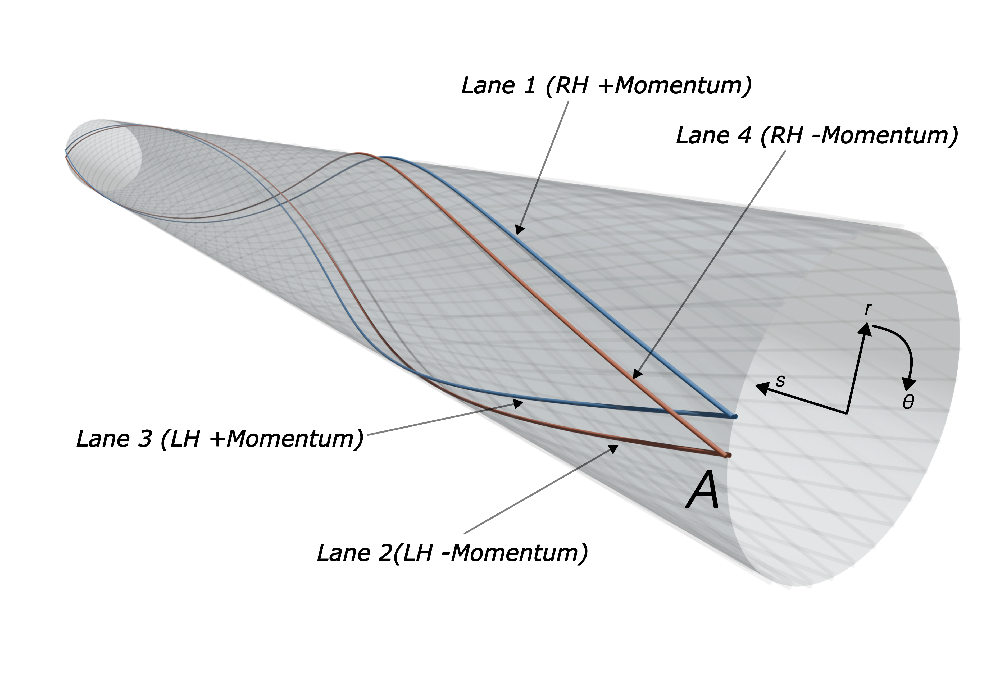
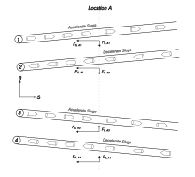
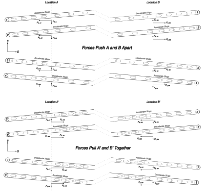

\noindent\hspace*{-0.05\textwidth}{width=110%}

\newpage

## Abstract

This paper proposes an orbital-ring architecture built from magnetically guided high-speed slug streams running in lanes set at small helix angle around a very large lightweight toroidal guide structure. The paper's main claim is narrower than feasibility: it identifies two linked ideas that are genuinely useful at the concept level and may serve as an internal prestress-and-actuation primitive for active-support ring concepts.

The first is that slug streams can do more than circulate momentum to loft a structure. By forcing the streams to follow curved helical paths on a large toroidal membrane, the design converts momentum redirection into distributed outward pressure, hoop prestress, and local structural stiffness. The result is best understood as a prestressed membrane-and-guide shell (intuitively a giant fabric torus) whose steady preload is created by guided moving mass. That preload may improve roundness, wrinkle suppression, and load transfer in an independent membrane/rib/guide structure, but it is not itself a proof of stabilizing tangent stiffness. Perturbations of the guided stream retain nonconservative follower-force terms that must be overcome by the shell, guide, and control system.

The second is that the same helical geometry enables a four-lane balanced cell that can generate distributed tug fields for macro-scale ring-shape actuation. In a fixed spatial speed gradient, one counter-propagating lane accelerates while its mirrored partner decelerates. Their structural reactions add, and a co-located bidirectional power path can exchange power between the two streams. That makes the cell a momentum-flux actuator and a high-power energy exchanger at the same time.

A central motivation for this architecture is that simple straight-lane or monolithic-rotor active support structure concepts do not provide passive self-centering by momentum redirection alone. A fast mass stream pushes into existing curvature. Without a surrounding structure and active control system that can react against that tendency, perturbations are anti-restored rather than damped away. The helical toroidal guide architecture is therefore not cosmetic. It supplies the reaction substrate and prestress channel that the control system can work through.

After presenting the force mechanism, lane-level guide requirements, perturbation argument, helical membrane architecture, and four-lane macro-actuation scheme, the paper turns to closure screens. Full-scale macro lift requires superorbital ring-tangential momentum flux, failures are energetically extreme, and losses, thermal rejection, timing, and containment all feed back into passive structural weight. The architecture should therefore be understood as a concept-level prestress and actuation primitive, not as a closed feasibility demonstration.

---

## 1. Introduction

The usual picture of an orbital ring is seductively simple: put a very fast moving mass around Earth, let curvature redirect momentum, and use the resulting reaction force to support a ring. But that picture leaves out two problems that are not secondary.

First, a fast moving mass stream does not provide passive self-centering by momentum redirection alone. If its path develops a curvature perturbation, the stream pushes further into that curvature. A simple straight lane or monolithic rotor therefore does not merely need support force. It needs a surrounding architecture that can resist and control a fundamentally anti-restoring tendency.

Second, even if one has enough moving momentum to loft a ring, that does not by itself provide a good mechanism for local structural stiffness or macro-scale alignment actuation. A ring around Earth has to survive construction tolerances, tether loads, payload impulses, gravity-gradient effects, and long-wavelength wobble. A concept that only says "there is a rotor going around the planet" has not yet explained how the machine is to be actuated, much less closed in feedback. An ideal system would be one where the same system that provides momentum for lift can be used for active control. 

This paper proposes a specific answer to both problems.

1. **Helical slug streams at small $\alpha$ in a prestressed membrane guide shell.** The lanes are wrapped helically around a large tensile membrane tube. Their curvature creates outward pressure that inflates and prestresses the torus, turning moving momentum into a steady prestress channel and reaction substrate for an independently stabilized guide structure.
2. **A four-lane balanced cell for macro-scale actuation.** The same helical geometry allows balanced groups of lanes whose momentum components cancel in steady operation but can be modulated through fixed spatial speed gradients to produce distributed tug fields and ring-scale bending moments.

The claim envelope should be stated early. This paper does not claim closure of the full orbital-ring system, nor does it claim demonstrated closed-loop controllability. It claims that shallow helical momentum streams plus four-lane balanced cells define a plausible internal prestress and actuation primitive. Dynamic stability, guide technology, thermal rejection, fault isolation, startup, deployment, and passive-mass closure remain explicit closure requirements.

The main fatal risks are also worth naming early: follower-force instability, unacceptable guide loss, impossible thermal rejection, unmanageable fault-domain energy, and a passive-mass closure loop that fails to converge.

To ground ourselves in the geometry of the problem, Figure 1 gives the global geometry of the orbital ring concept and the local section chosen for closer inspection. 

{width=100%}

**Figure 1.** Global geometry of the orbital ring around Earth.

The highlighted section of the orbital ring is displayed below in Figure 2 and shows the corresponding local guide-shell geometry and a representative helical lane used throughout the paper.

{width=100%}

**Figure 2.** Local guide-shell segment with a representative helical lane and local coordinates.

### 1.1 Paper structure

The argument proceeds in six steps. First, momentum redirection is established as the basic force mechanism. Second, the paper asks what one lane demands from its magnetic guide. Third, it shows why a straight high-speed lane does not self-center under perturbation. Fourth, it introduces the helical toroidal guide architecture as a way to turn the dominant steady curvature load into useful local prestress while making the remaining stability problem explicit. Fifth, it develops the four-lane balanced cell and distributed tug fields as the main macro-scale actuation result. Only then does it turn to the harder practicality screens: macro lift throughput, fault-domain architecture, and closure.

### 1.2 Coordinate convention

To avoid ambiguity, the paper uses three local coordinates:

$$
s = \text{distance along the ring centerline around Earth}
$$

$$
\theta = \text{azimuth around the torus cross-section}
$$

$$
r = \text{local radial direction normal to the torus cross-section}
$$

In the local tube approximation, what other orbital-ring discussions often call "axial" means the $s$ direction, not the global Earth rotation axis. The helical lanes wind in $\theta$ while moving mainly along $s$.

### 1.3 Reference bookkeeping case

To keep later screens anchored, the paper uses one primary bookkeeping case unless otherwise stated.

| Quantity | Baseline value | Role in the paper |
| --- | --- | --- |
| Altitude | 500 km | Primary reference case |
| Ring-tangential speed $u$ | 10 km/s | Macro-lift and actuation screens |
| Torus radius $a$ | 50 m | Helix-curvature and shell screens |
| Net inward non-stream load $w_p$ | 10 kN/m | Notional support burden |
| Lane count | about 300 | Discrete-lane and balanced-cell screens |
| Prestress ratio $\Gamma$ | 10 baseline, 30 to 100 sensitivity | Lower-bound shell-prestress screen |

This is a bookkeeping case, not an optimized design. The 500 km altitude is only a convenient reference point (indeed, a better altitude might be considerably lower, perhaps even below 100 km to avoid orbital debris), and none of the other ring parameters in this test case are claimed to be optimal. The case is used to keep the paper's numbers internally consistent while making clear which burdens grow when the passive mass or prestress target rises.

Throughout the paper, $w_p$ should be read as the **net inward non-stream load per metre**. It includes whatever passive structural burden, tether load, payload load, drag-like disturbance, or other non-stream loading the moving stream must support. For the guide shell's own mass, that bookkeeping can include gravity minus the guide's small centrifugal relief from Earth co-rotation. At 500 km altitude that relief is small, but defining $w_p$ this way keeps the lift comparison unambiguous.

Because the local numbers are easy to underestimate, the corresponding whole-ring inventory is worth stating early:

| Reference-case inventory item | Approximate value |
| --- | ---: |
| Ring radius at 500 km altitude | about 6,871 km |
| Circumference | about 43,000 km |
| Passive mass for $w_p=10~\mathrm{kN/m}$ | about $5\times10^{10}$ kg |
| Moving-stream mass for $\lambda_\mathrm{stream}\approx 1600~\mathrm{kg/m}$ | about $6.9\times10^{10}$ kg |
| Total moving kinetic energy | about $3.5\times10^{18}$ J |
| Total slug count for 10 kg slugs | about $6.9\times10^{9}$ |

That table does not refute the architecture, but it does place the reference case firmly in the megastructure regime. Even the paper's nominally light reference point already involves tens of billions of kilograms of passive and moving inventory.

---

## 2. Momentum redirection is the force mechanism

Consider a mass stream moving at speed $v$ along a guide path of curvature $\kappa$. The stream requires normal acceleration

$$
a_n = v^2\kappa.
$$

For a continuous stream of line density $\mu$, the required guide force per unit path length is

$$
f = \mu v^2\kappa.
$$

For a discrete slug train with fixed mass flux $\dot m$, the effective line density is $\mu_\mathrm{eff}=\dot m/v$, so the corresponding force law becomes

$$
f = \dot m v\kappa.
$$

That distinction matters. A continuously filled cable-like stream at fixed line density scales as $v^2$. A throughput-limited slug train whose spacing changes with speed scales as $v$.

The physical interpretation is straightforward. The guide pushes the stream onto a curved path. The stream pushes back on the guide with equal and opposite force. This is the structural force source. No speculative physics is required.

It is often convenient to introduce an equivalent dynamic-tension scale

$$
T_\mathrm{eq} = \mu v^2
$$

for the continuous case, or equivalently $T_\mathrm{eq}=\dot m v$ for the fixed-flux slug-train case. That notation is useful, but it must not be over-read. In this architecture the support force does not require a passive material hoop carrying literal mechanical tension equal to $T_\mathrm{eq}$. The force can instead arise from guided momentum redirection in discrete moving masses.

At this early stage it is worth previewing an organizing distinction that becomes central later. The paper is not claiming that local helical inflation replaces orbital support. The two curvature channels do different jobs:

- **tube-scale helical curvature** supplies local prestress in the membrane torus,
- **Earth-scale ring curvature** supplies macro lift.

For one lane with ring-centerline speed component $u=v\cos\alpha$, the Earth-scale lift channel is

$$
q_{\mathrm{lift,lane}} = \dot m\left(\frac{u}{R} - \frac{g_h}{u}\right)
$$

where $R$ is ring radius and $g_h$ is gravity at altitude. At this point it is enough to note that local helix curvature and Earth-scale curvature are separate channels and must not be conflated.

---

## 3. What one lane requires from its guide

Before discussing orbital-ring architecture, it is worth asking what one lane demands from its stator.

### 3.1 Magnetic reaction scale

A rough upper bound on magnetic normal stress is

$$
p_\mathrm{mag,max} \sim \frac{B^2}{2\mu_0},
$$

where $B$ is field strength and $\mu_0$ is the permeability of free space. The ideal upper-bound values from $B^2/(2\mu_0)$ are:

| Field strength $B$ | Ideal upper-bound normal stress |
| ---: | ---: |
| 0.5 T | about 0.10 MPa |
| 1 T | about 0.40 MPa |
| 2 T | about 1.59 MPa |
| 3 T | about 3.58 MPa |

Real delivered traction will be lower because of gap, fringing, force margin, thermal limits, imperfect field topology, and control requirements.

If $A'$ is effective magnetic interaction area per unit lane length, then the required mean traction is

$$
p_\mathrm{req} = \frac{f}{A'}.
$$

For a fixed-flux slug lane this becomes

$$
p_\mathrm{req} = \frac{\dot m v\kappa}{A'}.
$$

So tight curvature, high speed, and small interaction perimeter all make the lane harder to guide.

It is tempting to look for a simple square-cube optimum in slug size here, but this particular screen does not produce one cleanly. The relevant quantity is $A'$, effective interaction area per unit lane length, not the perimeter of one isolated slug. If a slug family is scaled uniformly at fixed aspect ratio and lane fill fraction, then per-slug mass scales like $L^3$ while slug count per unit lane length scales like $1/L$, so moving mass per unit lane length scales like $L^2$, just as interaction area per unit lane length does. On that simplified scaling, $p_\mathrm{req} = \dot m v\kappa/A'$ does not by itself force a single geometric optimum. The sharper slug-size trade appears later through switching rate, timing precision, gap control, eddy-current loss, and per-slug fault energy rather than through this one ratio alone.

### 3.2 Tugging also requires tangential traction

The guide-force screen is not only a normal-force screen. Any speed-gradient control section must also accelerate or decelerate the slugs longitudinally.

For one lane, a stationary speed gradient requires tangential force density

$$
q_\parallel = \dot m \frac{du}{ds}
$$

along the lane. The corresponding mean tangential traction scale is therefore roughly

$$
p_\parallel \sim \frac{\dot m |du/ds|}{A'}.
$$

The normal guide requirement from curvature following is still

$$
p_\perp \sim \frac{\dot m v\kappa}{A'},
$$

so a more honest first screen on the stator is a vector resultant,

$$
p_{\mathrm{req,total}} \sim \sqrt{p_\perp^2 + p_\parallel^2},
$$

before adding control margin, thermal margin, gap margin, and loss margin. A ring that can guide the lane laterally but cannot push and brake it longitudinally does not yet possess the proposed macro-scale actuation channel.

A representative numerical case is useful here. In the paper's notional 500 km, 10 kN/m passive-load example, the moving-stream line density is about 1600 kg/m. If that is spread across roughly 300 lanes, each lane carries about 5.4 kg/m, so at 10 km/s the mass flux per lane is about $5.4\times10^{4}$ kg/s. With helix angle about $0.79^\circ$ and tube radius $a=50~\mathrm{m}$, the local helical curvature is about $3.8\times10^{-6}\,\mathrm{m^{-1}}$. The resulting normal guide load is then only about 2.1 kN per metre of lane. Even a 10 MN long-wave tug shared across 300 lanes corresponds to only about 33 kN integrated axial contribution per lane, or about 0.33 N/m if spread over a 100 km control sector.

A useful caveat is

$$
q_{\parallel,\mathrm{lane}} \sim \frac{F_{\mathrm{sector}}}{N_{\mathrm{lanes}}L_{\mathrm{sector}}}.
$$

So the mild force-density result depends on broad participation and long actuation length. If only 30 lanes participate, or if the actuation length is 10 km instead of 100 km, the average tangential force density rises by about two orders of magnitude. The lane-level distributed force densities are therefore not automatically benign. They are merely not the dominant horror under the broad-participation reference case used here. The harsher burdens remain the associated power exchange, synchronization, thermal management, and fault energy.

### 3.3 Convective local control

A lane is not merely static curvature plus average force. The stream is convected through the guide at high speed, so disturbances arrive on a timescale

$$
t_\mathrm{conv} \sim \frac{\lambda}{v},
$$

where $\lambda$ is disturbance wavelength. At $v=10~\mathrm{km/s}$, a $100~\mathrm{m}$ disturbance convects past in $10~\mathrm{ms}$, a $10~\mathrm{m}$ disturbance in $1~\mathrm{ms}$, and a $1~\mathrm{m}$ disturbance in $0.1~\mathrm{ms}$. High speed helps force generation and hurts control.

Using lateral displacement $y(x,t)$ along a lane coordinate $x$, the convective derivative is

$$
\frac{D}{Dt} = \frac{\partial}{\partial t} + v\frac{\partial}{\partial x},
$$

so the lateral acceleration contains

$$
\frac{D^2y}{Dt^2} = y_{tt} + 2v y_{xt} + v^2 y_{xx}.
$$

The last term is the same curvature-following term that generates support force. The middle term is transport coupling. Both must be handled by the guide.

A credible architecture therefore needs layered control:

- very fast local gap control at the lane level,
- bus-level coordination of nearby lanes and sectors,
- and slower macro-shape control at the ring scale.

The orbital ring cannot be treated as a single centralized control loop.

---

## 4. Why straight lanes and monolithic rotors do not provide passive self-centering by momentum redirection alone

This is the missing structural argument in many simple orbital-ring pictures.

Consider a nominally straight lane or monolithic rotor segment with a small transverse deflection $y(x,t)$. For small slope, the centerline curvature is approximately

$$
\kappa \approx y_{xx}.
$$

The moving stream must then be forced to follow that curved path. The stream exerts on the guide a reaction load per unit length of the form

$$
q_\mathrm{stream} \approx -T_\mathrm{eq} y_{xx},
$$

where $T_\mathrm{eq}=\mu v^2$ or $T_\mathrm{eq}=\dot m v$, depending on whether one uses the continuous or fixed-flux picture.

Now consider a sinusoidal perturbation,

$$
y(x,t) = Y\sin(kx).
$$

Then

$$
y_{xx} = -k^2 y,
$$

so the stream reaction becomes

$$
q_\mathrm{stream} = +T_\mathrm{eq} k^2 y.
$$

That has the **same sign as the displacement**. If the lane is displaced upward at some point, the stream pushes upward there as well. The moving mass therefore pushes further into an existing curvature perturbation rather than restoring the lane to straightness.

This is not yet a complete stability model. Real dynamics also involve beam stiffness, membrane stiffness, damping, actuator delay, boundary conditions, and control law. But it is enough to establish the key point: a straight high-speed lane does not passively self-center by momentum redirection alone. The moving stream behaves like an anti-restoring curvature follower unless the surrounding structure and controls provide compensating reaction.

That observation cuts directly against naive pictures of a single giant monolithic rotor or a set of parallel straight rotors simply going around Earth. Such concepts may contain enough momentum to generate support in principle, but they do not automatically contain a good structural answer to perturbations.

---

## 5. Helical lanes in a prestressed membrane guide shell

Instead of asking a fast lane to remain straight in free space, this paper proposes an architecture that places the lanes on an intentionally curved helical path wrapped around a very large tensile membrane tube. The simplest intuition is a lightweight fabric torus, but the hardware should be pictured more technically as a prestressed membrane-and-rib guide carrier with discrete lane carriers, distributed stators, power buses, sensors, thermal paths, and fault segmentation.

### 5.1 Helical curvature creates a steady prestress channel

For a helix on a cylinder of radius $a$, with helix angle $\alpha$ measured relative to the local $s$ direction,

$$
\kappa_\mathrm{helix} = \frac{\sin^2\alpha}{a}
$$

in the local-cylinder approximation.

That curvature is not an accident. It is the local mechanism that converts moving momentum into distributed outward reaction on the membrane-supported lane system.

For a fixed-flux slug lane, the local outward load per unit ring length is

$$
q_\mathrm{loc,lane} = \dot m u \frac{\tan^2\alpha}{a}
$$

where

$$
u = v\cos\alpha
$$

is the ring-centerline speed component.

For one symmetric pair of lanes,

$$
q_\mathrm{loc,pair} = 2\dot m u \frac{\tan^2\alpha}{a}
$$

and, if those loads are azimuthally smoothed, the corresponding equivalent pressure from one pair is

$$
p_\mathrm{pair} = \frac{\dot m u \tan^2\alpha}{\pi a^2}.
$$

For $N_p$ paired modules distributed around the torus,

$$
p_\mathrm{eq} = \frac{N_p \dot m u \tan^2\alpha}{\pi a^2}.
$$

So the helical lanes create a steady outward load channel that can inflate the torus and prestress its membrane.

### 5.2 Equivalent pressure is an averaged load model

The pressure language is useful, but it is an azimuthally averaged approximation. The real loads are applied through discrete lanes, ribs, or lane carriers.

The averaging is only justified when lane pitch, rib stiffness, and membrane shear transfer are fine enough that the discrete loads appear smooth at the wavelengths of interest. At $a=50~\mathrm{m}$, the circumference is about

$$
2\pi a \approx 314~\mathrm{m}.
$$

If the torus carries on the order of 300 lanes, the pitch is about 1 m and a pressure-like description may be reasonable for long-wave structural modes. If it carries only a few tens of lanes, the loading is much less pressure-like and the discrete rib-and-membrane mechanics become first-order.

Equivalent pressure should therefore be read as a useful homogenized model, not as proof that the membrane literally feels a perfectly smooth gas-like pressure field.

### 5.3 Prestress creates a reaction substrate, not automatic stability

Equivalent pressure $p_\mathrm{eq}$ creates hoop membrane force per unit ring length

$$
N_\theta = p_\mathrm{eq} a.
$$

This prestress plausibly helps with:

- maintaining circular cross-section,
- resisting ovalization,
- suppressing wrinkling in a membrane wall,
- increasing local indentation stiffness,
- and providing a stable substrate onto which guides, sensors, power hardware, and auxiliary structure can be mounted.

The imposed helical curvature converts the dominant **steady** curvature load into useful membrane prestress. But that does not by itself prove local dynamic stability. Perturbations about the helical path still have follower-force character. The moving stream still carries an effective dynamic-tension scale $T_\mathrm{eq} \sim \dot m v$, and displaced lane segments can still generate incremental curvature-following loads unless the membrane, guide, and controller supply enough incremental stiffness and damping.

A more honest way to write the screening condition is in the frequency domain. Define the total incremental stiffness as

$$
K_\mathrm{tot}(k,\omega) = K_\mathrm{membrane}(k,\omega) + K_\mathrm{guide}(k,\omega) + K_\mathrm{control}(k,\omega).
$$

Then, for a sinusoidal perturbation of wavenumber $k$, the real part must satisfy

$$
\mathrm{Re} K_\mathrm{tot}(k,\omega) > T_\mathrm{eq} k^2.
$$

with positive damping and adequate phase margin required separately. In other words, the real difficulty is not merely static stiffness. It is whether the membrane, guide, and delayed controller together remain stabilizing over the disturbance band of interest. The stability local stability question is addressed in details in Appendix A and B. 

### 5.4 Why the helix angle is likely small

The architecture wants helical curvature for local prestress, but it also wants most of the speed to remain ring-tangential so the orbital ring can loft itself. That trade pushes the design toward shallow helical angles.

Define the paired-module momentum-flux scale

$$
A_\mathrm{pair} = N_p \dot m u.
$$

The total paired-lane contribution is then $2A_\mathrm{pair}$.

The inflation requirement can be written as

$$
A_\mathrm{pair} \ge \frac{\pi a N_{\theta,\mathrm{req}}}{\tan^2\alpha}
$$

where $N_{\theta,\mathrm{req}}$ is required hoop membrane force per unit length.

The macro-lift requirement, derived later, is

$$
A_\mathrm{pair} \ge \frac{w_p}{2\left(\frac{1}{R} - \frac{g_h}{u^2}\right)}.
$$

Balancing the two gives a useful screening estimate

$$
\tan^2\alpha_\mathrm{cross} = 2\pi a\Gamma\left(\frac{1}{R} - \frac{g_h}{u^2}\right)
$$

with

$$
\Gamma = \frac{N_{\theta,\mathrm{req}}}{w_p}.
$$

For small angles,

$$
\alpha_\mathrm{cross} \approx \sqrt{2\pi a\Gamma\left(\frac{1}{R} - \frac{g_h}{u^2}\right)}.
$$

Using a reference case with $a=50~\mathrm{m}$, altitude $500~\mathrm{km}$, $u=10~\mathrm{km/s}$, and $\Gamma=10$, one gets a screening crossover angle of about $0.014~\mathrm{rad}$, or about $0.79^\circ$. So once macro lift matters, the preferred helical bias is very shallow. At $a=50~\mathrm{m}$ and $\alpha\approx0.79^\circ$, one full wrap pitch is about $23~\mathrm{km}$, which means the intended architecture is a field of many nearly axial lanes with only slight azimuthal drift, not a steep screw conveyor.

The more important question is whether that shallow helix produces enough prestress. With passive supported weight of $10~\mathrm{kN/m}$ and prestress ratio $\Gamma=10$, the implied hoop-force target is only about $100~\mathrm{kN/m}$. At a 50 m torus radius, that corresponds to only about 2 kPa of equivalent pressure. That is useful for roundness and wrinkle suppression, but it is not obviously enough to make a 100 m diameter shell behave like a stiff beam.

So $\Gamma=10$ should be read as a lower-bound screening case, not as a settled design point. If shell-mode analysis demands higher prestress, the required helix angle rises only slowly. At the same $500~\mathrm{km}$, $10~\mathrm{km/s}$ point, $\Gamma=30$ gives about $1.38^\circ$ and a wrap pitch of about $13~\mathrm{km}$, while $\Gamma=100$ gives about $2.51^\circ$ and a wrap pitch of about $7~\mathrm{km}$. The geometry therefore remains in the shallow-helix regime even for substantially higher prestress targets. The real requirement has to come from shell stiffness, ovalization modes, rib spacing, and load-path analysis rather than from geometry alone.

### 5.5 What the prestressed shell does and does not solve

The prestressed membrane guide shell solves an important but limited problem. It gives the lanes a reaction structure, creates local prestress, and provides a platform for hardware. It does **not** automatically create a globally rigid torus, and it does **not** by itself close the local stability problem.

The homogenized shell picture should also be bounded in wavelength. With about 300 lanes around a 314 m circumference, the pitch is about 1 m, so pressure-like averaging may be reasonable for long-wave deformation. It should not be trusted blindly for metre-scale guide deformation, local rib failure, lane dropout, or sharp control-sector gradients. A useful rule of thumb is that the smoothed shell model belongs to wavelengths well above the torus diameter and preferably well above the circumference, while shorter scales require an explicitly discrete lane-and-rib treatment.

### 5.6 Prestress is not tangent stiffness

The helical stream-generated load must not be double-counted. The same moving masses that generate the steady outward preload also generate nonconservative incremental follower-force terms when the guide path is perturbed.

For one lane, the moving-stream dynamic-tension scale is

$$
T_{\mathrm{eq,lane}} = \lambda_{\mathrm{lane}} v^2 .
$$

In the reference case, $\lambda_{\mathrm{lane}}\approx 5.4~\mathrm{kg/m}$ and $v\approx10~\mathrm{km/s}$, giving

$$
T_{\mathrm{eq,lane}}\approx5.4\times10^8~\mathrm{N}.
$$

For a perturbation of wavelength $L$, the quasi-static follower contribution scales as

$$
q_{\mathrm{follow}}\sim T_{\mathrm{eq,lane}}\left({2\pi\over L}\right)^2Y .
$$

For $Y=1~\mathrm{mm}$ this gives approximately:

| Wavelength $L$ | Anti-restoring load per lane |
| ---: | ---: |
| 100 m | about 2.1 kN/m |
| 10 m | about 210 kN/m |
| 1 m | about 21 MN/m |

The steady helical normal load in the same reference case is only about 2.1 kN/m per lane. Thus, at 100 m wavelength, a 1 mm perturbation already creates an anti-restoring incremental load comparable to the entire steady helical preload; at 10 m wavelength it is roughly two orders of magnitude larger.

This does not mean the architecture is impossible, but it sharply limits what the helical preload can be claimed to do. The moving stream supplies a useful steady load channel. It does not by itself supply the stabilizing tangent stiffness required to suppress local follower-force instability. That stiffness must come from the conservative membrane/rib/guide structure (i.e internal guy wires) and from active local control, with the moving stream terms included on the destabilizing side of the linearized dynamics.

Increasing $\alpha$ raises the steady preload, but it does not provide an easy stability escape within the shallow-helix architecture. At fixed useful ring-direction momentum flux, the preload channel grows as $\tan^2\alpha$, while the moving-stream follower-force scale remains of order $\dot m u$. Meaningful direct competition with the follower-force scale would require helix angles of order tens of degrees, at which point the architecture is no longer the shallow nearly axial lane system used for macro lift. Therefore $\alpha$ should be treated as a preload-design variable, not as a local-stability solution.

A full eigenvalue analysis of both the local lane and local tube levels is presented in Appendix A and B. 

---

## 6. The four-lane balanced cell

A helical lane patern is useful for generation of prestress inflation pressure on the tube. It's also useful to configure the lanes such that there are a matching number of lanes with slugs travelling in each direction ($\pm s$), as this allows momentum to be exchanged between one lane with $+s$ travelling slugs with one lane with $-s$ travelling slugs so that no net force in the $s$-direction is genearted. However, due to the twist in the $\theta$-direction of the lanes, an exchange in slug momentum between a pair of $\pm s$ direction lanes that have the same left or right handedness will generate a transfer of momentum from the slugs to the lanes in the $\theta$ direction. 

As such, the minimal balanced cell contains four lanes: To keep the sign bookkeeping explicit, define handedness geometrically by the sign of $d\theta/ds$ for the lane centerline itself: right-handed means positive azimuthal slope with increasing $s$, and left-handed means negative azimuthal slope. **This definition is geometric, not based on the slug's direction of travel.**

| Lane | Handedness | $s$-momentum | $\theta$-momentum |
| --- | --- | ---: | ---: |
| 1 | RH | + | + |
| 2 | LH | - | + |
| 3 | LH | + | - |
| 4 | RH | - | - |

Lane 1 and 4 therefore cancels $s$-momentum but retains positive $\theta$-momentum, lane 2 and 3 cancels $s$-momentum but retains negative $\theta$-momentum, and the four-lane cell cancels both together. Figure 3 shows the corresponding local geometry as a rendered guide-shell segment. The translucent cylindrical shell is the membrane-and-guide substrate, the colored lanes are the mirrored helical paths, and the cut face defines the local $(s,r,\theta)$ coordinates used in the sign convention above. The station marked A should be read as a representative control-sector location, not as a separate structural component.

\noindent\hspace*{-0.25\textwidth}{width=150%}

**Figure 3.** Rendered local guide-shell segment for the balanced-cell lane geometry. Orange and blue lanes indicate mirrored helical paths on the translucent membrane shell; arrows indicate local tangent and travel directions; the cut face defines the local $s$, $r$, and $\theta$ coordinates. The station A marks a representative control location, and the helix angle is exaggerated for clarity.

The four-lane balanced cell allows for the exchange of momentum between pairs of lanes to generate a net force on the lane carriers / ring structure in the $s$-direction without introducing any net first order force in the $\theta$-direction. For example, to generate a force on the membrane-and-guide substrate in the negative $s$-direction at location A, we would accelerte slugs in lanes 1 and 3 while decelerating sluds in lane 2 and 4. 

Figure 4 then makes the cancellation bookkeeping explicit in force-component form. Each lane reaction is decomposed into ring-centerline and circumferential components. Because the full cell contains equal positive and negative azimuthal slopes, the $\theta$-components occur in equal and opposite pairs, so the four-lane sum removes the first-order circumferential reaction. 

But, the $s$-components behave differently. In a stationary speed-gradient section (i.e. Location A), a lane that accelerates in its own direction of travel and a mirrored lane that decelerates in the opposite direction still impose the same structural reaction along $s$ on the stationary guide hardware. So the balanced four-cell can cancel the unwanted $\theta$-channel while retaining a net axial tug, which is the actuator channel used later for distributed ring-scale control.

**Figure 4.** Force-component bookkeeping for a balanced four-lane cell at a representative control location. The circumferential $\theta$ components cancel in the four-lane sum, while the ring-direction $s$ components add to produce a net axial structural tug during acceleration or deceleration.

Tug forces cannot be generated in isolation. A balanced four-lane cell that has its slugs accelerated and decelerated at one location (A) as depicted in Figure 4 needs to be operated with a second location (B) where the slugs are accelerated / decelerated back to normal ring velocity. The use of paired control locations is developed further in section 7 where it becomes critical for macro ring shape articulation and control. 

Operated together, this four-lane cell can cancel to first order:

- net axial momentum,
- net circumferential momentum,
- net angular momentum about the torus,
- and first-order structural torque in symmetric operation.

At the same time it preserves:

- common-mode inflation pressure,
- controllable pressure trim,
- axial or tangential tug authority,
- and azimuthally selective moment generation. 

However, these cancellations are not automatic. They require equal mass flux, equal scalar speed profiles, matched helix angles, and symmetric placement of the four lanes within the cell. Flux mismatch, lane dropout, speed-trim error, or geometric asymmetry create residual force and torque channels.

### 6.1 Tolerance budget and degraded modes

The balanced cell is elegant, but it is not forgiving. In the $500~\mathrm{km}$, $u=10~\mathrm{km/s}$, 300-lane reference case, one lane carries about $5.4\times10^{4}~\mathrm{kg/s}$ of mass flux. Its ring-direction momentum flux is therefore about $5.4\times10^{8}~\mathrm{N}$, and its circumferential momentum flux at $0.79^\circ$ helix angle is about $7.6\times10^{6}~\mathrm{N}$.

That means even a small fractional mismatch creates a real residual channel:

| Fractional mismatch in one lane | Residual $s$-momentum-flux channel | Residual $\theta$-momentum-flux channel |
| --- | ---: | ---: |
| 0.01% | about 54 kN | about 0.76 kN |
| 0.1% | about 0.54 MN | about 7.6 kN |
| 1% | about 5.4 MN | about 76 kN |

So the cancellation tolerances are not cosmetic. A four-lane cell only behaves like the intended primitive if mass flux, speed profile, and phasing are held tightly enough that the residual channels remain small compared with the commanded ones.

Slug discreteness makes the same point in time-domain form. In the $10~\mathrm{kg}$ bookkeeping row developed later, one lane carries about $5.4\times10^{3}$ slugs/s, so the nominal headway is about $0.185~\mathrm{ms}$. That means any short-time cancellation budget is quantized by individual slug arrivals.

| Averaging window in one lane | Expected slug count | One extra or missing slug implies average flux error of |
| ---: | ---: | ---: |
| 1 ms | about 5.4 | about 18.5% |
| 10 ms | about 54 | about 1.85% |
| 100 ms | about 540 | about 0.185% |
| 1 s | about 5,400 | about 0.0185% |

So a millisecond-scale controller cannot rely on statistical averaging to preserve 0.01% to 0.1% balance. It needs explicit synchronization, timing discipline, and local bookkeeping of actual slugs, not just average mass flux.

The same severity appears as phase tolerance. In the $10~\mathrm{kg}$ row, 1% headway accuracy means about $1.8~\mu\mathrm{s}$, while 0.1% headway accuracy means about $0.18~\mu\mathrm{s}$. That does not automatically kill the concept, but it does mean the four-lane cell is as much a synchronization architecture as it is a symmetry argument.

Single-lane failure is harsher still. A lane dropout does not produce a slightly imperfect balanced cell. It destroys the symmetry class of that cell. The safe response is therefore not to keep operating the remaining three lanes as if nothing happened. It is to isolate the failed cell, dump or bleed its associated tug command, and transition neighboring cells into a degraded but still symmetric support mode. That degraded-mode architecture is a first-class requirement, not a later embellishment.

---

## 7. Distributed tug fields and macro-scale ring actuation

This is the second major payoff of the architecture, and arguably the main result of the paper.

The inflated torus makes a locally stiff substrate. The four-lane balanced cell gives that substrate a distributed long-wave actuation channel.

The right mental picture is not a rigid pipe with a single giant control thruster attached to it. It is a huge, lightly built but prestressed torus with many nearly axial lanes distributed around its wall, and selected neighborhoods of stator modules quietly speeding up or slowing down particular lanes over long distances. Those neighborhoods are what let the ring "lean" on itself internally.

At this point the architecture has solved an important local problem. The helical lanes can inflate and prestress the membrane guide shell, and the four-lane cell can remove hidden steady momentum and torque channels. But a locally stiff torus is not yet a globally well-aligned orbital ring. A 100 m diameter prestressed membrane can still be flexible at long wavelength. The ring still has to respond to tether loads, payload-launch impulses, gravity-gradient effects, construction asymmetries, and wobble modes.

So the decisive question is whether this lane architecture identifies a plausible macro-scale actuation channel. The claim of this section is narrower than full control closure: if one places spatial speed gradients in the right lanes, in the right sectors, then the torus can in principle develop distributed internal tugs and ring-scale bending moments. Whether the resulting shell, guide, controller, and power system can stabilize those modes in practice is a later question.

### 7.1 Stationary spatial speed gradients act on momentum flux

The quantity being controlled is momentum flux along the ring centerline direction $s$.

Physically, one should imagine a control sector as a long run of stator hardware that does not grab the whole torus at once. Instead, it gently biases the speed of selected lanes over some distance, rather like a very long electromagnetic grade in a maglev line. The force on the structure comes from those distributed speed ramps.

Let one lane in a balanced cell have signed centerline speed

$$
V_s(s) = \sigma u(s)
$$

with $\sigma = \pm 1$ for the two travel directions. Here $u=v\cos\alpha$ is the scalar ring-centerline speed component.

For a stationary speed field, the convective acceleration along $s$ is

$$
a_s = V_s \frac{dV_s}{ds} = u \frac{du}{ds}.
$$

The key point is that $a_s$ is independent of $\sigma$. A fixed spatial speed gradient acts the same way on counter-propagating lanes when projected onto the stationary structure.

For one lane with scalar mass flux $\dot m$, the structural force per unit ring length is therefore

$$
q_{s,\mathrm{lane}} = -\dot m \frac{du}{ds}.
$$

If $\alpha$ is locally constant so that $u=v\cos\alpha$, this may also be written as

$$
q_{s,\mathrm{lane}} = -\dot m \cos\alpha \frac{dv}{ds}.
$$

That is the basic tug-field law.

### 7.2 Why counter-propagating lanes add instead of canceling

Now consider a mirrored pair in the same fixed spatial speed gradient. If $du/ds>0$, the $+s$-traveling lane accelerates through the section while the counter-propagating lane decelerates through the same section. Yet their structural force densities are the same, because both are governed by the same stationary gradient law above.

So for one mirrored pair,

$$
q_{s,\mathrm{pair}} = -2\dot m \frac{du}{ds}.
$$

This is the real reason the pair adds instead of cancels. It is not that both lanes slow down in their own direction of travel. It is that a fixed spatial speed gradient produces the same structural reaction for both travel directions.

In more visual terms, a mirrored lane pair passing through one control sector behaves less like two carts hitting two brakes and more like two opposite traffic lanes passing through the same hill in the road. One stream is climbing while the other is descending, but the roadbed still feels the same net push in the same place.

Integrating across a control section from $u_1$ to $u_2$ gives

$$
F_{\mathrm{pair}} = -2\dot m (u_2-u_1).
$$

For $N_s$ participating paired modules in one azimuthal sector,

$$
F_{\mathrm{sector}} = -2N_s\dot m (u_2-u_1).
$$

If one only needs the magnitude, this becomes

$$
|F_{\mathrm{sector}}| = 2N_s\dot m |\Delta u|.
$$

For constant $\alpha$, $|\Delta u| = \cos\alpha |\Delta v|$.

### 7.3 Distributed tug fields

The control section need not be a hard boundary. In fact, a distributed transition is usually better because it lowers peak local force density.

That means the actuator is best imagined not as a point force but as a long, quiet patch of guideway that slightly changes lane speed over hundreds of metres or kilometres. The tug is smeared out along the structure instead of being applied at one violent station.

For one mirrored pair,

$$
q_{s,\mathrm{pair}}(s) = -2\dot m \frac{du}{ds}.
$$

For $N_s$ participating paired modules,

$$
q_{s,\mathrm{sector}}(s) = -2N_s\dot m \frac{du}{ds}.
$$

Integrating over the transition width gives

$$
F_{\mathrm{sector}} = \int q_{s,\mathrm{sector}}(s) ds = -2N_s\dot m \Delta u.
$$

So a distributed tug field preserves the same integrated authority as a hard transition while spreading the load over a useful finite distance.

### 7.4 Opposed sectors create bending moments

Now place such tug fields in opposed azimuthal sectors of a torus of radius $a$. Then the sector tugs form a couple.

At the level of order of magnitude,

$$
M \sim 2a |F_{\mathrm{sector}}|.
$$

A more explicit finite-sector estimate is

$$
M_{\mathrm{pair}} = 4aN_s\dot m |\Delta u| C_\mathrm{sec}(\Delta\phi)
$$

with

$$
C_\mathrm{sec}(\Delta\phi) = \frac{\sin(\Delta\phi/2)}{\Delta\phi/2}
$$

where $\Delta\phi$ is sector width and $C_\mathrm{sec}$ accounts for finite angular extent.

This is the macro-scale actuation mechanism. It turns distributed speed modulation in balanced helical lanes into a real bending moment on the torus. Figure 5 sketches the opposed balanced four-cells geometrically: one cell runs from $A$ to $B$, while a mirrored cell runs from $A{\prime}$ to $B{\prime}$ on the opposite side of the guide shell. To keep the geometry readable, each plotted helix stands for the coincident positive and negative slug lanes of one handedness within that cell. Figure 6 then makes the same logic more physical by resolving the lane reactions at representative control locations into local $s$- and $\theta$-components. The lane numbers from 1 to 8 are indicated in both Figure 5 and 6 for ease of bookkeeping.

\noindent\hspace*{-0.25\textwidth}{width=150%}

**Figure 5.** Two opposed balanced four-cells on a local guide-shell segment. One cell spans $A$ to $B$ and the other spans $A{\prime}$ to $B{\prime}$. Each helical path label 1-8 matches the lane numbers 1-8 used in Figure 6. 

\noindent\hspace*{-0.25\textwidth}{width=150%}

**Figure 6.** Local force-component view of the opposed balanced-cell actuator. Within each four-lane sum, the circumferential $F_\theta$ components cancel, while the ring-direction $F_s$ components add. In the opposed sectors, those surviving axial reactions push $A$ and $B$ apart while pulling $A{\prime}$ and $B{\prime}$ together, producing the bending couple sketched in Figure 5.

So the physical picture is two-stage. Within each balanced cell, the unwanted circumferential reaction is removed by symmetry. Across the torus, the surviving $s$-directed reactions push $A$ and $B$ apart while pulling $A{\prime}$ and $B{\prime}$ together, so the opposed sectors generate a couple rather than a mere net force.

The simplest mental picture is squeezing a hoop on two opposite sides, except here the squeeze is generated internally by momentum exchange inside the lane system rather than by external hands.

### 7.4.1 Load path from lane tug to ring bending

The couple estimate above is only useful if the torus can actually transmit sector forces as a ring-scale bending moment rather than merely ovalizing locally.

The intended free-body path is: lane force into lane carrier, lane carrier into rib or local cross-brace, rib into membrane hoop tension and circumferential shear, and then that distributed cross-sectional load closing against the opposed sector to create a couple about the ring centerline. In other words, the lane does not push directly on a rigid beam. It pushes on a ribbed shell that must redistribute the load around the torus cross-section before that load can look like ring-scale bending.

That means the simple couple law belongs to the long-wave regime. A more honest bookkeeping form is

$$
M_\mathrm{eff} \approx \eta_\mathrm{load} 2a |F_\mathrm{sector}|,
$$

where $\eta_\mathrm{load}$ is a cross-sectional transfer efficiency between zero and one that absorbs ovalization, shear lag, local twist, and other non-ideal shell behavior. At wavelengths comparable with the torus diameter, rib spacing, or shell ovalization modes, one should expect $\eta_\mathrm{load}$ to fall below unity and local distortion to appear before clean global bending emerges. The present paper therefore treats the tug-sector couple as a plausible long-wave actuation primitive, not as proof that every local shell mode cooperates automatically.

A crude screening estimate helps pin that down. In the illustrative 10 MN tug example spread over a 100 km sector, the average structural load is only about 100 N/m along that sector. If ribs or cross-braces are spaced every 10 m, that corresponds to only about 1 kN of incremental axial transfer per rib bay before azimuthal sharing. Even if only a minority of the circumference participates efficiently, the average per-bay transfer still lands in the kilonewton range rather than the meganewton range. That does not prove that $\eta_\mathrm{load}$ is near unity, but it does suggest that long-wave load transfer is not obviously absurd provided rib spacing is on the order of metres to tens of metres and the hoop prestress is already in the $\Gamma\sim30$ to 100 regime rather than the bare $\Gamma=10$ lower bound.

### 7.5 Why fill and drain are not required for steady speed fields

The remaining concern is whether such speed modulation requires literal insertion and removal of slugs at every ordinary control section. For the architecture considered here, the answer is no.

Let slug number flux be $J$, so that

$$
\dot m = J m_s
$$

where $m_s$ is mass per slug. In steady flow through a lane with local speed $v(s)$, number continuity gives

$$
n(s) = \frac{J}{v(s)}
$$

where $n(s)$ is slug number density along the lane. Equivalently, if $h=1/J$ is time headway, then the center-to-center spacing in a locally uniform region is

$$
s(s) = \frac{1}{n(s)} = v(s)h.
$$

So a region with lower speed automatically compresses spacing and raises local occupancy, while a region with higher speed automatically expands spacing and lowers it. No source term is required. The lane stores more or less slug inventory simply because the same flux is moving more slowly or more quickly through that region.

That is the clean kinematic reason why ordinary tug fields do not require fill-and-drain hardware.

It is also important to state where the force actually comes from. The force is generated at the speed-gradient zones, not in a uniform low-speed pocket by itself. A closed low-speed pocket that returns to its starting speed has zero net integrated tug,

$$
\int -2\dot m \frac{du}{ds} ds = -2\dot m\Delta u = 0,
$$

so its entry and exit ramps produce equal and opposite tugs at different positions. Useful macro-scale actuation therefore comes from placing those opposite gradient zones deliberately in space, so they generate internal load, bending moment, or stress redistribution where desired.

So the useful mental picture is not "the ring has a slow patch." It is "the ring has a deliberately placed slow-down ramp here and a deliberately placed speed-up ramp somewhere else," with the separation between those ramps creating the useful internal couple.

The main constraints are instead collision and delay limits. For a monotone low-speed region with minimum speed $v_1$, the minimum spacing becomes

$$
s_\mathrm{min} = h v_1
$$

so collision avoidance requires

$$
h v_1 \ge \ell_s + g_\mathrm{min}
$$

where $\ell_s$ is slug length and $g_\mathrm{min}$ is the minimum allowable gap.

For an upward ramp, incomplete actuation can let a trailing slug catch a slower incumbent. A useful first delay bound is

$$
\tau_d < \frac{h v_0 - (\ell_s + g_\mathrm{min})}{v_1-v_0}
$$

where $\tau_d$ is total sensing, computation, actuation, and field-establishment delay.

For time-varying control profiles, the continuity constraint is stronger still. The slug density must satisfy

$$
\frac{\partial n}{\partial t} + \frac{\partial (nV)}{\partial s} = 0.
$$

So the no-fill/no-drain claim applies only to steady or slowly varying speed fields. A controller cannot arbitrarily command $u(s,t)$ without launching density and headway waves through the lane. Dynamic control therefore requires phase and inventory management so that those waves do not create collision, starvation, or excessive headway error.

So the issue is not that mass must be added or removed in ordinary control sections. The issue is that the speed profile has to respect both static spacing limits and dynamic continuity.

### 7.6 The tug actuator is also a high-power energy exchanger

The tug equations are momentum-flux equations, but the next question is about power, and rightly so.

For one lane, the exact finite power transfer across a section that changes speed from $u_1$ to $u_2$ is

$$
P_{\mathrm{lane}} = \frac{1}{2}\dot m\left(u_2^2-u_1^2\right) = \dot m \bar u \Delta u
$$

where $\bar u=(u_1+u_2)/2$. For small $\Delta u$, this reduces to

$$
P_{\mathrm{lane}} \approx \dot m u   \Delta u.
$$

Using the force magnitude $|F_{\mathrm{lane}}| = \dot m |\Delta u|$, this is

$$
P_{\mathrm{lane}} \approx |F_{\mathrm{lane}}|\,u.
$$

At $u \sim 10~\mathrm{km/s}$, even modest structural tug implies enormous power exchange. A 1 MN tug at 10 km/s corresponds to roughly 10 GW.

For the notional ring used throughout the paper, the more relevant number is larger. Take the screening passive load to be

$$
w_p = 10~\mathrm{kN/m}.
$$

Then a 100 km arc with a 1% local weight-or-lift mismatch carries an unbalanced load of about 10 MN.

So the grounded long-wave control example for this hypothetical ring is 10 MN, not 1 MN. At 10 km/s, that implies about 100 GW of exchanged power.

If the notional 300-lane cross-section participates broadly in that correction, the mean integrated axial contribution is only about 33 kN per lane. The surprising quantity is therefore not force per lane. It is the power associated with making even a small speed change at 10 km/s.

That does not by itself kill the architecture, but it does mean the tug-field actuator is not a gentle trim system. It is a very high-power bidirectional momentum-and-energy exchanger. The paired-gradient argument gives local power balance only if the accelerating and decelerating channels are physically co-located, phase-matched, and tied together by a bidirectional electrical or magnetic power-transfer path. Otherwise the control sector is not a locally self-balancing actuator. It is a high-power grid node that must exchange power with a bus, buffer, or some other part of the ring.

Any serious realization would therefore require bidirectional power electronics, local energy buffering, phase-managed transfer between accelerating and decelerating lanes, and heat rejection for conversion losses.

Again, the helpful mental model is not a small trim tab. It is a distributed, reversible linear-motor system moving very large power between lanes and sectors while only modestly changing speed.

### 7.7 Control-channel coupling and allocation

The tug channel is not dynamically independent. Spatial speed gradients generate structural tug, but the associated local speed field also changes helical prestress and Earth-scale lift.

This is the point where the machine stops looking like three separate knobs and starts looking like a coupled control surface. Turning the "tug" knob also nudges the local pressure and local lift channels because all three are functions of the same lane-speed field.

For the prestress channel,

$$
p_\mathrm{eq} \propto \dot m u \tan^2\alpha,
$$

so, at fixed $\dot m$ and $\alpha$, the first-order pressure sensitivity is simply

$$
\frac{\delta p_\mathrm{eq}}{p_\mathrm{eq}} = \frac{\delta u}{u}.
$$

For the lift channel,

$$
q_\mathrm{lift} = 2N_p\dot m\left(\frac{u}{R} - \frac{g_h}{u}\right),
$$

so the corresponding first-order sensitivity is

$$
\delta q_\mathrm{lift} = 2N_p\dot m\left(\frac{1}{R} + \frac{g_h}{u^2}\right)\delta u.
$$

The fractional lift sensitivity is therefore

$$
\frac{\delta q_\mathrm{lift}}{q_\mathrm{lift}} = \frac{\left(\frac{1}{R} + \frac{g_h}{u^2}\right)}{\left(\frac{1}{R} - \frac{g_h}{u^2}\right)}\frac{\delta u}{u}.
$$

At the illustrative 500 km, $u=10~\mathrm{km/s}$ reference point, that multiplier is about 3.8. So a 1% local speed modulation produces roughly a 3.8% local lift modulation in the participating lift stream.

The same speed field therefore actuates three coupled outputs: axial tug, local pressure, and local lift. A real machine would need a control-allocation layer that distributes commands across the four lanes and across neighboring sectors so that desired tug, pressure trim, and lift trim are separated as well as possible.

The right coupling metric is not just the local gradient. It is the speed-offset area associated with the tug command. Define

$$
\beta = \frac{1}{R} + \frac{g_h}{u^2}.
$$

For the participating lane pairs in one control sector, the integrated lift side-effect is

$$
\Delta W_{\mathrm{lift,sector}} = 2N_s\dot m\beta \int \delta u(s) ds.
$$

The associated tug from one gradient zone is still

$$
F_{\mathrm{sector}} = -2N_s\dot m \Delta u.
$$

So the coupling ratio becomes

$$
\frac{\Delta W_{\mathrm{lift,sector}}}{F_{\mathrm{sector}}} = -\beta \frac{\int \delta u(s) ds}{\Delta u}.
$$

If one defines an effective speed-offset length, called $L_\mathrm{eff}$, as the speed-offset area divided by the speed step, then the earlier $\beta L$ estimate is just the special case in which that effective length happens to equal the physical sector length. A triangular ramp gives about $L_\mathrm{eff}=L/2$. A long low-speed pocket is dominated by its plateau length. An antisymmetric profile can partly cancel its own lift side-effect.

So the honest statement is this: the control coupling is governed by the speed-offset area associated with the tug command, not by the gradient alone.

At the illustrative 500 km, u = 10 km/s point, beta is about $2.3\times10^{-7}$ per metre, and the corresponding inverse length scale is about 4,350 km. Commands whose effective offset length is far shorter than a few thousand kilometres therefore sit in a weak-coupling regime.

It is useful to separate three different smallness claims.

First, the required speed trim for a long-wave tug can be small because the moving mass flux is enormous. A 10 MN tug spread across 300 participating lanes is only about 33 kN per lane. With about $5.4\times10^{4}$ kg/s per lane, that implies a speed step of only about 0.61 m/s, or about $6\times10^{-5}$ of the 10 km/s operating speed.

Second, the integrated lift side-effect per tug is small only when the effective speed-offset length is short compared with about 4,350 km. For a conservative 100 km box-like offset profile, the coupling factor is about 0.023, so a 10 MN tug carries about 230 kN of integrated lift side-effect. For a triangular profile of the same span, the side-effect is about half that.

Third, the resulting compensation burden can also be small, but only if the controller has spare lift and pressure trim authority. Spreading the conservative 230 kN side-effect over a 1000 km neighboring compensation arc gives only about 0.23 N/m, which is $2.3\times10^{-5}$ of the screening 10 kN/m supported load. With the 3.8 lift sensitivity, the required common-mode speed correction is then only about $6\times10^{-6}$. But that compensation is not free. It consumes trim margin and may introduce lower-frequency interactions between sectors.

That is why the coupling can converge rather than blow up. The strong inner-loop channel is axial tug. Pressure and lift correction are weaker outer-loop trims only if the speed-offset area is short enough and spare trim authority exists.

A useful way to name that problem is with a local linearized control map. Write

$$
\delta y = \mathbf{M} \delta u
$$

with output vector

$$
\delta y = \left(\delta F_s,  \delta p_\mathrm{eq},  \delta q_\mathrm{lift}\right)^T
$$

and lane-command vector

$$
\delta u = \left(\delta u_1,  \delta u_2,  \delta u_3,  \delta u_4\right)^T.
$$

Here $\mathbf{M}$ depends on lane placement, handedness, sector participation, and operating point. The present paper does not solve that allocation problem, but naming it explicitly makes clear what the next control-theory step must be.

In plain language, the controller is trying to combine four lane-speed trims into three useful local effects, while suppressing the residual unwanted ones. That is a recognizable control-allocation problem, not handwaving.

### 7.8 Global bookkeeping and compensating zones

The ring is not creating net momentum from nowhere. A tugging sector must be paired with other sectors or stations that close the momentum and energy bookkeeping.

What the architecture offers is not free net force. It offers a way to **redistribute** momentum flux and the associated structural reaction in space. That is exactly what a shape-control system needs.

The important result is that this redistribution can be accomplished internally, in balanced four-lane cells, by smooth spatial speed fields. One does not need monolithic moving hoops or routine fill-and-drain hardware throughout the ring to generate useful macro moments.

In practice, one should picture families of cooperating sectors around the ring, not a single magic control patch acting in isolation. One sector borrows momentum and another pays it back.

---

## 8. Remaining closure screens

The paper's claim is architectural coherence at the actuation-primitive level. Several closure screens are still decisive.

Before going through them one by one, the main unresolved closure gates can be named compactly:

::: {.wide-table}
| Closure gate | Representative screening variable | Why it is central |
| --- | --- | --- |
| Passive-mass convergence | supported passive weight per metre $w_p$ | It closes directly into required momentum flux, stored energy, thermal hardware, and containment burden. |
| Guide feasibility | allowable loss, gap-control bandwidth, and bidirectional power-transfer efficiency | The lane can look gentle in force density while still being extreme in switching rate, synchronization, and power flow. |
| Four-lane balance | timing, mass, and speed mismatch budget | The balanced cell is only useful if residual momentum channels stay well below commanded tug channels. |
| Shell load transfer | cross-sectional transfer efficiency $\eta_\mathrm{load}$ and rib spacing | Opposed sector tugs matter only if lane loads can be redistributed into a real long-wave bending couple rather than local ovalization. |
| Fault containment | isolated domain energy and response time | The stored energy density is high enough that fault handling is likely a dominant feasibility gate rather than a secondary detail. |
| Startup and reconfiguration | partial-commissioning support path and lane-phase initialization | The present paper treats startup, commissioning, and shutdown as open architectural problems rather than solved parts of the concept. |
:::

### 8.1 Macro lift is still a separate burden

The helical torus gives local prestress. It does not, by itself, loft the entire ring around Earth. Macro lift comes from turning the ring-tangential component of stream momentum around Earth.

For the symmetric counter-propagating pairs used throughout the paper, the guide-relative expression below should be read as the leading-order form derived from the explicit inertial-frame bookkeeping in Appendix E.

Let $u=v\cos\alpha$ be ring-tangential speed and let the ring radius be $R$. For one slug lane with mass flux $\dot m$, the net outward lift per unit ring length is

$$
q_\mathrm{lift,lane} = \dot m\left(\frac{u}{R} - \frac{g_h}{u}\right),
$$

where $g_h$ is gravity at altitude.

For $N_p$ paired modules,

$$
q_\mathrm{lift} = 2N_p\dot m\left(\frac{u}{R} - \frac{g_h}{u}\right).
$$

The lift changes sign at

$$
u_\mathrm{orb} = \sqrt{g_hR}.
$$

If $u<u_\mathrm{orb}$, the moving stream loads the ring downward overall. Only for $u>u_\mathrm{orb}$ does it contribute net outward lift.

This is why the helical angle has to stay small at full scale. The ring needs its speed mostly in the ring-tangential direction.

### 8.2 The full system faces a closure loop

Let $w_p$ denote the net inward non-stream load per unit ring length. The lift requirement can be written as

$$
A_\mathrm{pair} = N_p \dot m\,u \ge \frac{w_p}{2\left(\frac{1}{R} - \frac{g_h}{u^2}\right)}
$$

where $A_\mathrm{pair}$ is the paired-module momentum-flux scale and the total paired-lane contribution is $2A_\mathrm{pair}$.

That sounds like a simple scaling law, but it closes several hard subsystems into one loop:

$$
w_p \to A_\mathrm{pair} \to \left(E_{\mathrm{kin}},  P_{\mathrm{loss}}\right) \to \left(w_{\mathrm{contain}},  w_{\mathrm{thermal}},  w_{\mathrm{power}}\right) \to w_p
$$

In words:

1. more passive hardware raises ring weight,
2. more weight requires more momentum flux,
3. more momentum flux raises stored energy per metre and usually raises losses,
4. those burdens demand more containment, thermal hardware, and power infrastructure,
5. which raises ring weight again.

The concept stands or falls on whether this loop converges.

One brutal scale number is worth stating explicitly. In the illustrative 500 km, $u=10~\mathrm{km/s}$ reference case,

$$
\frac{u^2}{R} - g_h \approx 6.1~\mathrm{m/s^2}.
$$

So supporting even

$$
w_p = 10~\mathrm{kN/m}
$$

of passive weight requires moving-stream line density of about

$$
\lambda_\mathrm{stream} \approx \frac{w_p}{u^2/R-g_h} \approx \frac{10{,}000}{6.1} \approx 1600~\mathrm{kg/m}.
$$

The corresponding kinetic energy per metre is then

$$
E' \approx \frac{1}{2}\lambda_\mathrm{stream}u^2 \approx 82~\mathrm{GJ/m}.
$$

For a full 43,000 km class ring, that implies total moving-stream kinetic energy on the order of $3.5\times10^{18}$ J in this notional case. That is the energy scale associated with the notional $10~\mathrm{kN/m}$ passive load case. It does not refute the architecture, but it should stop the reader from underestimating the closure burden.

The harder message is that the moving-energy burden scales linearly with passive weight. A crude closure worksheet therefore looks like this:

| Passive weight assumption | Moving-stream line density | Moving kinetic energy per metre |
| --- | ---: | ---: |
| 10 kN/m | about 1,600 kg/m | about 82 GJ/m |
| 30 kN/m | about 4,900 kg/m | about 245 GJ/m |
| 100 kN/m | about 16,000 kg/m | about 820 GJ/m |

So the closure loop is not a subtle second-order effect. If containment, thermal hardware, guide modules, ribs, and fault isolation drive passive weight up by a factor of only a few, the moving-energy burden rises by the same factor.

### 8.3 Fault domains still need an explicit architecture

The helical membrane guide shell should not be interpreted as a containment solution by itself. Any serious version of the architecture would still require physical segmentation into independently isolated sectors, energy-isolating gates, sacrificial catchers, controlled dump paths, distributed braking, and faulted-section bypass.

Fault-domain length must be set by allowable segment energy, not by construction convenience. If the moving stream stores energy per unit length $E'$, then each isolated domain inherits

$$
E_{\mathrm{segment}} = E' L_{\mathrm{segment}},
$$

and the isolation architecture has to be sized from that energy, not merely named.

At the notional 82 GJ/m energy density, even a 1 km isolated fault domain still contains about 82 TJ. So "small" domains are still enormous energetic objects. This paper does not develop that system in detail, but the energy scale has to be stated explicitly because containment cannot be left implicit.

The right conclusion is not merely that fault isolation is required. It is that fault isolation is likely one of the dominant feasibility gates for any real machine built around this primitive.

The helical geometry may, however, offer real dump-path degrees of freedom. A deliberately opened path can in principle eject a failed slug stream outward from the torus rather than through the ring body itself, which is locally valuable. But safe disposal is still an orbital-mechanics problem, not just a local containment problem. At the 500 km reference point, the stream speed relative to the guide is 10 km/s and the guide's inertial ring-tangential speed is about 0.5 km/s. The inertial prograde and retrograde stream speeds are therefore roughly 10.5 km/s and 9.5 km/s, while local escape speed is about 10.8 km/s. So a prograde dump can be near escape while a retrograde dump remains a very energetic bound-orbit release. Depending on inertial velocity, direction, and dump impulse, unguided slugs may enter atmosphere, escape, or occupy long elliptical trajectories that re-cross the ring altitude. Emergency dumping therefore requires dedicated debris-trajectory and range-safety analysis. The present paper does not analyze that trade in detail.

### 8.4 Startup, deployment, shutdown, and reconfiguration remain open

The present paper is still strongly steady-state. That is a real limitation and should be admitted directly.

The paper does not yet answer how billions of slugs are inserted, how the stream is accelerated to operating speed, how partially commissioned sectors are supported before full lift is available, how lane phases are initialized, or how the ring is safely spun down. Those are not secondary implementation details. They are part of the architecture.

At the same time, the helical membrane concept may create deployment options that more monolithic orbital-ring sketches do not obviously possess. A membrane-and-lane system could in principle be assembled in a compact geometry, perhaps even a very large folded terrestrial or near-terrestrial staging geometry, brought to partial prestress at comparatively high helix angle, and then unfolded or reconfigured as more ring-tangential throughput comes online. In that picture, some commissioning cells might temporarily favor higher $\alpha$ for prestress and handling margin, then later be reconfigured toward shallower steady-state $\alpha$ once enough lift throughput exists elsewhere in the ring.

That idea is speculative, and this paper does not claim it as solved. But it is a real architectural question raised by the helical torus concept: the geometry that is best for deployment or early commissioning may not be the geometry that is best for final orbital operation. Modular lane segments and staged reconfiguration could therefore matter as much as the steady-state actuation primitive itself.

---

## 9. Conclusion

This paper argues for a specific architectural idea: shallow-angle helical slug streams running in a prestressed membrane guide shell can provide both a local structurally stiff substrate and a plausible macro-scale actuation primitive for an active-support orbital ring concept.

The first key result is local. Helical curvature converts momentum redirection into distributed inflation pressure and hoop prestress, giving the membrane guide shell something closer to a real structural reaction surface than a bare straight lane or monolithic rotor picture provides.

The second key result is global. The same helical geometry enables a four-lane balanced cell whose lanes can be modulated to produce distributed tug fields for orbital-ring alignment, wobble suppression, tether-load management, and other long-wave actuation tasks while preserving first-order steady momentum balance.

Those two results belong together. The prestressed shell without the balanced control cell is only a locally stiff carrier. The balanced control cell without the prestressed shell lacks a good medium through which to act. Together they form a coherent architecture.

A major motivation for the architecture is that straight high-speed lanes and simple monolithic rotors do not provide passive self-centering by momentum redirection alone. The stream pushes into existing curvature. The helical guide shell is therefore not merely a convenient geometry. It is a way to supply the reaction structure and actuation channels that a viable ring would need anyway.

The main actuation result can be stated compactly. A stationary spatial speed gradient changes lane momentum flux. In a mirrored counter-moving pair, one lane accelerates while the other decelerates through the same fixed section, yet their structural reactions add rather than cancel. In a four-lane balanced cell, those pairwise tug fields can be placed in opposed sectors to generate ring-scale moment commands while maintaining first-order steady momentum balance.

The next crux is no longer whether that primitive exists. It is whether a distributed stator, power, and synchronization system can command useful momentum-flux gradients while simultaneously maintaining lane phase, headway, lift, prestress, power balance, thermal rejection, fault isolation, and acceptable degraded modes. That is the natural next battlefield for the concept.

Macro lift still demands superorbital ring-tangential momentum flux, and the closure screens remain harsh. The present paper therefore does not claim a physically closed, dynamically proven, thermally solved, fault-tolerant machine. It claims something narrower and, I think, more durable: this architecture identifies a plausible internal prestress and actuation primitive that simple rotor-around-Earth sketches do not have. Even if the full orbital ring proves too hard, the paper identifies a new family of active-support structures in which moving momentum, tensile membranes, and distributed control are tightly integrated.

---

## Appendix A. Local closed-loop stability screen

The perturbation argument in the main text shows that the moving streams generate nonconservative follower-force terms. A steady force balance is therefore not sufficient. A viable architecture must possess a stable linearized equilibrium.

This appendix gives a deliberately minimal local eigenvalue screen, it asks whether there exists any plausible local shell/guide/controller parameter regime in which the moving-stream follower terms can be stabilized over the local and middle wavelength bands.

The answer from this screen is conditional. The follower-force instability is not automatically fatal at wavelengths of order $100~\mathrm{m}$ and longer, provided the local guide supplies high-bandwidth transverse stiffness and damping with sub-millisecond effective delay. At wavelengths of order $10~\mathrm{m}$ and below, active control becomes severe enough that the burden probably has to move to passive guide stiffness, local carrier bending stiffness, very short magnetic-bearing loops, or a different lane architecture. The balanced-cell tug actuator by itself should not be credited with stabilizing those short and middle wavelengths unless its transverse control-influence matrix is explicitly demonstrated.

### A.1 Reference lane parameters

Use the reference case from the main text:

$$
\lambda_{\mathrm{lane}}\approx 5.4~\mathrm{kg/m},
$$

$$
v\approx 10^4~\mathrm{m/s},
$$

so that the lane-level moving-stream dynamic-tension scale is

$$
T_{\mathrm{eq,lane}}=
\lambda_{\mathrm{lane}}v^2
\approx
5.4\times 10^8~\mathrm{N}.
$$

For a transverse perturbation of the lane carrier,

$$
y(s,t)=Y e^{i k s},
$$

the quasi-static follower-force contribution has stiffness magnitude per unit lane length

$$
K_{\mathrm{follow}}(k)=
T_{\mathrm{eq,lane}}k^2.
$$

This is a negative tangent stiffness in the transverse perturbation equation. Numerically,

::: {.wide-table}
|   Wavelength $L$ |                $k=2\pi/L$ | $K_{\mathrm{follow}}=T_{\mathrm{eq,lane}}k^2$ | Load for $Y=1~\mathrm{mm}$ |
| ---------------: | ------------------------: | --------------------------------------------: | -------------------------: |
|  $10~\mathrm{m}$ |   $0.628~\mathrm{m^{-1}}$ |                $2.1\times10^8~\mathrm{N/m^2}$ |        $210~\mathrm{kN/m}$ |
|  $30~\mathrm{m}$ |   $0.209~\mathrm{m^{-1}}$ |                $2.4\times10^7~\mathrm{N/m^2}$ |         $24~\mathrm{kN/m}$ |
| $100~\mathrm{m}$ |  $0.0628~\mathrm{m^{-1}}$ |                $2.1\times10^6~\mathrm{N/m^2}$ |        $2.1~\mathrm{kN/m}$ |
| $300~\mathrm{m}$ |  $0.0209~\mathrm{m^{-1}}$ |                $2.4\times10^5~\mathrm{N/m^2}$ |       $0.24~\mathrm{kN/m}$ |
|  $1~\mathrm{km}$ | $0.00628~\mathrm{m^{-1}}$ |                $2.1\times10^4~\mathrm{N/m^2}$ |          $21~\mathrm{N/m}$ |
|  $3~\mathrm{km}$ | $0.00209~\mathrm{m^{-1}}$ |                $2.4\times10^3~\mathrm{N/m^2}$ |         $2.4~\mathrm{N/m}$ |
:::

The $100~\mathrm{m}$ case is important. The destabilizing incremental force for a $1~\mathrm{mm}$ perturbation is only a few kilonewtons per metre per lane, which is not obviously beyond magnetic-guide authority. The problem is not force magnitude alone. The problem is that the force is destabilizing, convected at $10~\mathrm{km/s}$, and must be opposed with the correct sign and phase.

### A.2 Minimal scalar lane model

Let $y(s,t)$ be one transverse generalized coordinate of a lane carrier relative to the local guide shell. The simplest linearized local model retaining the moving-stream terms is

$$
M y_{tt}+2 i_\mathrm{op}\lambda v y_{st}+C y_t+B y_{ssss}+K_0 y-T_{\mathrm{eq,lane}} y_{ss}^{(-)}+q_{\mathrm{ctrl}}=0.
$$

It is clearer to write the Fourier-mode form directly. For

$$
y(s,t)=\hat y e^{\sigma t+i k s},
$$

the open-loop characteristic equation is

$$
M\sigma^2+\left(C+2i\lambda v k\right)\sigma+\left[B k^4+K_0-T_{\mathrm{eq,lane}}k^2\right]=0.
$$

Here:

* $M$ is the effective supported modal mass per lane length.
* $C$ is passive damping per lane length.
* $B k^4$ represents short-wave lane-carrier, rib, or local guide bending stiffness.
* $K_0$ represents transverse shell/guide restoring stiffness.
* $T_{\mathrm{eq,lane}}k^2$ is the destabilizing follower-force stiffness.
* $2i\lambda v k\sigma$ is the non-self-adjoint convective term.

The sign convention above has the stabilizing stiffness terms positive and the moving-stream follower stiffness negative. The necessary open-loop static-stiffness condition is therefore

$$
B k^4 + K_0 > T_{\mathrm{eq,lane}}k^2.
$$

Equivalently,

$$
K_{\mathrm{margin}}(k)=B k^4 + K_0 - T_{\mathrm{eq,lane}}k^2>0.
$$

If this margin is negative, the mode is locally divergent unless active control supplies additional stabilizing stiffness and damping.

### A.3 Passive stiffness alone is unlikely to cover all wavelengths

Bending stiffness helps at short wavelength because it scales as $k^4$. It is ineffective at long wavelength compared with the follower term, which scales as $k^2$.

If one tried to stabilize a mode using bending stiffness alone, the requirement would be

$$
B k^4 > T_{\mathrm{eq,lane}}k^2,
$$

or

$$
B > \frac{T_{\mathrm{eq,lane}}}{k^2}=T_{\mathrm{eq,lane}}\left(\frac{L}{2\pi}\right)^2.
$$

Numerically,

|   Wavelength $L$ | Required $B$ for bending-only stabilization |
| ---------------: | ------------------------------------------: |
|  $10~\mathrm{m}$ |              $1.4\times10^9~\mathrm{N,m^2}$ |
|  $30~\mathrm{m}$ |           $1.2\times10^{10}~\mathrm{N,m^2}$ |
| $100~\mathrm{m}$ |           $1.4\times10^{11}~\mathrm{N,m^2}$ |
|  $1~\mathrm{km}$ |           $1.4\times10^{13}~\mathrm{N,m^2}$ |

Thus, local bending stiffness may plausibly help at metre-to-tens-of-metres wavelengths, but it is not a credible complete answer at $100~\mathrm{m}$ and above. Those wavelengths require guide stiffness, shell/guy-web stiffness, or active control.

### A.4 Active transverse guide model

The local guide must therefore be treated as an active transverse bearing. A minimal proportional-derivative controller with actuator lag is

$$
q_{\mathrm{ctrl}} = z,
$$

$$
\tau_a \dot z + z=K_c y + C_c \dot y,
$$

where:

* $K_c$ is active transverse stiffness per unit lane length,
* $C_c$ is active damping per unit lane length,
* $\tau_a$ is the effective actuator, sensing, computation, and field-establishment lag.

For one Fourier mode, the closed-loop characteristic equation becomes

$$
M\sigma^2+\left(C+2i\lambda v k\right)\sigma+\left[B k^4+K_0-T_{\mathrm{eq,lane}}k^2\right]+\frac{K_c+C_c\sigma}{1+\tau_a\sigma}=0.
$$

Multiplying through by $1+\tau_a\sigma$ gives a cubic eigenvalue problem:

$$
\left(1+\tau_a\sigma\right)\left\{M\sigma^2+\left(C+2i\lambda v k\right)\sigma+B k^4+K_0-T_{\mathrm{eq,lane}}k^2\right\}+K_c+C_c\sigma=0.
$$

The mode is locally stable if every root satisfies

$$
\mathrm{Re}(\sigma)<0.
$$

This is the minimum local eigenvalue test. Any full shell model should reduce to this form in the single-lane/single-mode limit.

### A.5 Delay scale

A disturbance with wavelength $L$ convects past local hardware on the timescale

$$
t_{\mathrm{conv}}=\frac{L}{v}.
$$

A crude $30^\circ$ phase-lag bound gives

$$
\tau_{\mathrm{max}}\sim \frac{L}{12v}.
$$

At $v=10~\mathrm{km/s}$,

|   Wavelength $L$ | Convective time $L/v$ | Approximate $30^\circ$ delay budget |
| ---------------: | --------------------: | ----------------------------------: |
|  $10~\mathrm{m}$ |       $1~\mathrm{ms}$ |                 $0.083~\mathrm{ms}$ |
|  $30~\mathrm{m}$ |       $3~\mathrm{ms}$ |                  $0.25~\mathrm{ms}$ |
| $100~\mathrm{m}$ |      $10~\mathrm{ms}$ |                  $0.83~\mathrm{ms}$ |
| $300~\mathrm{m}$ |      $30~\mathrm{ms}$ |                   $2.5~\mathrm{ms}$ |
|  $1~\mathrm{km}$ |     $100~\mathrm{ms}$ |                   $8.3~\mathrm{ms}$ |

This immediately separates the problem into bands. Metre-scale disturbances cannot be stabilized by ordinary sector-level control. The $100~\mathrm{m}$ band is severe but not obviously impossible for local electromagnetic guide hardware. Kilometre-scale modes are much less demanding in delay, but may involve more shell mass and more cross-section coupling.

### A.6 Worked scalar eigenvalue screen

To test whether the equations above have any plausible stable region, take a deliberately simple active-guide law:

$$
K_c = 3T_{\mathrm{eq,lane}}k^2,
$$

so the controller supplies three times the destabilizing follower stiffness. The resulting net positive stiffness margin, ignoring passive $B$ and $K_0$, is then approximately

$$
\begin{aligned}
K_{\mathrm{net}}
&= K_c - T_{\mathrm{eq,lane}}k^2 \\
&= 2T_{\mathrm{eq,lane}}k^2.
\end{aligned}
$$

Choose active damping corresponding to a target damping ratio $\zeta=0.35$:

$$
C_c = 2\zeta\sqrt{M K_{\mathrm{net}}}.
$$

For illustration, set

$$
M=50~\mathrm{kg/m},
$$

with $B=0$, $K_0=0$, and negligible passive damping. This is not a design claim. It is a screening mass chosen to ask whether the eigenvalue problem is categorically impossible.

The table below gives the largest real part of the closed-loop eigenvalues for several actuator lags. Negative values are stable in this scalar model.

::: {.wide-table}
|   Wavelength $L$ | $\max\mathrm{Re}(\sigma)$ with $\tau_a=0.1~\mathrm{ms}$ | $\max\mathrm{Re}(\sigma)$ with $\tau_a=0.5~\mathrm{ms}$ | $\max\mathrm{Re}(\sigma)$ with $\tau_a=1.0~\mathrm{ms}$ |
| ---------------: | ------------------------------------------------------: | ------------------------------------------------------: | ------------------------------------------------------: |
|  $10~\mathrm{m}$ |                        $-3.0\times10^2~\mathrm{s^{-1}}$ |                        $+7.7\times10^2~\mathrm{s^{-1}}$ |                        $+9.9\times10^2~\mathrm{s^{-1}}$ |
|  $30~\mathrm{m}$ |                        $-2.2\times10^2~\mathrm{s^{-1}}$ |                        $+1.3\times10^1~\mathrm{s^{-1}}$ |                        $+1.9\times10^2~\mathrm{s^{-1}}$ |
| $100~\mathrm{m}$ |                        $-7.4\times10^1~\mathrm{s^{-1}}$ |                        $-5.7\times10^1~\mathrm{s^{-1}}$ |                        $-3.0\times10^1~\mathrm{s^{-1}}$ |
| $300~\mathrm{m}$ |                        $-2.6\times10^1~\mathrm{s^{-1}}$ |                        $-2.4\times10^1~\mathrm{s^{-1}}$ |                        $-2.2\times10^1~\mathrm{s^{-1}}$ |
|  $1~\mathrm{km}$ |                                  $-7.7~\mathrm{s^{-1}}$ |                                  $-7.6~\mathrm{s^{-1}}$ |                                  $-7.4~\mathrm{s^{-1}}$ |
:::

This toy calculation gives a useful answer. The local follower-force problem is not mathematically hopeless. There are stable closed-loop eigenvalues for the $100~\mathrm{m}$ to kilometre band with sub-millisecond to millisecond-class local actuation. But the same controller becomes unstable at $10$ to $30~\mathrm{m}$ once delay rises into the $0.5$ to $1.0~\mathrm{ms}$ range.

The force scale is also revealing. At $L=100~\mathrm{m}$, the active stiffness choice above corresponds to approximately

$$
\begin{aligned}
K_cY
&= 3T_{\mathrm{eq,lane}}k^2Y \\
&\approx 6.4~\mathrm{kN/m}
\end{aligned}
$$

for a $1~\mathrm{mm}$ displacement. That is severe but not obviously beyond local magnetic-bearing authority.

At $L=10~\mathrm{m}$, the same rule requires about

$$
640~\mathrm{kN/m}
$$

for a $1~\mathrm{mm}$ displacement, with an effective delay well below $0.1~\mathrm{ms}$. That is a very different regime. It is probably not credible as ordinary distributed shell control. It would need to be handled by extremely local guide stiffness, short magnetic-bearing loops, stiff lane carriers, or by designing the lane geometry so that such modes are not permitted to grow.

## Appendix B. Local multi-lane tube-section eigenvalue screen

The main text shows that helical momentum redirection can generate steady inflation pressure and hoop prestress. That is not enough to prove a stable operating point. The same moving streams that create the steady preload also create nonconservative follower-force terms when the guide path is perturbed. The relevant question is therefore not merely whether the steady forces exist, but whether the shell/guide/stream/controller system has a stable linearized equilibrium.

This appendix gives a local multi-lane eigenvalue screen for that question.

The purpose is deliberately narrower than a full orbital-ring dynamics model. The goal is to test the local and middle wavelength bands of the guide shell: the regime where lane carriers, ribs, shell ovalization, local guide control, and neighboring-lane coupling dominate. Global ring modes, station-keeping, tether interaction, and long-wave orbital dynamics are outside the scope of this appendix.

The screen asks the following falsification question: Is there any plausible local shell/guide/controller parameter regime in which the moving-stream follower terms can be stabilized over the local and middle wavelength bands?

The answer from the reduced-order map is conditional. The architecture is not immediately ruled out by local follower-force instability, but it survives only if the guide system acts as a high-bandwidth transverse magnetic bearing or equivalent local active suspension. The helical prestress alone is not stabilizing tangent stiffness. The balanced-cell axial tug field alone is also not a local transverse stabilizer unless its control-influence matrix is explicitly shown to couple into the unstable shell/lane modes.

### B.1 Local coordinates and Fourier modes

Use the local tube coordinates from the main text:

$$
s = \text{distance along the ring centerline},
$$

$$
\theta = \text{azimuth around the torus cross-section},
$$

$$
a = \text{local tube radius}.
$$

A local perturbation is expanded as

$$
\mathbf{x}(s,\theta,t) = \hat{\mathbf{x}}e^{\sigma t+i k_s s+i n\theta},
$$

where $k_s$ is the axial wavenumber and $n$ is the cross-section mode number.

The corresponding axial wavelength is

$$
L_s = \frac{2\pi}{k_s}.
$$

For a lane of handedness $h_j=\pm 1$, the wavenumber seen along the helical lane is approximately

$$
k_{\parallel,j} = k_s\cos\alpha + h_j\frac{n}{a}\sin\alpha .
$$

For shallow helix angle $\alpha$, the first term usually dominates for short axial wavelengths, but the cross-section term becomes important for high-$n$ ovalization or shear modes at long axial wavelength.

### B.2 Fixed-flux follower-force scale

For one fixed-flux slug lane, the effective line density is

$$
\lambda_{\mathrm{lane}}=\frac{\dot m}{v},
$$

so the moving-stream dynamic-tension scale is

$$
\begin{aligned}
T_{\mathrm{eq,lane}}
&= \lambda_{\mathrm{lane}}v^2 \\
&= \dot m v.
\end{aligned}
$$

This is not a passive material tension. It is the coefficient multiplying the curvature-follower term in the linearized moving-stream reaction.

Using the reference case,

$$
\lambda_{\mathrm{lane}}\approx 5.4~\mathrm{kg/m},
$$

$$
v\approx 10^4~\mathrm{m/s},
$$

so

$$
T_{\mathrm{eq,lane}}
\approx
5.4\times10^8~\mathrm{N}.
$$

For each lane, the destabilizing follower stiffness per unit lane length is

$$
K_{\mathrm{follow},j} = T_{\mathrm{eq,lane}}k_{\parallel,j}^2 .
$$

This is the term that must be overcome by shell stiffness, guide stiffness, passive damping, active damping, and local control.

For the reference shallow-helix case with

$$
a=50~\mathrm{m},
\qquad
\alpha\approx0.014~\mathrm{rad},
$$

the following table gives the worst-case follower stiffness for several representative axial wavelengths and cross-section mode numbers, taking the handedness sign that maximizes $|k_{\parallel,j}|$.

::: {.wide-table}
| Axial wavelength $L_s$ | Mode $n$ | $|k_{\parallel}|$ | $K_{\mathrm{follow}}$ | Load for $Y=1~\mathrm{mm}$ |
| ---: | ---: | ---: | ---: | ---: |
| $30~\mathrm{m}$ | 0 | $0.209~\mathrm{m^{-1}}$ | $2.4\times10^7~\mathrm{N/m^2}$ | $24~\mathrm{kN/m}$ |
| $30~\mathrm{m}$ | 64 | $0.227~\mathrm{m^{-1}}$ | $2.8\times10^7~\mathrm{N/m^2}$ | $28~\mathrm{kN/m}$ |
| $100~\mathrm{m}$ | 0 | $0.0628~\mathrm{m^{-1}}$ | $2.1\times10^6~\mathrm{N/m^2}$ | $2.1~\mathrm{kN/m}$ |
| $100~\mathrm{m}$ | 64 | $0.0807~\mathrm{m^{-1}}$ | $3.5\times10^6~\mathrm{N/m^2}$ | $3.5~\mathrm{kN/m}$ |
| $300~\mathrm{m}$ | 0 | $0.0209~\mathrm{m^{-1}}$ | $2.4\times10^5~\mathrm{N/m^2}$ | $0.24~\mathrm{kN/m}$ |
| $300~\mathrm{m}$ | 64 | $0.0389~\mathrm{m^{-1}}$ | $8.2\times10^5~\mathrm{N/m^2}$ | $0.82~\mathrm{kN/m}$ |
| $1~\mathrm{km}$ | 0 | $0.00628~\mathrm{m^{-1}}$ | $2.1\times10^4~\mathrm{N/m^2}$ | $21~\mathrm{N/m}$ |
| $1~\mathrm{km}$ | 64 | $0.0242~\mathrm{m^{-1}}$ | $3.2\times10^5~\mathrm{N/m^2}$ | $0.32~\mathrm{kN/m}$ |
| $3~\mathrm{km}$ | 0 | $0.00209~\mathrm{m^{-1}}$ | $2.4\times10^3~\mathrm{N/m^2}$ | $2.4~\mathrm{N/m}$ |
| $3~\mathrm{km}$ | 64 | $0.0200~\mathrm{m^{-1}}$ | $2.2\times10^5~\mathrm{N/m^2}$ | $0.22~\mathrm{kN/m}$ |
:::

The key result is that the $100~\mathrm{m}$ to kilometre band is not obviously impossible on force magnitude alone. The destabilizing load for a $1~\mathrm{mm}$ displacement is in the kilonewton-per-metre to sub-kilonewton-per-metre range per lane for many modes. The difficult parts are sign, phase, bandwidth, saturation, and actuator coupling.

### B.3 Multi-lane tube-section state model

Let the local tube section contain $N_\ell$ lanes indexed by $j$. Define a generalized state vector

$$
\mathbf{x} =
\begin{bmatrix}
\mathbf{x}_{\mathrm{shell}} \\
\mathbf{x}_{\mathrm{rib}} \\
\mathbf{x}_{\mathrm{lane}} \\
\mathbf{x}_{\mathrm{guide}}
\end{bmatrix}.
$$

This vector contains shell radial and tangential displacements, rib or internal guy-web modes, lane-carrier offsets, and guide-gap states.

For each Fourier pair $(k_s,n)$, the open-loop linearized dynamics can be written as

$$
\begin{aligned}
\mathbf{M}\ddot{\mathbf{x}}
&+ \left(\mathbf{C}_{\mathrm{struct}} + \mathbf{C}_{\mathrm{conv}}\right)\dot{\mathbf{x}} \\
&+ \left(\mathbf{K}_{\mathrm{shell}} + \mathbf{K}_{\mathrm{rib}} + \mathbf{K}_{\mathrm{guide}} - \mathbf{K}_{\mathrm{follow}}\right)\mathbf{x} = \mathbf{B}\mathbf{u}.
\end{aligned}
$$

Here:

* $\mathbf{M}$ is the local generalized mass matrix.
* $\mathbf{C}_{\mathrm{struct}}$ is passive structural damping.
* $\mathbf{C}_{\mathrm{conv}}$ contains moving-stream convective terms.
* $\mathbf{K}_{\mathrm{shell}}$ is the prestressed membrane/shell stiffness.
* $\mathbf{K}_{\mathrm{rib}}$ is the rib, cross-brace, or internal guy-web stiffness.
* $\mathbf{K}_{\mathrm{guide}}$ is passive guide stiffness.
* $\mathbf{K}_{\mathrm{follow}}$ is the destabilizing follower-force stiffness.
* $\mathbf{B}$ is the actuator influence matrix.
* $\mathbf{u}$ is the actuator command vector.

The follower matrix has lane-level diagonal blocks of the form

$$
\left[\mathbf{K}_{\mathrm{follow}}\right]_{jj} = T_{\mathrm{eq},j}k_{\parallel,j}^2
$$

projected into the corresponding lane-carrier and shell coordinates.

The convective term for lane $j$ has the corresponding non-self-adjoint contribution

$$
\left[\mathbf{C}_{\mathrm{conv}}\right]_{jj} = 2i\sigma_j\lambda_j v_j k_{\parallel,j},
$$

where $\sigma_j=\pm1$ is the slug travel direction along the lane.

This term is not necessarily destabilizing by itself, but it shifts modal phase and directional wave response. It must be retained in any serious stability map.

### B.4 Actuator channels

The actuator vector is divided into three classes:

$$
\mathbf{u} =
\begin{bmatrix}
\mathbf{u}_{\perp} \\
\mathbf{u}_{\parallel} \\
\mathbf{u}_{p}
\end{bmatrix}.
$$

Here:

* $\mathbf{u}_{\perp}$ are direct transverse guide forces or magnetic-bearing forces.
* $\mathbf{u}_{\parallel}$ are axial speed-gradient or tug commands.
* $\mathbf{u}_{p}$ are common-mode pressure or prestress trim commands.

The corresponding influence matrix is

$$
\mathbf{B} =
\begin{bmatrix}
\mathbf{B}_{\perp} &
\mathbf{B}_{\parallel} &
\mathbf{B}_{p}
\end{bmatrix}.
$$

This split is essential.

A local transverse follower-force instability cannot be assumed controllable merely because the system has large axial tug authority. For each unstable open-loop mode $\boldsymbol{\phi}_r$, the relevant modal controllability condition is

$$
\boldsymbol{\phi}_r^\dagger \mathbf{B} \ne 0.
$$

More specifically, if the unstable mode is mainly transverse, then the direct or indirect transverse projection must satisfy

$$
\boldsymbol{\phi}_r^\dagger
\mathbf{B}_{\perp}
\ne 0
$$

or, if relying on axial tug coupling,

$$
\boldsymbol{\phi}_r^\dagger
\mathbf{B}_{\parallel}
\ne 0
$$

with usable sign, phase, and authority.

If a mode lies in or near the nullspace of $\mathbf{B}_{\parallel}$, then balanced-cell speed-gradient control cannot stabilize that mode no matter how much scalar axial tug authority exists.

### B.5 Closed-loop controller and delay model

Use a local dynamic controller

$$
\dot{\mathbf{x}}_c = \mathbf{A}_c\mathbf{x}_c + \mathbf{L}_c\mathbf{y},
$$

$$
\mathbf{u}_{\mathrm{cmd}} = \mathbf{F}_c\mathbf{x}_c + \mathbf{D}_c\mathbf{y},
$$

where $\mathbf{y}$ is the measured local guide/shell state.

Actuator lag is represented by

$$
\boldsymbol{\tau}_a \dot{\mathbf{u}} + \mathbf{u} = \mathbf{u}_{\mathrm{cmd}},
$$

where $\boldsymbol{\tau}_a$ may be diagonal or block diagonal for different actuator classes. This is only a first-order delay approximation. A more detailed implementation should use the actual sensing, computation, current-rise, magnetic-field, and power-electronics dynamics.

The augmented closed-loop state is

$$
\mathbf{z} =
\begin{bmatrix}
\mathbf{x} \\
\dot{\mathbf{x}} \\
\mathbf{x}_c \\
\mathbf{u}
\end{bmatrix}.
$$

For each $(k_s,n)$,

$$
\dot{\mathbf{z}} = \mathbf{A}_{\mathrm{cl}}(k_s,n)\mathbf{z}.
$$

The local small-signal stability criterion is

$$
\max_r\mathrm{Re}\left[\sigma_r(k_s,n)\right] < 0
$$

over the wavelength band assigned to local control.

A practical design should demand not merely negative real parts, but margin:

$$
\max_r
\mathrm{Re}
\left[
\sigma_r(k_s,n)
\right] < -\gamma_{\mathrm{stab}},
$$

where $\gamma_{\mathrm{stab}}$ is a required decay-rate margin.

### B.6 Saturation screen

A linear eigenvalue result is not sufficient if the stabilizing force exceeds actuator authority. For every mode, the demanded force must satisfy

$$
\left|\mathbf{u}_{\perp}\right| < \mathbf{u}_{\perp,\max},
$$

$$
\left|\mathbf{u}_{\parallel}\right| < \mathbf{u}_{\parallel,\max},
$$

and

$$
\left|\mathbf{u}_{p}\right| < \mathbf{u}_{p,\max}.
$$

For the transverse guide channel, a useful first screen is

$$
q_{\perp,\mathrm{req}}
\sim
\gamma_K
T_{\mathrm{eq,lane}}k_{\parallel}^2Y,
$$

where $\gamma_K$ is the stiffness margin factor and $Y$ is the displacement amplitude being stabilized.

For $\gamma_K=3$ and $Y=1~\mathrm{mm}$, the required transverse force densities are approximately:

::: {.wide-table}
| Axial wavelength $L_s$ | Mode $n$ | Required transverse force density |
| ---------------------: | -------: | --------------------------------: |
|        $30~\mathrm{m}$ |        0 |                $71~\mathrm{kN/m}$ |
|        $30~\mathrm{m}$ |       64 |                $84~\mathrm{kN/m}$ |
|       $100~\mathrm{m}$ |        0 |               $6.4~\mathrm{kN/m}$ |
|       $100~\mathrm{m}$ |       64 |              $10.6~\mathrm{kN/m}$ |
|       $300~\mathrm{m}$ |        0 |              $0.71~\mathrm{kN/m}$ |
|       $300~\mathrm{m}$ |       64 |               $2.4~\mathrm{kN/m}$ |
|        $1~\mathrm{km}$ |        0 |                 $64~\mathrm{N/m}$ |
|        $1~\mathrm{km}$ |       64 |              $0.95~\mathrm{kN/m}$ |
:::

This is an important result. The $100~\mathrm{m}$ and longer modes are not obviously force-impossible. A few to tens of kilonewtons per metre per lane is severe, but within the broad magnetic-pressure envelope discussed in the main text. The $30~\mathrm{m}$ band is much harsher. The $10~\mathrm{m}$ band would push toward hundreds of kilonewtons per metre for millimetre-scale displacement and should probably be assigned to passive local guide stiffness, very short bearing loops, or lane-carrier geometry rather than shell-level active control.

For speed-gradient actuators, the saturation condition must also include speed trim and power:

$$
|\Delta u| < \Delta u_{\max},
$$

$$
P \sim \dot m u \Delta u < P_{\max}.
$$

Thus, axial tug authority cannot be assessed by force alone. Its power and thermal burden must also be inside the local sector envelope.

### B.7 Delay and bandwidth screen

A disturbance of axial wavelength $L_s$ convects through the local guide at approximately

$$
t_{\mathrm{conv}} = \frac{L_s}{v}.
$$

A crude $30^\circ$ phase-lag bound gives

$$
\tau_{\max}
\sim
\frac{L_s}{12v}.
$$

For $v=10~\mathrm{km/s}$:

| Axial wavelength $L_s$ |   Convective time | Approximate $30^\circ$ delay budget |
| ---------------------: | ----------------: | ----------------------------------: |
|        $10~\mathrm{m}$ |   $1~\mathrm{ms}$ |                 $0.083~\mathrm{ms}$ |
|        $30~\mathrm{m}$ |   $3~\mathrm{ms}$ |                  $0.25~\mathrm{ms}$ |
|       $100~\mathrm{m}$ |  $10~\mathrm{ms}$ |                  $0.83~\mathrm{ms}$ |
|       $300~\mathrm{m}$ |  $30~\mathrm{ms}$ |                   $2.5~\mathrm{ms}$ |
|        $1~\mathrm{km}$ | $100~\mathrm{ms}$ |                   $8.3~\mathrm{ms}$ |

This table is probably the most important practical local-stability result. The metre-to-tens-of-metres band is too fast for ordinary distributed control. The $100~\mathrm{m}$ band is severe but not obviously impossible for local electromagnetic guide hardware. Kilometre-scale modes have much more forgiving delay budgets, although they may involve larger participating shell mass and weaker local actuator projection.

### B.8 Nominal eigenvalue-map cases

The local eigenvalue map should be evaluated under at least the following cases.

#### Case N: nominal four-lane-balanced operation

All lanes are present, mass fluxes are matched, transverse guide channels are active, and balanced-cell axial tug channels are available.

The pass condition is

$$
\max_r
\mathrm{Re}
\left[
\sigma_r^{(N)}(k_s,n)
\right] < -\gamma_{\mathrm{stab}}
$$

for all modes in the assigned local-control band.

#### Case P: prestress-only operation

Set

$$
\mathbf{B}_{\perp} = \mathbf{B}_{\parallel} = \mathbf{B}_p = 0
$$

and retain only shell, rib, passive guide, and prestress terms.

This case is expected to fail for some wavelengths unless passive guide stiffness is very high. Failure of Case P is not fatal, because the architecture is explicitly active. But it confirms that helical pressure should not be described as passive dynamic stability.

#### Case T: axial tug only

Set

$$
\mathbf{B}_{\perp}=0
$$

and allow only $\mathbf{B}_{\parallel}$.

If unstable transverse modes remain uncontrollable or weakly controllable,

$$
\boldsymbol{\phi}_r^\dagger
\mathbf{B}_{\parallel}
\approx 0,
$$

then balanced-cell speed-gradient control cannot be claimed to stabilize local shell/lane perturbations.

This is the expected result for short and middle wavelengths. The balanced-cell tug field is primarily a long-wave shape-control actuator, not a substitute for local transverse guide stiffness.

#### Case G: transverse guide control

Allow direct transverse guide actuation,

$$
\mathbf{B}_{\perp}\ne0.
$$

This is the case that determines whether the architecture has a plausible local-stability window.

The reduced-order map indicates that the answer can be yes for wavelengths of order $100~\mathrm{m}$ and above if the transverse guide supplies several times the follower stiffness with sub-millisecond effective lag. It becomes severe around $30~\mathrm{m}$ and probably implausible as shell-level active control around $10~\mathrm{m}$ unless passive lane-carrier stiffness or very local magnetic-bearing loops dominate.

#### Case D1: one actuator degraded

Remove one actuator column from $\mathbf{B}$ or reduce its authority:

$$
\mathbf{B}
\rightarrow
\mathbf{B}^{(D1)}.
$$

The pass condition is that all local modes remain stable, or that the unstable modes have growth times long enough for isolation and unloading.

#### Case D2: one lane mass-flux mismatch

Perturb one lane’s dynamic-tension scale:

$$
T_{\mathrm{eq},j}
\rightarrow
T_{\mathrm{eq},j}(1+\epsilon).
$$

Evaluate the eigenvalue shift

$$
\Delta\sigma_r = \sigma_r^{(D2)} - \sigma_r^{(N)}.
$$

The balanced cell is acceptable only if expected mass-flux and speed-trim errors do not push any mode across the imaginary axis.

#### Case D3: one lane dropout

Set one lane’s mass flux and actuator authority to zero:

$$
T_{\mathrm{eq},j}
\rightarrow 0,
$$

$$
\mathbf{B}_j
\rightarrow 0.
$$

This is not expected to be a normal operating mode. A lane dropout breaks the symmetry class of the four-lane cell. The relevant pass/fail question is therefore not indefinite stable operation, but whether the transient growth rate is slow enough for isolation, bypass, and neighboring-cell unloading.

A useful degraded-mode criterion is

$$
\frac{1}{\max \mathrm{Re}(\sigma_r^{(D3)})} > t_{\mathrm{iso}}
$$

for all newly unstable modes, where $t_{\mathrm{iso}}$ is the physical isolation and unloading time. If this inequality fails, a lane dropout becomes a prompt structural instability rather than a containable fault.

### B.9 Reduced-order map result

The reduced-order tube-section screen gives the following qualitative map.

::: {.wide-table}
| Band                                         | Dominant problem                                                                 | Likely stabilizing mechanism                                                    | Result                                                 |
| -------------------------------------------- | -------------------------------------------------------------------------------- | ------------------------------------------------------------------------------- | ------------------------------------------------------ |
| $L_s \lesssim 10~\mathrm{m}$                 | Very large follower stiffness and sub-$0.1~\mathrm{ms}$ delay budget             | Passive guide stiffness, very local magnetic-bearing loops, stiff lane carriers | Not credible as ordinary shell-level active control    |
| $L_s \sim 30~\mathrm{m}$                     | Tens of kN/m per lane for millimetre motion; delay budget $\sim0.25~\mathrm{ms}$ | Passive guide stiffness plus extremely fast local transverse bearing            | Severe / marginal                                      |
| $L_s \sim 100~\mathrm{m}$                    | Few kN/m per lane for millimetre motion; delay budget $\sim0.8~\mathrm{ms}$      | High-bandwidth transverse guide control                                         | Plausible future-technology window                     |
| $L_s \sim 300~\mathrm{m}$ to $1~\mathrm{km}$ | Lower follower stiffness but larger structural participation                     | Local shell/guide control plus cell coordination                                | Plausible if actuator matrix has rank and phase margin |
| $L_s \gtrsim 10^2$ to $10^3~\mathrm{km}$     | Long-wave ring shape and alignment                                               | Distributed balanced-cell tug fields                                            | Natural domain of macro actuator                       |
:::

The most important negative result is Case T: axial tug authority by itself does not close the local stability problem. It is not enough to show that neighboring lanes can generate large internal axial forces. The transverse influence matrix must have the right rank, sign, phase, and saturation margin.

The most important positive result is Case G: the local follower-force problem is not an immediate theoretical impossibility if the lane guide is treated as a high-bandwidth active transverse bearing. At $100~\mathrm{m}$ wavelength, the reference-case destabilizing load for a $1~\mathrm{mm}$ perturbation is only a few kilonewtons per metre per lane. With a stiffness margin of order three, the required corrective force is of order $6$ to $10~\mathrm{kN/m}$ for low-to-moderate cross-section mode number. That is severe, but not obviously beyond future magnetic-guide authority.

## Appendix C. Slug discreteness screen

The fixed-flux treatment is useful, but the slugs themselves cannot stay abstract. In the 500 km, 10 km/s, 300-lane, 10 kN/m reference case, each lane carries about $5.4\times10^{4}$ kg/s of mass flux. The table below shows what that means for several representative slug masses.

::: {.wide-table}
| Slug mass | Slugs per second per lane | Spacing at 10 km/s | Time headway | Kinetic energy per slug |
| ---: | ---: | ---: | ---: | ---: |
| 0.1 kg | $\sim 5.4\times10^{5}$ /s | $\sim$ 1.8 cm | $\sim$ 1.8 µs | $\sim$ 5 MJ |
| 1 kg | $\sim 5.4\times10^{4}$ /s | $\sim$ 18 cm | $\sim$ 18 µs | $\sim$ 50 MJ |
| 10 kg | $\sim 5.4\times10^{3}$ /s | $\sim$ 1.8 m | $\sim$ 0.18 ms | $\sim$ 500 MJ |
| 100 kg | $\sim 5.4\times10^{2}$ /s | $\sim$ 18 m | $\sim$ 1.8 ms | $\sim$ 5 GJ |
:::

This is a genuine design fork.

- Small slugs reduce individual projectile energy, but demand extreme event rate, timing accuracy, sensing bandwidth, and electromagnetic switching frequency.
- Large slugs relax rate and timing, but make each slug an individually catastrophic object.

For the rest of the screening discussion, it is useful to keep one bookkeeping row in mind. A 10 kg slug is not claimed to be optimal, but it is a workable reference because it implies about $5.4\times10^{3}$ slugs per second per lane, about 1.8 m spacing, about 0.18 ms headway, and about 500 MJ per slug. That is already severe while remaining easier to visualize than the lighter-slug rows.

The no-fill/no-drain argument in Section 7.5 remains kinematically sound for steady speed fields, but it only works if headway compression and expansion stay inside collision margins. If a controller is allowed only 10% headway error, then the 1 kg row above implies a timing tolerance of only a few microseconds, while the 0.1 kg row pushes into the sub-microsecond regime. That does not kill the concept by itself, but it means slug discreteness has to become a first-class design variable rather than a hidden detail.

The 10 kg bookkeeping row also gives a simple cancellation-budget screen:

| Quantity for the 10 kg row | Approximate value |
| --- | ---: |
| Slug rate per lane | about $5.4\times10^{3}$ /s |
| Headway | about 0.185 ms |
| Timing error for 1% headway error | about 1.8 µs |
| Timing error for 0.1% headway error | about 0.18 µs |
| Averaging time needed for one-slug count error to fall below 0.1% | about 0.19 s |

That last line is especially sobering. If balance is judged purely by counts, a one-slug mismatch does not average below 0.1% until the window is of order 0.2 s. But the lane and shell dynamics of concern are much faster than that. So precise four-lane balance is not just a matter of good average throughput accounting. It requires real-time synchronization, phase control, and fast local state estimation.

## Appendix D. Power-flow, guide, and thermal screen

The local guide-force density is not obviously the worst number. In the 500 km reference case, one lane sees only about 2.1 kN/m of helical normal load, and a 10 MN ring correction shared across 300 lanes corresponds to only about 0.33 N/m of average tangential force per lane over a 100 km sector. That is a broad-participation example, not a universal lane burden. The guide burden becomes terrifying because velocity is so high.

For the 10 MN long-wave correction used in the main text, the sector power throughput is about 100 GW. Even small inefficiency therefore becomes a large thermal burden:

| Effective conversion loss | Waste heat at 100 GW | Heat per metre over a 100 km sector |
| ---: | ---: | ---: |
| 1% | 1 GW | 10 kW/m |
| 0.1% | 100 MW | 1 kW/m |
| 0.01% | 10 MW | 100 W/m |

So the actuator can be quiet in force density and still be violent in power flow. The real guide-technology screen is therefore not just magnetic pressure. It is whether a planetary-scale electromagnetic guide can simultaneously deliver acceptable gap control, switching rate, bidirectional power exchange, loss per metre, quench safety, and fault isolation.

The guide technology is deliberately left unspecified in this paper because the present goal is to define the architecture-level prestress and actuation primitive, not to argue for one lane implementation over another. Any future implementation, whether based on superconducting suspension, inductive reaction, permanent-magnet carriers, conductive slugs, or some hybrid architecture, would still have to satisfy the same envelope: high-bandwidth gap control, low-loss bidirectional tangential actuation, acceptable thermal burden, and survivable fault behavior at the relevant slug rate.

A useful module-scale view makes the same point. Spread over 100 km, the average power transfer is about 1 MW per metre of sector across all participating lanes, or about 10 MW for each 10 m slice of the sector. Under this broad-participation example, a 10 m slice of one lane carries only about 33 kW of average control power, but at slug rates that may range from kilohertz to hundreds of kilohertz depending on slug mass. So the difficulty is not one giant generator. It is a huge distributed array of moderate-force, high-rate, high-efficiency bidirectional modules.

## Appendix E. Fault-domain and degraded-mode screen

At the 500 km reference point, the moving stream stores about 82 GJ/m. That makes allowable fault energy the key quantity for architecture. If one chooses an allowable released energy $E_\mathrm{allow}$, the corresponding maximum isolated domain length is roughly

$$
L_\mathrm{iso} \approx \frac{E_\mathrm{allow}}{82~\mathrm{GJ/m}}.
$$

The result is brutal:

| Allowable released energy | Maximum isolation length | Stream transit time across that length at 10 km/s |
| ---: | ---: | ---: |
| 1 GJ | about 1.2 cm | about 1.2 µs |
| 10 GJ | about 12 cm | about 12 µs |
| 100 GJ | about 1.2 m | about 0.12 ms |
| 1 TJ | about 12 m | about 1.2 ms |
| 10 TJ | about 120 m | about 12 ms |
| 82 TJ | about 1 km | about 0.10 s |

So if tolerable fault release is only gigajoule-scale, the implied isolation lengths are absurdly short. Even if one accepts terajoule-scale domains, the required gates, dump paths, catchers, and bypass logic still have to operate on millisecond-to-tens-of-milliseconds timescales.

This is also where four-lane degraded mode becomes inseparable from containment. A lane dropout is not just a control nuisance. It is a fault-domain event that may force local cell isolation, rapid unloading of neighboring cells, and transfer of support demand to a wider region. The safe machine is therefore not merely a balanced nominal lattice. It is a balanced lattice plus an explicit fault-response architecture.

A simple worked screen shows how quickly the numbers become uncomfortable. In the 10 kg bookkeeping row, one lane carries about $5.4\times10^{3}$ slugs/s, so a 10 ms loss-of-guidance event sweeps about 54 slugs into the faulted region. That packet contains roughly 540 kg of moving mass and about 27 GJ of kinetic energy. If one simply loses one lane of a balanced cell for those same 10 ms without immediately unloading its mirrored partners, the missing ring-direction momentum-flux channel implies an uncompensated impulse of about $5.4\times10^{6}$ N s.

That is not yet a complete fault simulation, but it is enough to show the architecture's character. Even sub-second degraded events are already too energetic to be treated as routine control glitches. They are containment-and-reconfiguration events.

## Appendix F. Reference-frame lift bookkeeping for a co-rotating guide

The main text uses a guide-relative lift screen because the guide shell's inertial speed is small compared with the slug speed in the reference case. Since that bookkeeping can be easy to misread, this appendix states the inertial-frame result explicitly and shows why the simpler expression is a good leading-order approximation for the symmetric lane pairs used in the paper.

Even a ring intended to remain stationary relative to the ground is not inertially stationary. An equatorial ring that supports ground-referenced tethers must co-rotate with Earth so that those tethers do not sweep across the surface. The guide shell therefore carries a real inertial ring-tangential speed set mainly by Earth rotation, even though the slug streams move much faster relative to the guide.

Let the local guide shell have inertial ring-tangential speed $U_g$, and let each lane have guide-relative speed $\sigma u$ with $\sigma = \pm 1$ for the two travel directions. The inertial lane speed is then

$$
U_\sigma = U_g + \sigma u.
$$

If $\dot m$ is the guide-frame mass flux in one lane, then the mass per unit guide length is $\lambda = \dot m/u$. The outward reaction per unit guide length from that lane is therefore

$$
q_{\mathrm{lift},\sigma} = \frac{\dot m}{u}\left(\frac{(U_g+\sigma u)^2}{R} - g_h\right).
$$

For a symmetric counter-propagating pair, the sum becomes

$$
q_{\mathrm{lift,pair}} = \frac{2\dot m}{u}\left(\frac{u^2 + U_g^2}{R} - g_h\right)
= 2\dot m\left(\frac{u}{R} - \frac{g_h}{u}\right) + 2\dot m\frac{U_g^2}{uR}.
$$

So the pair-averaged lift law used in the main text,

$$
q_{\mathrm{lift,pair}} \approx 2\dot m\left(\frac{u}{R} - \frac{g_h}{u}\right),
$$

is the leading-order result when $U_g \ll u$. The first-order $\pm 2U_g u/R$ correction cancels between the two travel directions. For an Earth-fixed equatorial guide at 500 km altitude, $U_g$ is about 0.50 km/s, so the retained correction is only about 0.25% of the main ring-curvature term in the reference case.

This does not solve the broader orbital-dynamics problem. Station-keeping, tether interaction, nodal precession, non-equatorial geometries, and deployment dynamics remain open. It only shows why the guide-relative lift expression used in the main text is a reasonable leading-order screen for symmetric lane pairs.
