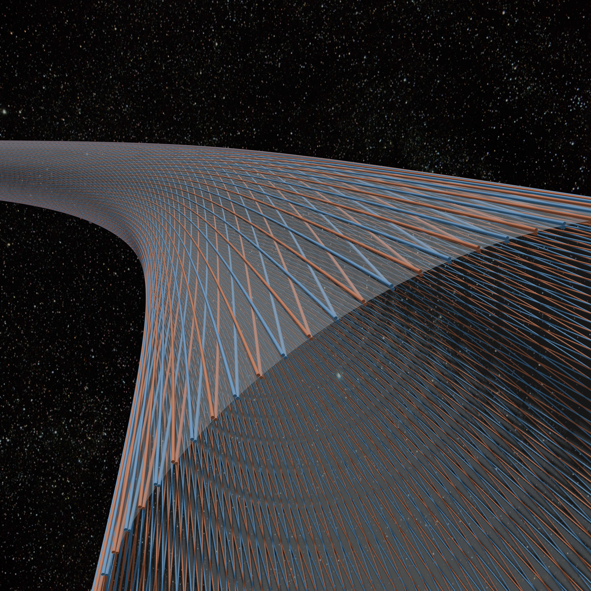

# Abstract {.unnumbered}

{fig-alt="Rendered view of an orbital ring guide shell above Earth" width=100%}

This paper proposes an orbital-ring architecture built from magnetically guided high-speed slug streams running in lanes set at small helix angle around a very large lightweight toroidal guide structure. The paper's main claim is narrower than feasibility: it identifies two linked ideas that are genuinely useful at the concept level and may serve as an internal prestress-and-actuation primitive for active-support ring concepts.

The first is that slug streams can do more than circulate momentum to loft a structure. By forcing the streams to follow curved helical paths on a large toroidal membrane, the design converts momentum redirection into distributed outward pressure, hoop prestress, and local structural stiffness. The result is best understood as a prestressed membrane-and-guide shell (intuitively a giant fabric torus) whose steady preload is created by guided moving mass. That preload may improve roundness, wrinkle suppression, and load transfer in an independent membrane/rib/guide structure, but it is not itself a proof of stabilizing tangent stiffness. Perturbations of the guided stream retain nonconservative follower-force terms that must be overcome by the shell, guide, and control system.

The second is that the same helical geometry enables a four-lane balanced cell that can generate distributed tug fields for macro-scale ring-shape actuation. In a fixed spatial speed gradient, one counter-propagating lane accelerates while its mirrored partner decelerates. Their structural reactions add, and a co-located bidirectional power path can exchange power between the two streams. That makes the cell a momentum-flux actuator and a high-power energy exchanger at the same time.

A central motivation for this architecture is that simple straight-lane or monolithic-rotor active support structure concepts do not provide passive self-centering by momentum redirection alone. A fast mass stream pushes into existing curvature. Without a surrounding structure and active control system that can react against that tendency, perturbations are anti-restored rather than damped away. The helical toroidal guide architecture is therefore not cosmetic. It supplies the reaction substrate and prestress channel that the control system can work through.

After presenting the force mechanism, lane-level guide requirements, perturbation argument, helical membrane architecture, and four-lane macro-actuation scheme, the paper turns to closure screens. Full-scale macro lift requires superorbital ring-tangential momentum flux, failures are energetically extreme, and losses, thermal rejection, timing, and containment all feed back into passive structural weight. The architecture should therefore be understood as a concept-level prestress and actuation primitive, not as a closed feasibility demonstration.
