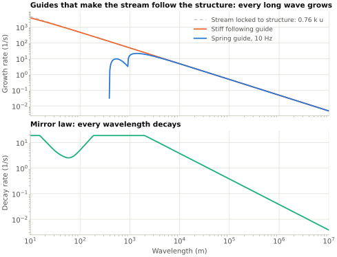
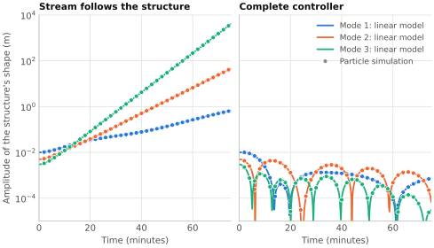
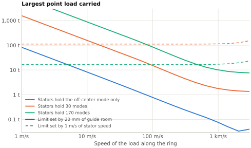

## Introduction {#sec-intro}

Birch's orbital ring [@birch1982orbital] belongs to a family of structures held up by moving mass, with Lofstrom's launch loop [@lofstrom1985launch] and Knapman's space cable [@knapman2009stability] among its smaller members. In all of them a stream moving faster than it could coast is bent by a guide, and the guide is pushed outward. The usual account stops there. It leaves two questions open: what the stream does to the *shape* of the structure that bends it, and how such a structure is to be controlled.

This paper answers both for a ring of a particular kind. The streams are trains of slugs in some 300 lanes, guided magnetically, and wound at a helix angle of under a degree round a tube 100 m across. The helix puts a small part of the streams' momentum to work inflating the tube. Lanes are grouped in fours so that speed changes along the ring put a net force on the structure, a tug, with no net change of momentum. The longer report [@hudson2026helical] develops that architecture. Here it is taken as given, and three results from the report are set out.

1. The ring is an arch with negative effective tension, and its shape is unstable at every wavelength if the streams follow the structure (@sec-teff, @sec-instability).
2. Steering the streams toward the mirror image of the structure's shape stabilizes it, with the stators needed for three specific jobs (@sec-steering, @sec-ring, @sec-loads).
3. Changing loads, and the guide force that helical prestress costs, are the two places where the scheme is most stretched (@sec-loads, @sec-closure).

The reference case throughout is a ring 500 km above the Earth, with streams at 10 km/s relative to the structure, carrying 10 kN/m of structure and load. The orbital speed there is 7.6 km/s. The passive mass is $m = 1{,}200$ kg/m, the streams' mass is $\lambda = 1{,}640$ kg/m, and their momentum flux is $\Pi = \lambda u^2 = 164$ GN.

## Effective tension {#sec-teff}

Let $N$ be the tension in the structure and $\Pi = \sum_j \dot m_j u_j$ the momentum flux of the streams, counted positive for both directions of travel. For an element of ring with unit tangent $\hat t$ and load $q$ per unit length,

$$
\frac{d}{ds}\left(T_\mathrm{eff}\,\hat t\right) + q = 0, \qquad T_\mathrm{eff} = N - \Pi .
$$ {#eq-cable}

This is the equation of a cable. The same combination appears for pipes conveying fluid [@paidoussis2014fluid] and for moving belts [@wickert1990classical], where the flow's part is a correction to the tension. Here it exceeds the tension on purpose. For a uniform ring of radius $R$ carrying its own weight, with $g$ the acceleration of gravity at the ring's height,

$$
T_\mathrm{eff} = -(m+\lambda)\,g R ,
$$ {#eq-teff-ring}

which is negative. A cable has positive tension and hangs. This ring has negative effective tension and stands (@fig-arch). It is an arch, and its compression member is made of momentum.

{#fig-arch}

Three consequences follow at once.

**A tug is reacted as tension.** If nothing pushes on the ring along its length, the tangential part of @eq-cable makes $T_\mathrm{eff}$ the same all the way round. A speed change that raises $\Pi$ along a stretch raises $N$ there by the same amount. The streams push outward harder, the structure pulls inward harder, and the normal balance does not notice. A stationary speed field cannot move lift from one part of the ring to another.

**What a speed field moves is weight.** At fixed mass flux, slugs bunch where they are slow. The structure, under less tension where the streams push less, is less stretched there and so denser too. A fractional speed change $\delta u/u$ changes the ring's weight per metre by

$$
\delta w = -\chi\,\lambda g\,\frac{\delta u}{u}, \qquad \chi = 1 + \frac{m u^2}{EA} ,
$$ {#eq-weight}

where $EA$ is the structure's axial stiffness. For the reference structure, with $EA = 50$ GN, $\chi = 3.4$.

**The ring answers a load backward.** A load $\delta q$ of wavenumber $k$ displaces the ring by $y = \delta q / (T_\mathrm{eff} k^2)$, which has the opposite sign to the load. A stretch of ring made heavier rises.

Birch found a bent tube carrying opposed streams to be "dynamically neutral in the absence of external forces" [@birch1982orbital]. That is the case $T_\mathrm{eff} = 0$, a tube whose tension equals its streams' momentum flux. A ring that holds weight up against gravity cannot carry that tension, because the difference between the two is what holds the weight.

## The shape instability {#sec-instability}

With inertia added, and the streams' mass riding with the structure, a wave of wavenumber $k$ short compared with the ring obeys $(m+\lambda)\ddot y = -T_\mathrm{eff}\,k^2 y$. It grows at

$$
\sigma = k\sqrt{\frac{-T_\mathrm{eff}}{m+\lambda}} = k\sqrt{gR} .
$$ {#eq-growth}

The second form uses the equilibrium @eq-teff-ring, and it shows that the rate depends on nothing but the wavelength and the orbital speed $\sqrt{gR}$: not on the speed of the streams, the load they carry, or how the compression is shared between momentum and structure. An error 1 km long grows e-fold in 21 ms, and one 100 km long in 2.1 s.

For the whole ring the modes are counted by the number of waves $n$ round the circumference, and gravity's change with height and the hoop's stretch enter. Three numerical models were built and agree: a pin-jointed frame carrying streams, a linear model with each stream as a separate field, and a particle simulation of the whole ring. With the slugs left to coast along their track, the reference ring drifts off center ($n = 1$) with an e-folding time of 17 minutes, and the modes with two and three waves grow in 7.7 and 5 minutes (@fig-modes). One mode is different. Uniform breathing, $n = 0$, is a stable oscillation with a period of 83 minutes if the slugs coast, because a coasting stream keeps its angular momentum. Holding the slugs' speed fixed would make it unstable.

{#fig-modes}

A stiffer guide does not help. Stiffness is what makes the slugs follow a bent structure, and that is the source of the push. Nor do tug fields, used against one another across the tube. They shift the line along which the streams push by the couple divided by $\Pi$, which is 6 mm for a couple of 1 GN m, and holding a sideways load that way keeps 3.2 MW per metre circulating for every newton per metre at a wavelength of 100 km.

## Steering {#sec-steering}

Treat each direction's streams as a field with sideways position $\eta_j$, distinct from the structure's position $y$. The guide pushes on the stream with a force $f_j$ per unit length and on the structure with the reverse:

$$
\lambda_j D_j^2\eta_j = f_j, \qquad m\,\ddot y = -\sum_j f_j, \qquad D_j = \frac{\partial}{\partial t} \pm u\frac{\partial}{\partial s} .
$$ {#eq-two-body}

If the guide holds $\eta_j = y$, this is the unstable arch again. Suppose instead that it holds each stream on the mirror image of the structure's shape,

$$
\eta^* = -c_m\,y ,
$$ {#eq-mirror}

with a gain $c_m$. The streams' push then acts toward the middle wherever the structure bulges (@fig-mirror), and

$$
\left(m - c_m\lambda\right)\ddot y = c_m\,\Pi\,y''
$$ {#eq-string}

for a structure that carries no tension of its own. The structure behaves as a string in tension. At $c_m = 0.5$ the tension is 82 GN, the string's mass 370 kg/m, and its wave speed 15 km/s. The gain has to stay below $m/\lambda = 0.72$, so that the structure outweighs the part of the stream it commands.

{#fig-mirror}

The guide force that does this is

$$
f_j = \lambda_j D_j^2\eta^* - K\left(\eta_j - \eta^*\right) - C\,D_j\left(\eta_j - \eta^*\right) .
$$ {#eq-guide}

The first term is the force that flies the commanded path. With it in place the feedback terms need no great stiffness. The law needs a guide whose force can be commanded, and it needs the structure's shape measured against an absolute reference. Lofstrom's launch loop already controls on absolute track position as well as on the gap [@lofstrom1985launch], and Knapman's active curvature control uses the same force for a different purpose [@knapman2023innovation].

**Damping.** @eq-string has none, and any delay makes it grow slowly. The cure is to steer each stream toward the mirror image of the shape a distance $d_a$ ahead of it in its direction of travel. That adds a damping term whose sign is the sign of $d_a$. With the look-ahead set to 0.3 rad of the wave's phase, and not less than 20 m, the damping ratio is 0.43 at wavelengths beyond a kilometre or so. The law acts from 300 m. Below 300 m the command is rolled off, and the tube's own bending stiffness, which outweighs the streams' push below about 120 m, holds the shape with a little structural damping (@fig-rates).

{#fig-rates}

**Room.** The mirror law holds a load by offsetting the streams from the structure. With an offset limited to $\delta_\mathrm{max}$, the load it can hold at wavenumber $k$ is

$$
q_\mathrm{max} = \frac{c_m}{1+c_m}\,\Pi k^2\,\delta_\mathrm{max} .
$$ {#eq-room}

For 20 mm of room that is 430 N/m at a wavelength of 10 km, 4.3 N/m at 100 km and 0.043 N/m at 1,000 km. Steering is strong at short wavelengths and has almost nothing at long ones.

**Steady loads.** A set point added to the commanded path, and adapted slowly with *positive* feedback on the mean offset, moves the ring to the funicular position, where the streams carry the load with no offset at all. This is the idea of zero-power magnetic levitation [@morishita1988zero]. A second set point, adapted with negative feedback on the difference between the two directions, keeps each of them centered.

## The whole ring {#sec-ring}

On the scale of the ring three things change. Two need the stators, and one must be left alone.

**Bunching.** A guide pushes at right angles to itself, not to the slug's path. When the mirror law tilts the stream's path against the structure, the lift force gets a component along the track, and coasting slugs bunch. The stators have to hold each slug softly to its place in their traveling wave, pulling its speed and position back at rates of the order of the orbital rate. Softly, and only the pattern: a stiff hold on the mean speed would bring back the breathing instability.

**The off-center mode.** Shifting a stream's whole path sideways changes no curvature, so the mirror law cannot hold $n = 1$. What can is weight. If the slugs run slower on the side that has drifted outward, that side grows heavier by @eq-weight and gravity pulls it back. A state-feedback law on the stators makes the offset decay with a time constant of about two hours, for a speed change of 10 mm/s per metre of offset.

**Breathing** is left alone. It is stable if the slugs coast.

With these in place every in-plane mode from $n = 2$ upward decays under the mirror law at $c_m = 0.5$, and every out-of-plane mode. The complete controller was run on the particle simulation: 120 masses and hoop springs for the structure, 1,200 slugs, inverse-square gravity. Started with its first three modes displaced by 10, 5 and 3 mm, the ring recovers, with the streams never more than 12 mm from the structure, and the simulation follows the linear model to within 1% (@fig-recovery). A run with thirty modes displaced at once agrees to 3.5%.

{#fig-recovery}

The simulation tests the linear models for small motions. It keeps only the longest modes, and it has two streams and one sideways direction, not 300 helical lanes on a tube.

## Loads that change {#sec-loads}

A point load $F$ puts $F/\pi R$ into every mode of the ring, down to the longest, where @eq-room leaves steering almost no room. With steering holding every mode from $n = 2$ up, a point load of 56 kg put on suddenly fills 20 mm of guide. (Loads here are in tonnes of 9.8 kN.)

The remedy is to give the longest modes to the stators. In those modes the streams go back to following the structure, so there is no offset to run out of, and stator feedback of the kind that holds the off-center mode holds the shape by shifting weight. Every mode from 2 to 170 then decays in 15 to 29 minutes. What the ring can carry depends on how many modes the stators take (@fig-loads): with 170, a point load of 9 tonnes put on suddenly, or of 8 tonnes moving at up to 3 km/s.

{#fig-loads}

The price is power. A stream slowed and let go again gives up power on the way in and takes it back on the way out, and the counter-propagating lanes pass it between them. Holding one tonne with 170 modes keeps 5 GW moving in each direction of travel. The margins are also thinner than steering's. The highest stator-held modes are lost if the streams move 2% further than the structure where they should move exactly with it, or if each direction of travel is 1% from their mean, in mass or in speed, and the feedback has not been told. Steering, by contrast, tolerates directions 10% above and below their mean in mass. And the stators can do nothing about a sideways load, because weight acts in the plane of the ring.

These load figures come from the linear model. The particle simulation has run the stators holding three modes with a small load in one of them, and agrees to within 0.5%.

## What prestress and loss cost {#sec-closure}

Guides, radiators and power supply are passive mass, and the amount of each is proportional to the weight carried. If they come to $G$ kilograms for every kilogram carried, the ring's passive mass is $m_0/(1-G)$, where $m_0$ is the part that is there for its own sake. The loop closes only if $G < 1$.

The guides push on the streams with the force that lifts the ring and with the force that turns the streams round the tube. If the helix is to give a hoop force of $\Gamma$ times the supported weight per metre, the guides' total normal force per unit of supported weight is

$$
\phi = 1 + 2\pi\Gamma .
$$ {#eq-phi}

At the reference $\Gamma = 10$ that is 64. The helix adds almost nothing to the momentum the streams must carry, but its prestress is paid for in guide force, sixty times over. Drag, guide hardware and heat all scale with that force. Writing the guide's drag as its normal force divided by a ratio $D$, and the hardware's masses per unit of force and power as assumed constants (@fig-gain), the loop for the reference case closes only for $D$ above about 60,000, and the power to make up the drag is then terawatts. Without the helix the same guide closes the loop at several hundred. A passive electrodynamic guide's ratio rises in proportion to speed [@post2000inductrack], which is the right direction, but nothing here shows that $10^5$ can be had at 10 km/s.

{#fig-gain}

The same force balance applies to any structure held up by a stream. For an arch of radius of curvature $R_c$, the stream must exceed $\sqrt{gR_c}$ to carry more than itself, the stored energy per metre is at least $\tfrac12 m g R_c$, and shape errors grow at $k\sqrt{gR_c}$. A ring round the Moon at the same speed ratio stores a twentieth of the energy per metre. Its whole-ring modes are not much slower, because the period of a low orbit is much the same on both bodies: two waves round the ring grow in ten minutes against eight, and the ring drifts off center in 29 minutes against 17.

## Scope and limits {#sec-limits}

The results are closed-loop stability of models, not of a machine.

- The shape of the ring is taken as measured against an absolute reference, at every wavelength from 300 m up.
- The guide's force is taken as commanded. A real magnetic guide has stiffness of its own that the control must cancel.
- The models have two streams and one sideways direction at a time. The real ring has 300 lanes wound round a tube, whose cross-section has modes of its own.
- The structure does not turn with the Earth. The unequal stream speeds that turning produces have been tried in the linear model. The Coriolis force on the structure has not.
- Large motions, recovery from saturation of the guide, and faults are not treated. The stored energy is 82 GJ per metre.
- The slugs act as a continuous stream for the shape control while they are 20 m apart or less. What their passing does to the guide's own structure, thousands of times a second, is open.

## Conclusion {#sec-conclusion}

A ring held up by momentum is an arch, and an arch of momentum is unstable in shape, at a rate that for waves short compared with the ring is fixed by the wavelength and the orbital speed. The instability is not cured by stiffness or by tug fields set against one another across the tube. It is cured by steering the streams against the structure's displacement, which costs room in the guide and no power, and which a simple local law with look-ahead does at every wavelength from 300 m to half the ring. The stators keep three jobs: holding the slugs' spacing, keeping the ring on center, and, at a price in power, holding the longest modes when loads change.

What stands between this and a machine is not the principle. Besides containing faults, which this paper does not take up, it is sensing the shape, building a guide whose force is commanded and whose drag is a hundred-thousandth of its load, and deciding how much of the helical prestress, which that drag makes expensive, the tube can do without.

## References {.unnumbered}

::: {#refs}
:::
